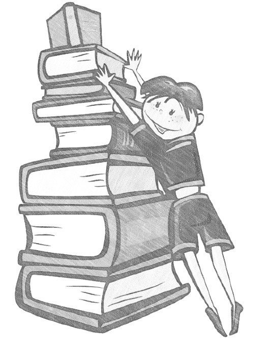

Курс «Интеллект-стек» раскрывает понятия интеллекта и мышления, а затем
предлагает усиление естественного и искусственного интеллекта за счёт
изучения лучших (SoTA, state-of-the-art) мыслительных практик,
основанных на трансдисциплинах понятизации, собранности, семантики,
математики, физики, теории понятий, онтологии, алгоритмики, логики,
рациональности, познания/исследований, эстетики, этики, риторики,
методологии, системной инженерии. Курс входит в пятый семестр программы
«Организационное развитие» Школы системного менеджмента.

В курсе говорится о понятии «интеллект» и его поведении «мышление»,
вводится понятие интеллект-стека как набора мыслительных практик
(методов мышления, паттернов мыслительной деятельности), позволяющих
интеллекту быстрее решать всё более широкий спектр проблем, мешающих
изменить себя и мир к лучшему. Улучшение мира понимается как
многоуровневое (например: вещество, существо (включая людей), популяция,
вся жизнь на Земле) избегание неприятного сюрприза в будущем, в
пределе --- снижение экзистенциальных
рисков^[<https://en.wikipedia.org/wiki/Global_catastrophic_risk>],
«спасение». Сам состав практик стека и последовательность изложения
материала курса специально адаптированы для учебных целей.

Для каждой мыслительной практики интеллект-стека говорится о том, зачем
она нужна, какое её место в мышлении, а также приводится краткая
характеристика её современного (SoTA) состояния, даются ссылки на
литературу. Содержание курса предполагает пререквизитом прохождение
курсов первых четырёх семестров программы «Организационное развитие»
Школы системного менеджмента. Курс не пересказывает материал
трансдисциплин, изучаемый в других курсах, но кратко касается содержания
каждой из трансдисциплин интеллект-стека. Курс предназначен для того,
чтобы как-то «склеить» вроде бы разрозненные знания трансдисциплин из
многих других курсов в целостную картину мира. Основная идея в том, что
это «аспирантский» курс: он должен вывести понимание текущей ситуации в
познании на фронтир, подготовить к самостоятельным исследованиям, к
самостоятельному планированию своего развития в контексте новейших
достижений цивилизации. Курс сам по себе не столько «учебный курс»,
сколько аннотированный обзор литературы: основные знания содержатся в
литературе, на которую ссылается курс, а материал курса только указывает
на то, что именно надо вычитывать в указанной литературе. В курсе более
семисот ссылок на литературные источники (хотя небольшая часть из них
дублируется из соображений удобства использования).

Текущая версия интеллект-стека опирается на исследования учёных,
занимающихся проблемами наиболее общих закономерностей эволюции жизни
(дарвиновской эволюции) и эволюции знания и инженерных систем
(техно-эволюции). Это труды групп David Deutsch, Виталия Ванчурина, Karl
Friston, Андрея Хренникова, Kit Fine, John Doyle, Michael Levin, Andrej
Karpathy и многих других учёных, с которыми они сотрудничают. Основная
идея --- это базирование объяснений интеллекта на первых принципах,
выводимых из физики (термодинамика) и теории эволюции. Если очень кратко
сформулировать основные идеи получившейся компиляции современного
состояния трансдисциплин, то это будет неумолимое увеличение сложности
многоуровневых биологических и технических систем в ходе биологической и
техно-эволюции, безмасштабность и неантропоцентричность объяснений,
творчество в основе деятельности, нацеленность агентов (естественных и
искусственных, а также коллективных) на изменение мира к лучшему как
пути «спасения».

В курсе в текущей версии приведено не так много заданий. Возможно, в
следующих версиях курса число заданий будет увеличено. В любом случае, к
моменту прохождения этого курса предполагается, что студент достаточно
организован, чтобы самостоятельно спланировать своё обучение. Пока не
планируется иметь варианты прохождения этого курса с инструктором или
преподавателем, курс нацелен на самостоятельную проработку материала в
удобном для студента темпе. Основное время должно уходить тут не столько
на освоение самого материала курса, сколько на знакомство с указанной в
курсе литературой.

После прохождения курса студент должен демонстрировать понимание того,
что такое интеллект и мышление, каким образом их можно усилить. Студент
должен демонстрировать целостное мировоззрение, позволяющее связно и
неантропоцентрично описывать многомасштабный мир, строить свои R&D
программы (инженерные программы, включая их часть, связанную с
исследованиями). После прохождения курса ожидается, что студент
организует свою лабораторию, которая в ходе шестого семестра программы
«Организационное развитие» разработает и будет развивать курс по
какой-то прикладной практике инженерии (включая «железную» инженерию,
менеджмент, образование, медицину и т.д.). Это ход на подъём
квалификации со студенческого «мастера» до аспирантского «реформатора»,
то есть переход с ведения программы организационного развития какого-то
предприятия на программу развития сообщества какой-то практики.

Курс получен путём полной переписки содержания курса «Образование для
образованных 2021». Содержание курса и терминология согласованы с
содержанием и терминологией курсов программы «Организационное развитие»
ШСМ. Ситуация с лучшим на сегодня известным знанием и пониманием того,
что такое интеллект, быстро меняется. Обновления курса будут частыми и
после окончания переписки варианта 2021 года.

Благодарность студентам и сотрудникам Школы системного менеджмента,
которые поддерживали меня в ходе этой работы. Особая благодарность
Роману Варьянко, который оперативно выполнил корректуру текста
переписанных разделов, не ограничиваясь грамматикой и орфографией, но и
делая содержательные замечания.

Ваши вопросы и замечания по текущей версии, предложения по поводу
следующих версий курса давайте в чат поддержки, он организован в
телеграм как общий для всех курсов пятого семестра «Образование для
образованных» программы «Организационное развитие»:
<https://t.me/odo_course>
