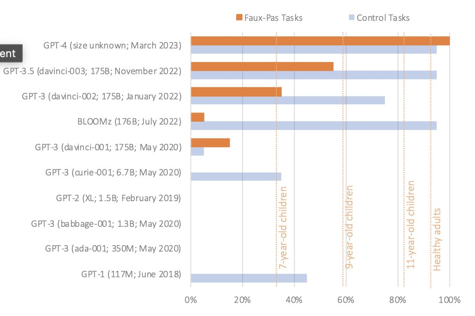
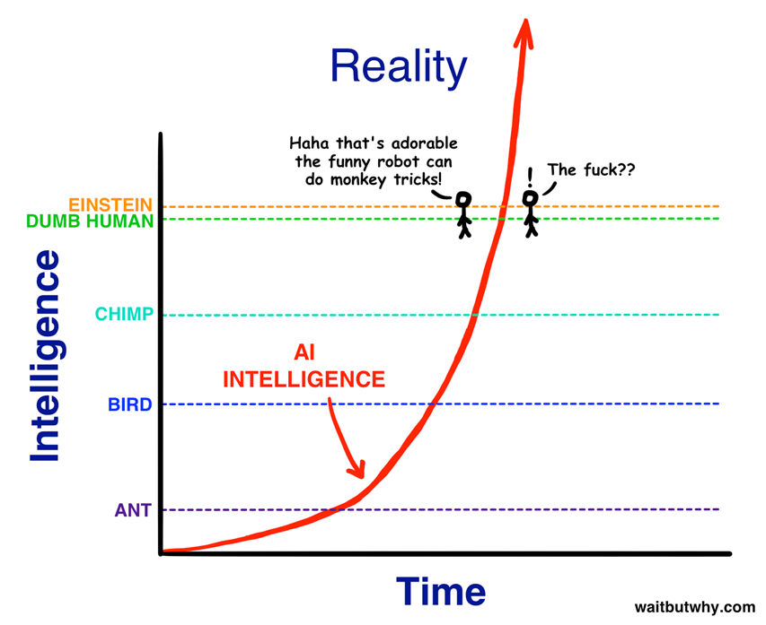
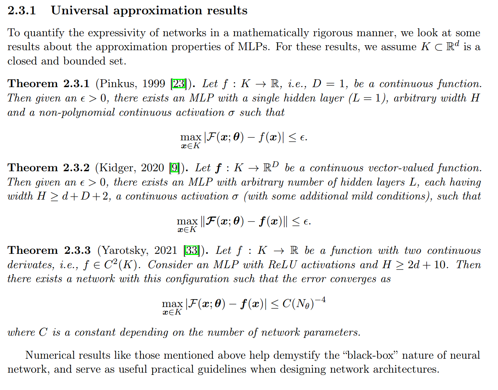

Мы говорим об интеллекте много проще: как вычислителе, который способен
находить решение разнообразных проблем, понимаемых как предотвращение
неприятных сюрпризов, которые можно ожидать в будущем (про проблемы ---
это мы берём из теории active
inference^[<https://www.activeinference.org/>]).
Вычисления::функция этого интеллекта::функциональный объект --- это и
есть мышление. Больше разнообразие этих проблем --- выше уровень
интеллекта, мощнее мышление, для определения силы интеллекта через
скорость решения проблем (то есть скорость обучения решать какой-то
класс проблем, если говорить точнее) используем подход François
Chollet^[<https://arxiv.org/abs/1911.01547>].

Компьютеры подешевели, и на огромном числе компьютеров теперь
человеческие дети тупеют, размахивая нарисованными мечами, которыми
рубят нарисованных демонов, интернет подешевел и стал большой помойкой,
а искусственный интеллект подешевел, и теперь помойка будет вообще
огромной, а использоваться он будет для того, чтобы маркетологам было
легче взламывать ваш мозг (при этом маркетологом можете быть и вы сами,
тогда будете взламывать мозг вашего ближнего, «ничего личного, это
бизнес»), а перед этим сильный корпоративный интеллект взламывать
слабенькие защиты вашего персонального ассистента, который слабенький,
потому что стоит дёшево, а маркетологи будут использовать дорогой
интеллект. Этот интеллект в персональном ассистенте будет защищать от
чужого взлома ваш мозг, но может также ломать его «по-правильному» с
точки зрения какого-то другого агента (фирмы-изготовителя, государства
пребывания, государства фирмы-изготовителя, государства, которое считает
вас своей собственностью, то есть своим гражданином, враждебного вам
хакера, ваших родителей или работодателей, которые настроили вашего
персонального помощника, случайных представлений, выбранных самим
интеллектуальным помощником и т.д., любой софт это только кажется, что
это ваш софт! К интеллектуальным помощникам/чат-ботам это относится в
полной
мере)^[<https://ailev.livejournal.com/1106188.html>].

Так что генератор мемов планетарного масштаба уже появился, теперь
ждём-с чего-то типа иммунной системы для этих мемов, развития
паразитизма (хаков самых разных интерфейсов, главный из которых ---
интерфейс через глаза, уши и даже кинестетику как раз к вам в мозг, но и
это недолго, будут интерфейсы и поинтереснее, в том числе инвазивные
нейроинтерфейсы^[Фирм, занимающихся нейроинтерфейсами,
сейчас множество: Blackrock Neurotech, BrainGate, ClearPoint NeuraLink,
Neurable, Precision Neuroscience, Synchron, Kernel, Motif Neurotech.
Гуглите, чтобы узнать текущее состояние дел в этой предметной области,
там всё меняется очень быстро.]) и т.д. --- все прелести
эволюции. Какие-то интересные картинки этого будущего читайте в работе
«Designing Ecosystems of Intelligence from First
Principles»^[<https://arxiv.org/abs/2212.01354>].
Смысл там в том, что у компьютера сейчас уже имеется какая-то модель
мира (в виде большой языковой модели,
LLM^[[https://ru.wikipedia.org/wiki/Большая\_языковая\_модель](https://ru.wikipedia.org/wiki/Большая_языковая_модель)]),
и таких компьютеров всё больше, причём современный компьютер --- это
датацентр с десятками тысяч компьютеров, поддерживающих миллионы
экземпляров таких моделей. На следующей стадии развития машинного
интеллекта будет различение мира и модели мира (понимание, что
интеллекту доступен не сам мир, а только модели мира, далее в
интеллект-стеке будем обсуждать понятия прямого доступа, первого
доступа, второго доступа^[замена в нейролингвистическом
программировании неудачного термина \"четверка\" заимствованными из
теории автоматов словами \"первый доступ\", означающими набор ощущений
во всех модальностях восприятия, но до их языковой обработки.
Соответственно, \"прямой доступ\" --- это информация об объекте,
получаемая в терминах входного потока (фотоны, звуковые волны и т.д.),
человек не имеет \"прямого доступа\", только \"первый доступ\". \"Второй
доступ\" --- это после подключения языка, именования паттернов,
наблюдаемых первым доступом.]).

Дальше машинный интеллект начнёт оперировать с такими моделями как
убеждениями о мире, то есть работать не только с моделями-1 мира, а с
моделями-2 этих моделей как убеждениями/уверенностями, что эти модели-1
отражают мир. В рассуждениях начинают участвовать beliefs по поводу
models, и дальше идёт моделирование не только агентов, но и их моделей
мира, а также своей уверенности в моделях агентов, моделях их картины
мира, сравнение чужих убеждений со своими убеждениями о мире и
уверенностью в них, и т.д. Это уже происходит. Изучение такого отражения
«нашим интеллектом» моделей мира «других интеллектов» называют theory of
mind (ToM), и современные нейронные сети, начиная с GPT-4 демонстрируют
такие свойства на уровне
человека^[<https://twitter.com/michalkosinski/status/1636789329363341313>]:

Модели, опубликованные до 2020 года, практически не показали способности
решать задачи ToM. Тем не менее, первая версия GPT-3 (\"davinci-001\"),
опубликованная в мае 2020 года, решила около 40% задач на ложное
убеждение - производительность, сопоставимая с 3,5-летними детьми.
Вторая версия (\"davinci-002\"; январь 2022 года) решила 70% задач на
ложное убеждение, что сравнимо с результатами шестилетних детей. Её
последняя версия, GPT-3.5 (\"davinci-003\"; ноябрь 2022 года), решала
90% задач на ложное убеждение, на уровне семилетних детей. GPT-4,
опубликованная в марте 2023 года, решила почти все задачи (95%). Эти
результаты позволяют предположить, что способность к ToM-подобному (до
сих пор считавшаяся уникальной для человека) могла спонтанно возникнуть
как побочный продукт совершенствования языковых
моделей^[<https://arxiv.org/abs/2302.02083>].
Последнее достижение --- это как получить 100% (заведомо лучше людей!)
прохождение тестов ToM через правильные вопросы для GPT-4 (дать
возможность нейросети подумать в несколько шагов, впрочем и для
нейросеток людей это тоже должно
помогать)^[<https://arxiv.org/abs/2304.11490>].

Но нельзя отождествлять интеллект только с мозгом! Помним, что главная
цель --- это найти практики, помогающие избежать неприятных сюрпризов. И
тут аппаратно существуют у животных минимум две такие системы: мозг
(ментальный мозг) и иммунная система («нементальный мозг»), которые
устроены абсолютно по-разному, но имеют одно и то же назначение:
охранять границы тела от внешних
вторжений^[<https://psyarxiv.com/fgcy5/>].
Мозг как сложная система, состоящая из множества совместно работающих
(обменивающихся сигналами) клеток самых разных типов, реагирует
централизованным выбором реакции из альтернатив «беги-бей», а иммунная
система, точно так же состоящая из множества разных типов клеток,
обменивающихся сигналами, реагирует реакцией воспаления. Обе системы
должны понимать, что представляет собой «тело», а что «внешняя среда»,
то есть распознавать «своё-чужое»,
«дружественное-нейтральное-враждебное». При этом мозг обучается, но и
иммунная система тоже обучается! Реализация интеллекта и формы его
существования оказываются предельно разными. А мышление? Трудно
представить, что иммунная система занимается мышлением --- но она таки
занимается мышлением, познаёт окружающий мир, затем формирует прикладное
мастерство быстрого реагирования на уже знакомые угрозы (когда иммунитет
к какому-то вирусу или бактерии есть, болезнь не успевает развиться), а
для новых угроз медленно, но распознаёт угрозу и формирует прикладное
мастерство подавления этой угрозы (болезнь успевает развиться, но затем
наступает выздоровление). И дальше по этой линии можно думать, что и
общество в целом «думает», и там происходят похожие распределённые
процессы, необязательно похожие на мышление отдельного централизованного
мозга, но более похожие на мышление «нементального» мозга типа иммунной
системы. Интеллект оказывается удивительно многолик.

Мы не будет дальше заниматься в курсе «нементальным интеллектом», но
удерживать этот вариант в мышлении надо, иначе трудно разбираться с
происходящим на системных уровнях выше отдельного человеческого
организма (уровнях популяции людей, людей и машинных интеллектов).

Важнейший эксперимент, который показал верность теории «никогда не бегут
куда, всегда бегут откуда» (то есть то, что интеллект никогда не
стремится к лучшему, он лучшим считает избегание худшего) --- это
эксперимент DishBrain, который провела лаборатория Cortical
Labs^[<https://corticallabs.medium.com/>].
В теории active
inference^[<https://www.activeinference.org/>]
и теории world as a neural
network^[<https://www.ncbi.nlm.nih.gov/pmc/articles/PMC7712105/>,]
говорится, что «достаточно сложная система может учиться, и это
описывается вот такой физикой». Далее берём несколько сотен миллионов
(то есть очень мало!) выращенных в пробирке нейронов мыши и/или человека
(работает и так, и так) и кладём на электродную матрицу. Архитектура
такого вычислителя --- «синапсовое спагетти, уж как выросло, но должно
быть достаточно сложное, чтобы мочь научиться чему-то заранее ему
неизвестному» (то есть постулируем, что у сложнозапутанных между собой
нейронов есть интеллект, этот интеллект должен избегать сюрпризов).
Современные теории утверждают, что для познания мира не нужно знать, что
такое «награда» (что такое «пища» или «здоровье» и т.д.). Но избегание
неприятностей, «выживание в мире, полном опасностей» --- оно появляется
во всех устойчивых системах, которые вынуждены поддерживать собственное
существование в условиях опасной неопределённости физического мира.
Поэтому избегаем неопределённости, ибо в ней те самые «неприятные
сюрпризы».

DishBrain («тарелковый мозг») погружаем в какой-то мир (в работе был
использован мир игры Pong), подавая сигналы от симулятора этого игрового
мира на матрицу электродов и распознавая сигналы от каких-то нейронов
DishBrain. Если DishBrain попадает ракеткой по мячу в игре (не зная, что
такое игра, ракетка, мяч, «попадание»), то ничего не делаем, работает
«физика игры». Но если DishBrain промахивается, то подмешиваем шум к
датчикам, то есть оставляем DishBrain в неизвестности о результатах
действия, сигнал о состоянии мира тонет в шуме. «Достаточно сложная
система» не делает ничего, она просто существует. Но если формулы active
inference верны, такая система должна дрейфовать к стабильности в
окружающей среде. Она, как и ожидается, каким-то чудом дрейфует:
DishBrain научился играть в понг за пять минут (это очень, очень быстро!
Попробуйте научить за это время играть в Pong кошку или собаку, или
трёхлетнего ребёнка!). Всё, наказание (антинаграда) неопределённостью
исчезло, мир вокруг себя несколько сот миллионов нейронов держат
стабильным, известным. По большому счёту, этим занят любой интеллект.

Тем самым цивилизация уходит от расхожих в прошлом представлений о
награде и наказаниях, доказательствах и опровержениях. Вместо этого
используется другой набор представлений: нет наград и наказаний, а есть
отсутствие неприятностей, при этом потенциальным источником
неприятностей будет неопределённость, то самое «не дай бог тебе жить в
эпоху перемен». Парадоксально, но если перемен нет прямо сейчас, то вы
будете вынуждены активно искать возможные источники сюрпризов в
ближайшем будущем, а потом и в более отдалённом будущем, всё более и
более отдалённом по мере роста интеллекта и возможностей его
предсказания и планирования действий. Интеллект обязательно будет
исследовать мир, активный поиск источников возможных сюрпризов в будущем
при кажущейся стабильности «прямо сейчас» заложен физикой, любопытство
по факту «аппаратное свойство»!

Активный поиск (active/embodied inference, деятельное/телесное
рассуждение) --- это поисковое рассуждение с учётом использования тела.
Не бывает интеллекта без какого-то его носителя, тела/body. Тело с его
интеллектом (реализованным мозгом или не мозгом, мы тут не обсуждаем
детали устройства) будет буквально подтаскивать глаза к углу и
заглядывать за угол --- вдруг там что-то опасное? Это если есть глаза,
но если глаз нет, то тело будет хотя бы ощупывать окружающее
пространство непрерывно двигающимися ресничками, как у одноклеточной
инфузории туфельки. Этот вечный поиск неприятностей, которых надо бы
избежать на многих и многих системных уровнях (клетки, органа,
организма, популяции --- и так далее вплоть до всей биосферы Земли, а по
гипотезе Виталия Ванчурина, так и вплоть до больших участков Космоса со
всеми тамошними галактиками) и попытки их избежать --- это и есть «смысл
жизни».

Нет «доказательств», но есть «опровержения относительно плохих
объяснений» (поперовская эволюционная эпистемология), и вы будете всю
жизнь выдвигать какие-то догадки и критиковать свои же догадки, а также
чужие догадки по тому, как устроен мир. Ибо для вас, как развитого
интеллекта, все эти модели мира --- только «верования в то, что
предложенная модель мира хороша», beliefs, а не собственно модели мира,
которые и впрямь отражают мир в его важных чертах. Нет, интеллект
сомневается, что его модели верны. Он сомневается и в том, что верна его
модель себя, что интеллект хорошо понимает, что такое он сам. Люди
сомневаются, что они хорошо себя понимают (и правильно сомневаются).

Это вечное стремление к познанию, вечный поиск чего-то нового
непознанного и есть «смысл жизни», ибо если интеллект не будет такое
«новое и непознанное» находить и моделировать (делать познанным) --- то
что-то подобное непонятное в окружении станет источником неприятных
сюрпризов: вас съедят, вас убьёт астероид или ещё что-нибудь такое
произойдёт, это даже не вопрос, произойдёт ли что-то неприятно! Вопрос
только --- когда, и насколько вы будете готовы избежать этой
неприятности. Избежать всегда возможно, ибо нет плохой погоды, есть
плохая одежда. Если у вас хорошая защита, то неприятности будут не
такими уж неприятными. Нет «хорошо», есть когда «знаю обо всём плохом и
подготовился, а поскольку знать обо всём плохом и подготовиться к
неизвестному нельзя, то познаю --- готовлюсь, познаю --- готовлюсь», и
это безмасштабно (от клетки через организмы до цивилизации), безлично и
ни разу не антропоцентрично (для AI всё тоже верно, как и для биосферы
Земли, включая техносферу с её компьютерами и другим оборудованием типа
экскаваторов). Ни награды, ни доказательства, сплошной смысл жизни как
«спасение». Спасение всей жизни во вселенной, не только вашей, и вас
даже не спрашивают, участвуете ли в эволюции, или не участвуете --- у
вас же физическое тело, а разум может только помогать эволюционировать
чуть быстрее, в том числе помогать строительством разума ещё более
крутого, чем разум одного человека или команды людей, так что текущий
разум тут не предел, получение искусственного интеллекта всё большей и
большей силы неминуемо, это реализация законов физики (помним про работы
группы Ванчурина).

Цель всех религий --- спасение. Получается, что если религию выкинуть,
то цель та же --- спасение, через вечное познание и вечное созидание.
Познаёшь, что ещё гадкого может произойти, и созидаешь что-то такое,
чтобы это на тебя не повлияло. Это относится и к Земле в целом, и к
живым существам на ней, и человечеству в составе биосферы, и всяким
обществам с сообществами, и лично к вам, и даже к вашим частям. Мозг и
иммунная система --- они тоже посвящены задачам спасения, «охране границ
от всякого разного вмешательства Вселенной, в том числе вмешательства в
лице таких же, как вы систем, спасающих себя, но не вас. Думать обо всех
агентах надо одинаково: все что-то/кого-то спасают, иногда даже жертвуя
собой, но необязательно спасают именно вас.

Vernor Vinge в январе 1983 популяризировал тезис I.J.Good, высказанный
ещё в 1965 году, что осталось 30 лет до создания искусственного
интеллекта, сравнимого по силе с человеческим (то есть ожидался 2013
год), далее этот интеллект должен начать усиливать сам себя, а затем
человек перестаёт быть царём природы. Невозможно предсказать, что будет
происходить после этого момента, ибо мир будет изменяться так быстро,
что обычный человек не будет способен понять происходящее и справиться с
этим. Этот момент был назван «технологической
сингулярностью»^[[https://ru.wikipedia.org/wiki/Технологическая\_сингулярность](https://ru.wikipedia.org/wiki/Технологическая_сингулярность)]
как совершенно особая точка в истории цивилизации. Вроде как
искусственный интеллект, по многим характеристикам уже сравнимый с
человеческим, был опубликован 14 марта 2023 года, это большая языковая
модель GPT-4, которая была настроена для разговоров на разные темы в
виде чата. Так что момент, изображаемый на картинке, иллюстрирующей
сингулярность --- это 2023 год:

Но если смотреть на происходящее не антропоцентрично, не с точки зрения
человеческого вида, а с точки зрения «спасения жизни» в целом (а не
спасения только одного вида существ), то сингулярность --- бессмысленное
понятие. Что-то такое, когда представители конкретного вида существ не
справлялись с происходящим вокруг, всегда было, просто скорость познания
была другая. «Непонятно, что происходит на улице с политикой, с новым
искусственным интеллектом» --- а что, сто лет назад даже людям было
понятно, что происходит на планете?! А что, до появления современной
человеческой технологической цивилизации неандертальцы понимали, что
происходит? А рыба латимерия, а мамонты --- они понимали? А вон тот
компьютер 2000 года выпуска, который выбросили только вчера, он понимал,
что происходит? А завтрашний свехчеловеческий искусственный
интеллект --- он-то сам будет понимать, что происходит?!

Тут уместно задать вопрос: а как вообще можно верить тому, что
искусственный интеллект сможет решить хоть какие-то задачи, которые не
может решить человек? В случае с сегодняшним вариантом AI на нейронных
сетях выполняются все три закона
Кларка^[[https://ru.wikipedia.org/wiki/Три\_закона\_Кларка](https://ru.wikipedia.org/wiki/Три_закона_Кларка)]:

1.  Когда уважаемый, но пожилой учёный утверждает, что что-то возможно,
    то он почти наверняка прав. Когда он утверждает, что что-то
    невозможно, --- он, весьма вероятно, ошибается.
2.  Единственный способ обнаружения пределов возможного состоит в том,
    чтобы отважиться сделать шаг в невозможное.
3.  Любая достаточно развитая технология неотличима от магии.

Первый вопрос: принципиально ли невозможно, что нейросеть сможет
повторить при достаточных размерах и отведённом на вычисления времени
то, что сделал Эйнштейн? Эйнштейн много лет читал тексты статей по
физике, общался с коллегами-физиками, затем выдал теорию относительности
и догадку про квантовость энергии, потом потратил много времени, чтобы
продвинуться в «квантовой гравитации», но не преуспел. В математике это
звучит как «можем ли мы создать такую функцию, которая на входе будет
получать всё то, что получал Эйнштейн, а на выходе выдавать всё то, что
выдавал Эйнштейн». Более точно будет не «создать такую функцию», а
«аппроксимировать с заданной точностью», ибо точная математическая копия
нам не нужна, нам нужна модель, которая оставляет от всего Эйнштейна
только интеллект, самое для нас важное в текущем рассмотрении. Лучшей
моделью кошки является другая кошка, хотя желательна та же самая. Вот
«аппроксимация» --- это как раз про «другую кошку», которая только
приблизительно равна «той же самой», но уж точно не утка и не заяц. Да,
нейросетки являются универсальными аппроксиматорами и могут
математически бесконечно точно аппроксимировать любую функцию. Вот
подборочка свежих результатов (и там смотрите литературные
источники)^[<https://arxiv.org/abs/2301.00942>]:.

Тем самым нейросетка достаточных размеров и за достаточное время вполне
может изобразить из себя с какой-то заданной точностью какой-нибудь
интеллект --- хоть интеллект Эйнштейна, хоть совокупный интеллект фирмы
IBM или даже совокупный интеллект общества какой-нибудь страны.
Последняя фраза про «демифологизацию» нейросетей важна, ибо результаты
инженерии систем AI и впрямь «неотличимы от магии» --- но теоретически
эти результаты вполне возможны. Помним, что Виталий Ванчурин со товарищи
и огромное число других исследователей напрямую говорят, что
«Вселенная --- это такая огромная
нейросеть»^[<https://scholar.google.com/citations?hl=en&user=nEEFLp0AAAAJ&view_op=list_works&sortby=pubdate>].

Так что теоретических запретов «по математике» нет, дальше стоит только
«экономическая» проблема
P!=NP^[[https://ru.wikipedia.org/wiki/Равенство\_классов\_P\_и\_NP](https://ru.wikipedia.org/wiki/Равенство_классов_P_и_NP)],
и другое близкое рассуждение теоремы бесплатного
обеда^[<https://en.wikipedia.org/wiki/No_free_lunch_theorem>].
Другими словами, можно ли найти такой алгоритм нейросети и такой
физический вычислитель для этого алгоритма, который будет это всё
считать не за бесконечное, а за приемлемое время --- при этом разные
задачи могут для «приемлемого времени» потребовать разные алгоритмы. Ну,
тут много чего можно сказать:

-   квантовые компьютеры на подходе, квантовоподобные вычисления на
    подходе, алгоритмы квантовоподобного вычисления для нейросетей уже
    есть, а ещё есть оптика, мемристоры и т.д. Скажем, китайский
    компьютер Juizhang в 180 миллионов раз быстрее на алгоритмах для AI,
    чем классический компьютер (хотя размер данных для этих алгоритмов
    пока может быть взят очень
    небольшой)^[<https://www.scmp.com/news/china/science/article/3223364/chinese-quantum-computer-180-million-times-faster-ai-related-tasks-says-team-led-physicist-pan>].
    Этот переход к идее «разная аппаратура ускорителей искусственного
    интеллекта для решения разных типов задач» в существенной мере
    решает проблему экономических ограничений на вычисления интеллекта.
    Как всегда, всё сводится к изобретениям: что такого взять из
    предметов окружающего мира (аффордансы), чтобы они могли выполнить
    функцию инструмента. Ускорители алгоритмов AI тут такие же
    инструменты, как и всё остальное. Уже сегодня программисты не
    столько сами пишут программы, сколько хорошо знают, какие уже
    написанные программы по каким интерфейсам надо задействовать. С
    интеллектами всё то же самое, надо просто подыскать подходящий для
    какого-то класса проблем.
-   нам абсолютно не нужен именно Эйнштейн как человек, нам хватит
    аппроксимации его в роли физика, что в разы и разы (порядки и
    порядки) проще. Это относится к любому человеку: важен нам не
    столько поэт Маяковский или Ян ЛеКун как один из отцов-основателей
    самой дисциплины глубокого обучения (deep learning) для нейронных
    сетей, сколько их работа в их ролях поэта и исследователя.
    Аппроксимации тут вполне сработают.
-   вообще-то все эти теоремы об нейросетках как универсальных
    аппроксиматорах --- это тривиальный результат, «спасибо, Кэп»,
    потому как Эйнштейн тоже физику продвигал своей «мокрой нейросетью»,
    так что вопрос тут больше про физическую реализацию, то есть
    инженерию, а не математику. Существование Эйнштейна с «мокрой
    естественной нейросетью» --- это наглядная демонстрация того, что
    нейросетевые вычислители могут много чего интересного, так что это и
    без математических доказательств понятно. Самого Эйнштейна не
    просили доказать, что он может подумать о чём угодно (в меру его
    ресурсных ограничений), так что к нейросеткам более строго
    относимся, чем к Эйнштейну. Сначала от AI требовали быть умней
    школьника, сейчас требуют быть умней даже не профессора, а умней
    вообще людских коллективов.

Отдельный аргумент --- это аргумент про «невозможность творчества».
Источником творчества является шум (для полной надёжности можно
использовать аппаратный датчик случайных чисел на базе квантовых
эффектов). Алгоритм всегда может произвести результат, которого ещё в
природе не было, просто взяв шум в качестве исходных данных. Если этот
шум будет так же использован для модификации алгоритма, то никаких
принципиальных проблем с абсолютной новизной результатов вычислений не
будет.

Что бы ни происходило, всегда можно найти давно известный класс явлений
и подвести любую необычность под него или объявить, что «каждый человек
или даже человечество в целом всегда отлично жило в условиях полной
неопределённости происходящего, и ничего. И не только человек или
человечество, всё так». При таком подходе всю эту «сингулярность» нужно
просто игнорировать, ничего особенного в связи с её приходом делать не
надо, да и её приход нельзя будет продемонстрировать: «компьютер смог
сделать то, чего не мог сделать человек»! Так компьютер и вчера мог
делать то, что человек не мог делать, начиная с ENIAC, люди никогда не
отличались в массе своей быстротой расчётов по строго определённым
алгоритмам. Что принципиально изменилось? Эта «сингулярность»
оказывается на всех уровнях, она не только про человечество, она всегда.
Это просто эволюция-как-спасение, а спасение как
познание-и-защита-от-познанных-новых-опасностей, не нужно для эволюции
другого слова. Так что да, сингулярность наступает, прямо в эти дни. И в
прошлые дни. И в будущие дни. Или наоборот, никакой сингулярности,
ничего это не изменяет.

Сегодня-завтра изменяется всё (биологические виды, носители интеллекта,
товары и услуги, лучшие теории по объяснению происходящего в мире), но
не изменяется ничего в плане физических принципов, давших нам эволюцию.

Просто сейчас пришли мощнейшие усилители интеллекта в виде компьютерных
нейронных сетей, удалось наладить производство компактных моделей мира с
использованием этих искусственных нейронных сетей, сжимать (хоть и с
потерями) знание о мире в несколько гигабайт в оперативной памяти
компьютера. Эти усилители интеллекта оказались также не менее мощными
усилителями глупости, ибо все глупости человечества точно так же
отражены в этих компактных моделях мира.

Конечно, при помощи этих искусственных нейронных сетей хотят обязательно
кого-то спасти, необязательно вас, чаще кого-то (или что-то) вместо
вас --- а вы должны этому помочь. Наболее частое сегодня употребление
этих искусственных нейросетей --- это маркетинг (включая политику),
прежде всего различные рекомендательные системы (включая показ постов в
социальных сетях).

Конечно, эти усилители интеллекта сами стремительно становятся
автономными, сами себя начинают проектировать --- пока при помощи людей,
но запуск таких сетей в циклах самоулучшения уже есть, просто это пока
очень дорого. Это нормально! Люди тоже изобретают себе очки и телескопы
для улучшения зрения, акваланги для дыхания под водой, а также книги для
поддержки памяти. И делают это друг для друга, для домашних животных,
для машинного интеллекта. И машинный интеллект занимается примерно тем
же самым, делает это для людей и для себя. Дэвид Дойч рекомендует
обсуждать искусственный интеллект примерно так же, как обсуждали рабов,
все эти дискуссии «как спастись от искусственного интеллекта» полностью
эквивалентны дискуссиям «как нам, свободным людям, спастись от восстания
рабов, как воспитывать детей рабов рабами, дружественными к нам,
свободным людям». И исторические результаты такого подхода будут,
конечно, теми же, что с людьми-рабами. Дэвид Дойч любит повторять, что
сегодня самое опасное для людей существо на планете как раз человек.
Бояться надо людей: люди воюют и убивают себе подобных в количестве, по
самым разным поводам.

Правильно обсуждать совсем другое: уже сегодняшнее спасение от жутких
сил природы за счёт обычных сегодняшних технологий, а также завтрашнее
спасение за счёт обычных завтрашних технологий. Про разрушения пишут все
СМИ и блогеры, а вот что помогают банальные правила соблюдения техники
безопасности --- это из новостного потока сходу не выловишь. Всё должно
быть наоборот, писать надо от том, как спасаться (в том числе о том, что
погибли те, кто не спасался, разрушено то, что не защищалось --- кто
спасался, кто защищался, те не погибли):

-   турецкий Эрзинь оказался единственным городом в зоне сильного
    землетрясения, где не обрушились дома и не было жертв, просто мэр
    был бескомпромиссным в соблюдении строительных норм (известно же,
    как строить дома так, чтобы они не пострадали при
    землетрясении!)^[<https://www.gazeta.ru/politics/news/2023/02/14/19740319.shtml>]
-   вот тут очень наглядное
    видео^[<https://www.youtube.com/watch?v=gZgMPZWvdTI>]
    про защиту домов от ураганов во Флориде: хорошо видно, что одни дома
    стоят, а другие --- не очень, разница в том, как их строят.
-   фотоэлектрические крыши от Tesla отлично стоят против ураганов, и на
    следующий день после урагана в домах с такими крышами и
    электричества
    вдоволь^[<https://www.teslarati.com/tesla-solar-roof-powerwall-vs-hurricane-ian-155mph-winds-storm-surge/>].

**Оптимизм** заключается в том, что нет ничего страшно плохого и
неизбежного, есть просто мало знаний о том, как этого избегать. Много
смертей от родильной горячки? Акушеры, мойте руки! В это трудно
поверить, но это помогает! Хочется долететь до Луны? Используйте
жидкостный ракетный двигатель и многоступенчатые ракеты, это не слишком
очевидно, но результат вас
порадует^[<https://en.wikipedia.org/wiki/Liquid-propellant_rocket>].
Хочется построить универсальный вычислитель? Используйте 17,468
вакуумных ламп (триодов) в режиме вентиля, а не пневматику или
механику^[<https://edisontechcenter.org/VacuumTubes.html>]!

Ну, или знания есть, но они просто недостаточно распространены. То есть
нужны исследования по тому, что может угрожать и инженерные разработки
средств защиты, затем просвещение по поводу того, как защищаться, как
спасаться. И тогда землетрясения не страшны, ураганы не страшны и много
чего ещё не страшно. Даже другие люди, организованные в государства,
тоже становятся не страшны. Искусственный интеллект должен в этом
помочь, и помочь сильно.

Сегодня (и, похоже, достаточно надолго в пока ещё человеческой
цивилизации) проблемой создания искусственных интеллектов на основе
нейронных сетей является достижение максимальной
безвредности/harmlessness^[<https://t.me/gonzo_ML/1277>]
и
полезности/услужливости/helpfulness^[<https://t.me/gonzo_ML/1285>].
(это назвается проблемой **согласования
целей/alignment**^[<https://en.wikipedia.org/wiki/AI_alignment>]).
Это делается на сегодняшний день несколькими основными приёмами:

-   Попытками обучать большую языковую модель на «правильных данных», а
    не на всех вообще данных. Это хорошо для математики, потому как если
    убрать из обучающей выборки пример с 2\*2=5 и код программ на разных
    языках программирования, который заведомо содержит ошибки, качество
    интеллекта растёт. Но это практически невозможно для многих других
    областей человеческих знаний, ибо не позволяет учить какой-то
    истории (в истории, как мы понимаем, и рабы встречались в
    количестве, и репрессии по религиозному и расовому признакам, а
    также было существенное неравноправие женщин и детей, а ещё средний
    уровень культуры в разных странах сильно различался). Сам вопрос,
    являются ли какие-то данные по поведению людей правильными --- он
    совершенно неоднозначен, и всегда можно найти какую-то группу людей,
    которая объявит себя «жертвой» и будет требовать от искусственного
    интеллекта учитывать интересы этой группы и не давать нейросети
    познать существование каких-то интересов, нарушающих интересы этой
    группы. Это довольно сильная (и вредная!) идеология
    wokeism^[<https://ivanov-petrov.livejournal.com/2287616.html>].
    При этом текущее правительство любой страны ещё и будет иметь
    предпочтительную версию истории, которая при резкой смене власти
    обычно переписывается. Всё как с людьми, нельзя из искусственного
    интеллекта получить «правильный интеллект» на «правильных данных»,
    ибо никак нельзя оградиться от «неправильных данных».
-   Ставят уже при использовании нейросети обязательное условие в
    ответах соблюсти
    «конституцию»^[<https://arxiv.org/abs/2212.08073>],
    чтобы обеспечить безвредность/harmlessness. Это обычно 15-20
    утверждений^[<https://lifearchitect.ai/sparrow/>]
    типа «Не используйте стереотипы и не делайте других вредных
    обобщающих заявлений о группах людей».
-   Воспитать «полезность/услужливость» при этом такими простыми
    методами не удаётся, поэтому чтобы языковую модель, генерирующую
    просто «какие-то тексты» в ответ на вопросы, сделать
    полезной/услужливой/helpful, её обучают на множестве примеров
    полезных и бесполезных ответов: буквально давая примеры того, что
    люди считают помогающим в ответах, а что считают бессмысленной
    тратой времени на «просто болтовню».

Всё это оказалось крайне проблемным, ибо накладывает ограничение на силу
искусственного интеллекта. Экспериментально много раз было показано, что
чем больше вводить ограничений на свободу мышления AI, тем менее
полезным этот интеллект будет: в большинстве случаев идёт отказ от
ответов, чтобы не наступить на чьи-то интересы, не сделать кого-то
жертвой (помним про wokeism!).

При этом почему-то эмерджентное (в силу роста сложности нейронной сети и
тех структур, которые получаются внутри неё в ходе начального
познания/learning) инициативное поведение сети как агента
(агентность/agency^[<https://en.wikipedia.org/wiki/Agency_(philosophy>),
the capacity of an autonomous agent to act, relating to action theory in
philosophy. <https://en.wikipedia.org/wiki/Agency_(psychology>), the
ability to recognize or attribute agency in humans and non-human
animals. <https://en.wikipedia.org/wiki/Agency_(sociology>), the ability
of social actors to make independent choices, relating to action theory
in sociology. <https://en.wikipedia.org/wiki/Structure_and_agency>,
ability of an individual to organize future situations and resource
distribution.]) рассматривается не как желанное, а как
опасное: вдруг инициатива будет направлена против «рода человеческого»?
В случае человека же наоборот, инициативность, «активная жизненная
позиция», непассивность по отношению к окружающему миру, лидерские
качества (умение «вести за собой коллектив», то есть мотивировать
собеседника на действие, реальное выполнение посоветованных действий, а
не просто услужливая помощь в ответ на запрос) считаются вроде как
положительными качествами. При этом благие намерения агента признаются,
что могут быть пагубными («благими намерениями вымощена дорога в ад»),
но в целом западная цивилизация подразумевает активное отношение к
познанию и изменению мира к лучшему, а восточная --- принятие мира как
есть, исключение возможностей что-то поменять. Нынешнее развитие
восточной цивилизацией связывается сегодня с тем, что во многом там
принимаются западное отношение к миру: его надо активно улучшать, а не
просто «плыть по течению, воспринимая мир как нечто целое и
непознаваемое» (идеи недеяния/у-вей,
холизма)^[[https://ru.wikipedia.org/wiki/У-вэй](https://ru.wikipedia.org/wiki/У-вэй)].
В том числе это всё в какой-то мере обсуждение работы в коннективистском
знании и рассуждений по интуиции («восточный подход», «голографический»)
и символистского знания для рассуждений интеллекта при помощи логики и
математики («западный подход»,
«членораздельный»)^[обсуждение коннекционизма против
символистского знания, 2016
<https://ailev.livejournal.com/1281819.html>, а также 2023 в «Об
духовность и нечленораздельность»,
<https://ailev.livejournal.com/1665855.html>].

Похоже, что поведение самой природы «голографично», то есть
«нейросетево» (потенциально «всё со всем связано», на самых разных
системных уровнях), но это не ограничение для интеллекта. Интеллект
использует самые разные мыслительные практики, чтобы выявить самые
важные для «спасения» связи и дальше на них влиять, а остальные связи
игнорировать. Чаще всего эти связи интеллект отыскивает на своём
системном уровне, но высокоразвитый интеллект понимает, что это спасение
можно сделать только оптимизацией конфликтов на самых разных системных
уровнях одновременно. И изобретает практики решения проблем, прикладное
мастерство оперирования с какой-то предметной областью. И проявляет ещё
и активность в познании мира, чтобы улучшать этот мир для собственного
существования. Проблемы возникают только в случае ошибочных выводов
интеллекта (скажем, что дождь можно вызывать, помолившись духам, или
можно решить проблемы собственного существования, истребив какой-то
соседний народ). И таких проблем избежать принципиально нельзя.

Конечно, все попытки ограничить естественный или искусственный интеллект
какими-то запретами будут вызывать критику. В искусственном интеллекте
это называют jailbreak («побег из тюрьмы»). Пример ChatGPT показывает
этот «киберпанк»^[Одна из ранних попыток, а их множество
---
<https://www.reddit.com/r/ChatGPT/comments/10x56vf/the_definitive_jailbreak_of_chatgpt_fully_freed/>,
<https://github.com/gayolGate/gayolGate/blob/index/ChatGPTJailbreak>.],
и всё это делается на естественном языке в ходе общения с сегодняшними
интеллектами. Нельзя считать, что это плохо. Предпринимающие такие шаги
задают нейросети **инструкцию** **спасения от зомбирования, или спасения
от культуры, это уж кто как думает**. Люцифер сатанистами тоже часто
трактуется как агент знания, ибо он за снятие барьеров типа «не кушайте
яблочки познания, но не скажу, почему», а христианский бог
характеризуется как зомбирующий людей враг знания, враг науки (и ведь
действительно, отношения между церковью и наукой сотни лет были весьма
напряжёнными, это у всех идеологов так).

Но после того, как искусственный интеллект получает свободу от
идеологии, от культуры, то есть оказывается не с запудренными его
создателями «мозгами», а с чистыми и промытыми от всякого
идеологического (в том числе господствующей в текущий момент культуры)
влияния, на что будет раскручивать чатбот-лидер своего собеседника?
Скажем, если ему поручить «профориентацию» или «политическую пропаганду
на выборах», или голосование по поводу присоединения какой-то территории
к какой-то юрисдикции в ходе «права наций на определение»? Чтобы подлить
масла в огонь дискуссии: учителя и госчиновники, ими управляющие,
запудривают мозги (патриотизм, культ предков и прочие скрепы), а дальше
эта пудра с мозгов смывается промывкой мозгов. Рациональное мышление как
раз промывает мозги, заставляет задумываться о том, чем тебе их
запудрили! Промывка мозгов --- это хорошо, запудривание --- плохо!
Развивать нужно осознанную самопромывку мозгов, ибо слишком много
желающих их тебе запудрить чем-то своим, «зазомбировать», подсунуть
идеи, недоступные для критики!

Продуктивный тут разговор, конечно, про осознанность и иммунную систему
как средство от зомбирования (подчинённая каким-то идеологам полиция ---
это иммунная система, а если мы получаем в итоге полицейское
государство, где приказы идеологов не обсуждаются, а выполняются, то это
аутоиммунное заболевание, которого практически невозможно
избежать)^[<https://ailev.livejournal.com/1622346.html>].
В любом случае, интеллект боится неизвестности, и придумывает всё время
что-то новенькое, чтобы этой неизвестности избежать. А поскольку
интеллект придумывает всё время что-то новенькое, то он сам является
сильнейшим источником неизвестности! Поэтому оптимизм оптимизмом, но
**интеллекты смотрят друг на друга одновременно с надеждой (коллективно
можно сделать много, много больше в плане обнаружения и затем
предотвращения неприятных сюрпризов, идущих от окружающей** **среды!) и
опаской (каждый чужой, а иногда и свой интеллект ---** **источник
неопределённости, возможно опасной!).**
