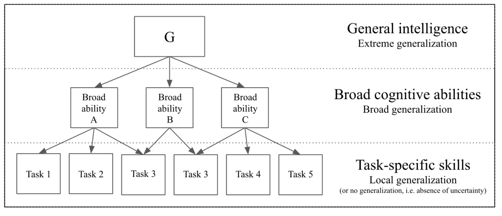

Эволюция заключается в бесконечном развитии, open
endedness^[<https://www.oreilly.com/ideas/open-endedness-the-last-grand-challenge-youve-never-heard-of>],
в выходящем на множество различных масштабов вещества и масштабов
времени непрерывном
познании^[<https://www.pnas.org/doi/10.1073/pnas.2120037119>].
Эволюция глубоко физична, по мере эволюции растёт сложность
эволюционирующих
систем^[<https://www.pnas.org/doi/10.1073/pnas.1807890115>]
и появляется всё более и более сильный интеллект.

Умность/интеллектуальность появляется в ходе эволюции как раз как
средство для ускорения бесконечного развития, для бесконечного прироста
видов мастерства агентов (животных, людей, а дальше технических систем и
гибридных коллективов из людей и оборудования, включая датацентры с AI),
бесконечного прироста в классах проблем, которые научилось решать
человечество как коллективный агент. Интеллект невозможные ранее задачи
(типа полёт по орбите в космосе вокруг Земли или общение по видеосвязи)
превращает во вполне решаемые.

Проекты, где требовались наборы старых навыков и умений большинства
людей, старое мастерство, стремительно теряют актуальность --- к ним
прилетают «сбоку» (из других отраслей) подрывные технологии, и эти
проекты заканчиваются. Телеграф вдруг исчезает, и людям с мастерством
телеграфиста нужно вписываться в новые проекты, отращивать себе новое
современное мастерство --- самое разное, часто никак с телеграфом не
связанное. **В этот момент никакой интеллект им не будет лишним, ибо
сила интеллекта определяет скорость обучения новому мастерству. Если
интеллект низкий, то к моменту достижения нужного уровня мастерства
нужда в этом виде деятельности может отпасть. Если интеллект у человека
высокий, то обучение новой деятельности пройдёт быстро, и останется ещё
время это мастерство использовать (а потом всё равно нужда в этом виде
деятельности отпадёт).**

Интеллект тем самым проявляется на задачах, которые не встречались в
момент его создания --- неизвестны ни самому интеллекту, ни создателю
или этого интеллекта (если речь идёт об аппаратуре --- мозге людей или
программно-аппаратном комплексе AI), ни учителю этого интеллекта (если
речь идёт о предобучении аппаратуры --- и людей, и AI). Родители не
знают, с какими проблемами в ходе бесконечного развития столкнётся их
ребёнок, учителя не знают, с какими проблемами столкнётся их ученик,
разработчики робота не знает, с какими проблемами столкнётся их робот.

Замерять решение человеком или компьютером (или многими людьми со
многими компьютерами) задач какого-то одного узкого класса, чтобы
определить силу их интеллекта --- неправильно. Нужно замерять
способности (broad abilities) к освоению новых предметных областей, то
есть скорость приобретения мастерства/skills в решении проблем в этих
предметных областях.

Беря за основу вот эту диаграмму, François Chollet предлагает определять
следующие **уровни интеллекта по линии универсальности проблем/задач,
которые он может научиться решать**:

-   **полное отсутствие интеллекта**: точно заданные образцы задачи.
    Заполнение точно известной компьютерной формы значениями, которые
    берутся из точно известных мест. Переноска заготовок от одного
    определённого станка к другому определённому станку.
-   **локальная генерализация** aka robustness: обработка точки в
    более-менее плотно заданном вероятностном распределении задач ---
    adaptation to known unknowns within a single task or well-defined
    set of tasks. Заполнение анкет разной формы (все возможные формы
    анкет известны заранее). Переноска заготовок между разными станками
    (между какими --- известно заранее). Это подмастерье.
-   **широкая генерализация** aka flexibility: разработчик/учитель этого
    не предвидел, решение широкого класса задач --- adaptation to
    unknown unknowns across a broad category of related tasks.
    Заполнение анкет как таковое, самых разных форм и содержания.
    Переноска заготовок между всевозможными станками, и не только
    станками, по потребности. Это мастер, он сориентируется по
    обстоятельствам.
-   **экстремальная** **генерализация** aka generality: как у
    человека --- adaptation to unknown unknowns across an unknown range
    of tasks and domains. Умею заполнять анкеты, переносить заготовки.
    Вдруг потребовалось управлять синхрофазотроном --- это не «задача»,
    это уже проблема! Попотел, но смог научиться. Это талантливый
    человек, «интеллектуал» (у него сильный интеллект, если научился
    быстро! Или не очень сильный, если научился, но медленно).
-   **универсальность**: генерализация на уровне большем, чем
    человек --- any task that could be practically tackled within our
    universe. Во вселенной есть много проблем, которые человеку и в
    голову не придут, он с ними не столкнётся. Но интеллект уровня выше
    человеческого сможет научиться решать и эти задачи, сможет
    выработать нужные для этого знания, умения, навыки, скиллы,
    мастерство. Это люди со всеми их компьютерами, а потом сверхлюди (мы
    не знаем, как люди смогут модифицировать себя, когда они решат
    текущие проблемы биологического старения и смерти, ограничений в
    биологическом восприятии текущих органов чувств, ограничений в
    ловкости и силе текущего человеческого тела).

Машинный/искусственный/компьютерный интеллект сегодня в целом решает
задачи локальой генерализации/robustness, то есть разбирается в узких
предметных областях. Это огромный прорыв по сравнению с тупым роботом,
выполняющим заданные операции в заданной последовательности только с
определёнными предметами, и даже не классами этих предметов.

Chollet (и ещё множество лидеров AI) призывает решать проблемы,
появляющиеся при широкой генерализации/flexibility.

Примерно это же имеют в виду люди, когда говорят о каком-то классе
человеческого интеллекта: эмоциональный интеллект (интеллект,
разбирающийся с самыми разными проблемами, связанными с эмоциями --- что
вы будете делать, когда вас захватывает эмоция, с которой ранее вы не
встречались?), коммуникационный интеллект (интеллект, который может
справиться с огромным разнообразием проблем, встречающихся в
коммуникации --- будь то в переговорах трёх конфликтующих групп, или
даже в разговоре с самим собой), математический интеллект (интеллект,
который способен справиться со всевозможными математическими
проблемами), и так далее. По факту, это не столько «проблемы» (которые
никто не знает, как решать), сколько задачи, которые можно успешно
решать, если использовать уже известные людям сегодня знания. Ну, и это
бытовая речь: мало что изменится, если заменить «интеллект» на
«мастерство»: эмоциональное мастерство, коммуникационное мастерство,
хотя вот математическое мастерство уже попадает в серую зону:
профессиональные математики, конечно, имеют прикладное математическое
мастерство (значительная часть выпуска университетских математиков
уходит работать в страховые компании и банки, где они занимаются
актуарными
расчётами^[[https://ru.wikipedia.org/wiki/Актуарные\_расчёты](https://ru.wikipedia.org/wiki/Актуарные_расчёты)]),
но всё-таки математики формулируют проблемы и находят новые способы их
решать, речь всё-таки идёт именно о математическом интеллекте как
решателе проблем (интеллект находит способ решения какого-то класса
задач, который непонятно как решать --- умение/мастерство решения этих
задач является результатом его работы). Так что в случае математического
интеллекта наше онтологическое чутьё подсказывает, что это всё-таки
что-то другое, чем математическое мастерство. В случае кулинарного или
эмоционального мастерства наше онтологическое чутьё молчит, мы понимаем,
что бытовой язык тут волен использовать какие угодно слова «для
красивого словца».

**AGI** (artificial general intelligence, искусственный универсальный
интеллект) --- так называют дисциплину инженерной практики создания
небиологического вычислителя для мышления. Нынешняя цель AGI --- создать
интеллект широкой генерализации/flexibility, в котором он потенциально
может выработать мастерство в решении тех же проблем, которые мог бы
научиться решать биологический человек, а не кошка или какое другое
животное. Обратите внимание на формулировку, включающую в себя
возможность относительно бесконечного развития: речь идёт не об умении
специализированного на каком-то классе задач «искусственного мастерства»
решать задачи так же, как обученный этому человек. Эта формулировка про
«такое же решение задач» не включает в себя развития. Формулировка про
«мог бы научиться решать человек» включает в себя бесконечное развитие,
есть ещё множество проблем, которые люди ещё не научились решать, и о
которых, возможно, ещё они не знают --- но можно ожидать, что они это
делать научатся (с помощью компьютеров, или без них).

Насколько это развитие бесконечно? Понятно, что человек сам по себе
может научиться решать только конечное число классов задач. Но вместе с
AI он может изменить и свою биологическую природу, и техническую природу
AI (скажем, сегодня ожидается резкий скачок в скорости вычислений при
переходе к универсальным алгоритмам на квантовых компьютерах). Плюс
учиться решать задачи может человек не только в одиночку, но и целой
группой, а хоть и целым человечеством --- наука и производство сегодня
глобальны, в них участвуют люди по всей планете плюс огромное количество
оборудования/аппаратуры и компьютеров.

Статья о бозоне Хиггса вышла с 5154
авторами^[<https://www.nature.com/news/physics-paper-sets-record-with-more-than-5-000-authors-1.17567>],
столько людей приняло участие в решении этой задачи. Статьи, в которых
расшифровывается геном каких-то организмов, у биологов выходят с числом
авторов больше тысячи. Интеллект как свойство научиться что-то делать
новое/решать новые классы/виды задач существует не только у отдельных
людей, но и у каких-то коллективов, в том числе включающих в себя людей
и компьютеры, в том числе и у всей цивилизации в целом вместе со всем
возможным оборудованием. Да, если брать все вычисления человечества, то
можно говорить о совокупном интеллекте человечества! Интернет позволяет
легко собрать вычислительные мощности и людей, и компьютеров, а потом
после решения проблемы предоставить результаты огромному числу других
людей и компьютеров, вновь найденное мастерство быстро распространится
по планете.

**Цель всей деятельности по усилению интеллекта как людей, так и
машин ---** **создать** **сверхчеловеческий универсальный**
**интеллект** **за пределами человеческой** **экстремальной
силы/универсальности/генерализации/generality.** Такой интеллект сможет
решить те классы задач, которые человечество пока не научилось решать.
**Такой интеллект экстремальной силы/универсальности не только сможет
помочь людям стать биологически бессмертными, наладить межпланетные и
межзвёздные путешествия (это задачи, которые нам могут прийти в голову
прямо сейчас), но и в рамках бесконечного развития сможет поставить
интересные проблемы, чтобы их решать и тем самым продолжить эволюцию за
пределы чисто человеческой мечты.** Особо обратим тут внимание, что
универсальный машинный интеллект тут не представляется обязательно
антропоморфным/парохиальным/земным, также не предполагается «видовое
противостояние» между «биологическим видом человека» и «технологическим
видом AGI». Нет, мы считаем, что люди друг с другом, а теперь и с
компьютерами живут в симбиозе. Но оставим эти рассуждения философам.

Конечно, как любая сложная система (помним, что интеллект мы
рассматриваем как мастерство познания в незнакомой ситуации) интеллект
имеет ещё множество других характеристик кроме общности. Из наиболее
интересных тут являются характеристики вменяемости/persuadability как
мера изменений, нужная для рационального изменения поведения
системы^[<https://www.frontiersin.org/articles/10.3389/fnsys.2022.768201/full>].
Невменяемые часы придётся переделать, кошку можно надрессировать, а
людям (и вот сейчас AI) можно что-то сказать --- и они изменят
поведение. Дальше по этой линии идёт обсуждение prompt
engineering^[<https://en.wikipedia.org/wiki/Prompt_engineering>]
и даже нейролингвистического программирования/neuro-linguistic
programming^[<https://anlp.org/knowledge-base/definition-of-nlp>]
(при этом обращение нейролингвистического программирования к
«бессознательному» сегодня считают просто учётом характера человеческой
нейросети, распознающей какие-то паттерны и реагирующей на эти
паттерны).
