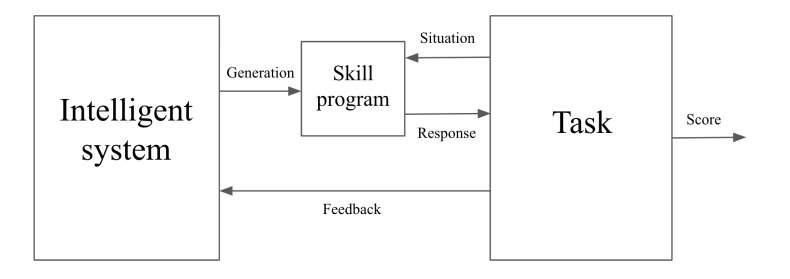

Основные отличия человеческого интеллекта от машинного интеллекта
представлялись ещё несколько лет назад ровно в степени его
общности/универсальности/generality, поэтому отсылка к интеллекту,
который «такой же умный и вменяемый, как человек» обозначалась как
artificial general intelligence. Сначала считалось, что general --- это
примерно «умный как человек-школьник». Поэтом незаметно стало считаться,
что это «умный как средний человек», потом --- «умный как средний
профессор», потом --- «умнее человека». После чего оказалось, что
технология больших языковых моделей даёт достаточную степень общности в
предметных областях (но не в типах решаемых проблем!), чтобы вот это AGI
превратилось в просто AI как указание на «машинное происхождение».
Заодно оказалось, что AI при помощи технологии больших языковых
моделей^[<https://en.wikipedia.org/wiki/Large_language_model>]
не учится действовать в мире как Маугли, взаимодействуя с теми объектами
окружающего мира, что случайно встретятся в природе. Нет, познание мира
большими языковыми моделями проходит так же, как у людей: их «насильно
встречают» с описаниями самых разных частей мира, имеющихся в текстах.
Грубо говоря, большие языковые модели учатся так же, как и люди --- «в
школе, в университете, читая книжки». Люди и AI для получения своего
интеллекта «с нуля» знакомятся с огромным объёмом книжного знания, а не
просто ощупывают и осматривают окружающий мир. Разница только в том, что
AI знакомится с огромным объёмом текста «по всем наукам», а человек
знакомится с небольшим объёмом текста по избранным предметам, а потом
добирает специализации в конкретной предметной области уже после вуза и
школы.

Мы хотим специально организованным предобучением примерно бакалаврского
уровня усиливать человеческий интеллект, повышая степень его широкой
универсальности/генерализации/flexibility, хотя это на ступеньку меньше,
чем «теоретическая» человеческая экстремальная универсальность.

При этом мы не будем забывать о ходе на универсальность через симбиоз
человека с компьютерами, то есть ходе на киборгизацию, включение
экзокортекса. Скажем, человек обладает биологически плохой памятью и в
силу этого сниженным интеллектом --- но ведение дневника даже на бумаге
и тем более в компьютере поможет помнить много и неограниченно долго.
Библиотека с полнотекстовой поисковой системой ещё лучше решает проблему
с памятью. Человек медленно умножает десятизначные числа ---
инструмент-калькулятор ему в этом поможет, а программируемый калькулятор
как внешний вычислитель (инструмент!) и подавно. Человек с книгой и
калькулятором сможет научиться решать задачи, требующие памяти и
вычислений быстрее, чем человек без книги и калькулятора. Человек с
книгой и калькулятором тем самым будет умнее человека без книги и
калькулятора. А человек с современным даже не компьютером, а
дата-центром умнее, чем человек с книгой и калькулятором. А группа людей
со множеством дата-центров вообще оказывается умнее всех одиночек с
компьютерами. Вы поняли идею: мы не верим в усиление чисто человеческого
интеллекта, поэтому предобучать будем сразу людей с их компьютерными
экзокортексами. Отдельный вопрос, что тут происходит с вменяемостью:
если группе людей дать много разных инструментов (например,
баллистических ракет с ядерными боеголовками), то вероятность того, что
вы рационально уговорите их изменить своё поведение, неожиданно может
снизиться, а не увеличиться.

Chollet даёт вот такую диаграмму, определяющую интеллект:

По этой функциональной диаграмме интеллект/интеллектуальная система
создаёт умение что-то делать как отдельное
мастерство/умение/прикладное\_знание/«программу скилла», и уже это
мастерство/умение решает каждую отдельную задачу, потихоньку превращаясь
в нетрудный для выполнения навык («автоматизируясь» через большое число
повторений, уходя в бессознательное и освобождая ресурс внимания).
Интеллект --- это вычислитель со способностью выработать
мастерство/умение, переходящее постепенно в навык, то есть исполняющееся
без сознательного к нему внимания. **Не можешь чему-то научиться за
приемлемое время ---** **это тебе не хватает интеллекта, какого-то
входящего в состав интеллекта мыслительного мастерства!**

Котёнок может быть очень умным для котёнка, но не способным научиться
играть на рояле. Поэтому у котёнка мы считаем интеллект слабым по
сравнению с человеком (но сильным по сравнению с рыбой). Если человек
оказывается неспособным научиться играть на рояле, неспособным научиться
математике, неспособным научиться операционному менеджменту, и так далее
по всем видам задач --- мы его не будем считать очень умным, откажем ему
в интеллекте. Люди-мнемоники в цирке умеют в уме умножать десятизначные
цифры, в этом они не хуже калькулятора. Или помнить бессмысленный
длинный текст, не хуже книжки. Мы их не считаем особо умными, если они
не демонстрируют, что они могут выучиться чему-то ещё. Калькулятор или
книжку мы не ценим за их интеллекты.

**Если человек постоянно демонстрирует способность освоить какую-то
новую предметную область** **(универсальность! Сила интеллекта в его
универсальности: скорости освоения самых разных новых задач!), поднимая
и поднимая сложность решаемых им** **проблем, мы говорим, что у этого
человека сильный интеллект. Если человек научился решать** **один класс
задач, но не в состоянии выучиться чему-нибудь ещё, интеллект его будет
считаться** **слабым (неуниверсальным! Малая скорость освоения нового,
времени на новое требуется столько, что жизни не хватает!) ---**
**независимо от того, насколько сложны те немногие задачи, которым этот
человек смог научиться. Этот человек может считаться уникумом, артистом
цирка, рекордсменом Гиннеса ---** **но не обладателем сильного
интеллекта.**

Интеллект связан с универсальностью в части классов решаемых задач и
скоростью обучения их решать, а также с вменяемостью как способностью
изменять своё поведение рациональным образом на основе получения
информации из текста (речи, книги, выдачи компьютера). **Единственный
способ подтвердить интеллект ---** **это демонстрировать, что ты
научаешься решать всё более и более сложные** **новые проблемы, а также
внимаешь рациональным аргументам для изменения своего поведения.**
**Например, научиться арифметике, потом высшей математике, потом
инженерным вычислениям, потом вычислениям универсальных алгоритмов, и
так далее --- до бесконечности усложняя и меняя виды проблем, классы
задач** **и исправляя ошибки, если на них тебе указывают. Если ты просто
демонстрируешь решение** **одного класса** **задач, вновь и вновь решая
арифметические задачи** **и не двигаясь дальше,** **не исправляя ошибки
и не реагируя на аргументы,** **то интеллект** **не будет**
**задействован, он так и будет считаться слабым, «достаточным только для
арифметики»** **и «механическим в своих проявлениях» по линии
вменяемости.**
