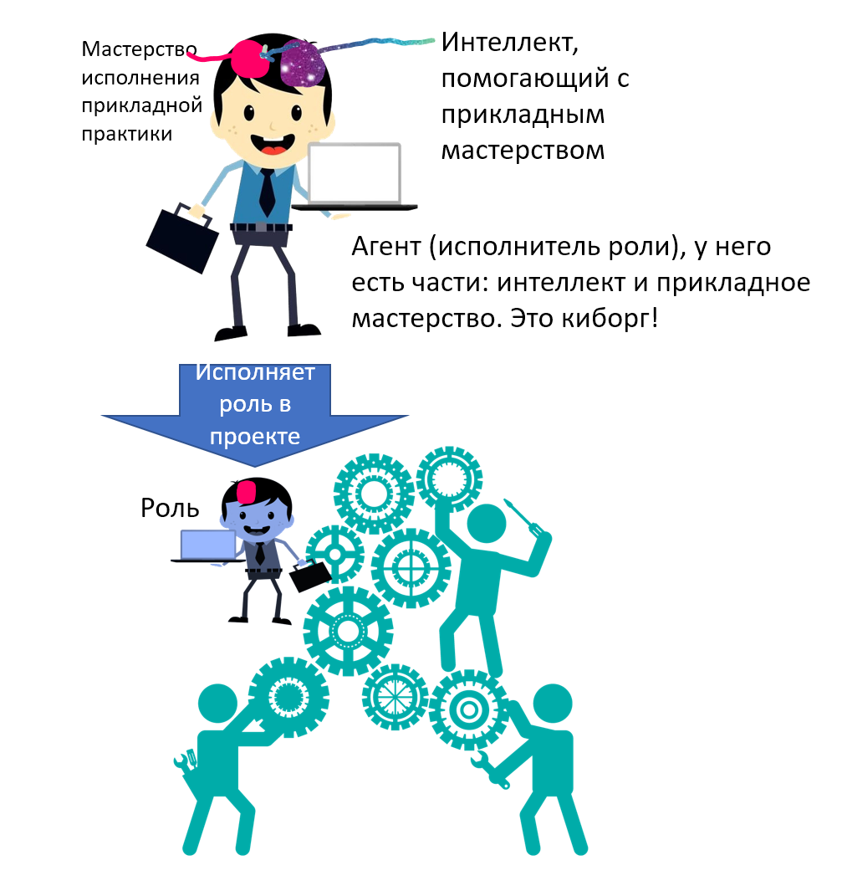

Занимаясь парой-тройкой прикладных практик, умнее не станешь, интеллект
не разовьёшь. Для усиления интеллекта надо заниматься трансдисциплинами:
сначала просто освоить лучшие их версии, известные на сегодняшний день,
а потом пытаться решать проблемы создания новых версий трансдисциплин
интеллект-стека, которые будут лучше сегодняшних (то есть заниматься
мышлением по поводу самого мышления).

Трансдисциплины могут быть неосознаваемые «народные», «самопальные»
(«здравый смысл», а не математическая логика), или наоборот --- хорошо
осознаваемые лучшие известные на данный момент человечеству, SoTA. Много
ли таких SoTA трансдисциплин вы изучали в школе, бакалавриате,
магистратуре традиционной государственной системы образования? Можно
поспорить, что ничтожное количество. Вот физкультура там была предметом,
который понятным образом влияет на качество последующей жизни: здоровое
тело может долго поддерживать ясность внимания, меньше уставать за
полный рабочий день. Но даже физкультура (главным образом командные
игры: баскетбол, волейбол, и немного лёгкая атлетика) не подавалась для
этих целей. А для чего? А непонятно для чего! Для сдачи норм ГТО («готов
к труду и обороне»), рудимент эпохи примата физического труда и
милитаристской организации общества.

Большинство других предметов имели более чем прикладное значение (даже
физика и математика!), сегодня их знание не помогает ориентироваться в
непрерывно меняющейся жизни, не используется никак. Когда вы в последний
раз задействовали знание различия дифракции и интерференции из курса
оптики или закона Кирхгофа из раздела «Электричество» школьного курса
физики? Сходу можете сказать, чем отличается момент инерции и импульс? А
это вы всё учили как «базовые знания, которые пригодятся в жизни»! Ну
что, пригодились ли в жизни, или пригодились только при сдаче экзамена и
при изучении вузовского курса физики, который так же в жизни никак не
пригодился? А учили ли вас логике как искусству правильных рассуждений,
и если таки случайно учили, то сколько времени от времени всей школьной
и вузовской программы? И какой версии логики вас учили? Аристотелевская
логика ведь давно была «уволена» примерно так же, как была уволена
теория флогистона и алхимия: она плохо работала! Нашлись варианты логики
получше, state-of-the-art.

Прошивку интеллекта, полученную «исподволь» (не прямым обучением
трансдисциплинам, а путём накопления более-менее случайного опыта при
изучении каких-то прикладных дисциплин) в традиционном образовании,
нужно менять на современную текущего года, нацеленную на будущую жизнь в
условиях полной рабочей неопределённости. Помним, что интеллект работает
в условиях, о которых не догадывается ни ученик, ни его учитель.

Вспомним игровую метафору. Мышление как работа интеллекта нужно, чтобы
научиться играть разные проектные роли в проектах, как в ролевых играх.
Мастерство в каких трансдисциплинах, исполнение каких ролей даст нам
мастерство в мышлении, то есть мастерство справляться со всё новыми и
новыми ситуациями, с новыми и новыми задачами? Ведь каждый раз, когда
нам нужно зайти в проект, интеллект должен выбрать подходящее
мастерство, сориентировать агента на занятие роли, далее следить, чтобы
не было проблем. То есть мы видим агента-киборга внутри проекта в
какой-то роли

Мыслительные практики (практики, которые исполняет интеллект) тоже имеют
названия ролей, которые занимает агент, чей интеллект выполняет эти
практики. И эти практики работают с какими-то функциональными объектами:
суть практики в том, чтобы выделять вниманием из пёстрого и мелькающего
окружающего и виртуального/ментального/абстрактного миров объекты и
проводить с ними какие-то рассуждения по правилам.

+-----------------------+-----------------------+-----------------------+
| **Практика** **(по    | **Роль **             | ** Некоторые**        |
| имени                 |                       | **функциональные      |
| трансдисциплины)**    |                       | объекты практики**    |
+-----------------------+-----------------------+-----------------------+
| **Системная           | Инженер               | **Практики и их роли: |
| инженерия**           |                       | разработки,           |
|                       |                       | архитектуры,**        |
|                       |                       | **DevOps/platform**   |
|                       |                       | **engineering.        |
|                       |                       | Концепция             |
|                       |                       | использования,        |
|                       |                       | концепция системы,    |
|                       |                       | архитектура и         |
|                       |                       | модульность,          |
|                       |                       | инженерные            |
|                       |                       | обоснования и         |
|                       |                       | прохождение развилок, |
|                       |                       | постоянный ввод в     |
|                       |                       | эксплуатацию. Мемом и |
|                       |                       | феном в               |
|                       |                       | техно-эволюции.       |
|                       |                       | Архитектурные идеи    |
|                       |                       | Дойля.**              |
+-----------------------+-----------------------+-----------------------+
| **Методология**       | Методолог             | **Практика/деятельнос |
|                       |                       | ть/рабочий            |
|                       |                       | процесс               |
|                       |                       | создателя/труд,       |
|                       |                       | роль/функция          |
|                       |                       | агента-создателя,     |
|                       |                       | жизненный цикл** и    |
|                       |                       | бесконечное           |
|                       |                       | развитие**. Агент,**  |
|                       |                       | прагматизм (цели и    |
|                       |                       | средства), блага,     |
|                       |                       | стратегия,            |
|                       |                       | альтернатива,         |
|                       |                       | предпочтение, (в том  |
|                       |                       | числе рациональный)   |
|                       |                       | выбор, ресурс,        |
|                       |                       | субъективная          |
|                       |                       | полезность, убывающая |
|                       |                       | предельная полезность |
|                       |                       | ресурса,              |
|                       |                       | отрицательная         |
|                       |                       | полезность работы,    |
|                       |                       | межвременные          |
|                       |                       | предпочтения,         |
|                       |                       | альтернативные        |
|                       |                       | издержки, предельные  |
|                       |                       | издержки,             |
|                       |                       | маржинальный выбор.   |
+-----------------------+-----------------------+-----------------------+
| **Риторика**          | Ритор                 | Убедительное          |
|                       |                       | объяснение, модель    |
|                       |                       | знаний, эмоций и др.  |
|                       |                       | агента, понятийное    |
|                       |                       | расстояние,           |
|                       |                       | нарративизация        |
+-----------------------+-----------------------+-----------------------+
| **Этика**             | Совесть               | Этические принципы,   |
|                       |                       | оценка целей, оценка  |
|                       |                       | средств. **Чья этика  |
|                       |                       | (проблема индивида и  |
|                       |                       | конфликты системных   |
|                       |                       | уровней).**           |
+-----------------------+-----------------------+-----------------------+
| **Эстетика**          | Эстет                 | Красота, элегантность |
+-----------------------+-----------------------+-----------------------+
| **Познание**          | Исследователь         | Недообъяснённый       |
|                       |                       | участок мира          |
|                       |                       | (проблема), догадка,  |
|                       |                       | критический           |
|                       |                       | рационализм           |
|                       |                       | (опровергаемость без  |
|                       |                       | доказательств),       |
|                       |                       | дополнения Дойча:     |
|                       |                       | трудноварьируемость   |
|                       |                       | объяснения,           |
|                       |                       | универсальность,      |
|                       |                       | компактность,         |
|                       |                       | оптимизм,             |
|                       |                       | бесконечность         |
|                       |                       | познания, структура   |
|                       |                       | реальности            |
|                       |                       | (фундаментальные      |
|                       |                       | объяснительные        |
|                       |                       | теории). Творчество и |
|                       |                       | новизна. Свобода      |
|                       |                       | критики как условие   |
|                       |                       | познания. Явления     |
|                       |                       | типа социального      |
|                       |                       | лазинга и меметика в  |
|                       |                       | целом.                |
+-----------------------+-----------------------+-----------------------+
| **Рациональность**    | Разум                 | Описания мира         |
|                       |                       | (модели) и            |
|                       |                       | рациональность против |
|                       |                       | эмпирицизма (в том    |
|                       |                       | числе дискуссия про   |
|                       |                       | достаточность RL и    |
|                       |                       | эволюцию с free       |
|                       |                       | energy как отсутствие |
|                       |                       | глобального           |
|                       |                       | "подкрепления",       |
|                       |                       | функции наград        |
|                       |                       | временные и           |
|                       |                       | познаются/выучиваются |
|                       |                       | ).                    |
|                       |                       | Теория решений как    |
|                       |                       | выбор из альтернатив: |
|                       |                       | causal quantum-like   |
|                       |                       | active inference      |
|                       |                       | (excess Bayesian      |
|                       |                       | inference). Три       |
|                       |                       | уровня лестницы       |
|                       |                       | понимания/объяснения/ |
|                       |                       | причинности           |
|                       |                       | (ассоциации, "если    |
|                       |                       | это, то что" ---      |
|                       |                       | интервенции, "если бы |
|                       |                       | не" --- возможные     |
|                       |                       | миры и                |
|                       |                       | контрфактуалы).       |
|                       |                       | Действие как реакция  |
|                       |                       | на изменения в        |
|                       |                       | окружении             |
|                       |                       | (active/embodied, а   |
|                       |                       | не любой inference).  |
+-----------------------+-----------------------+-----------------------+
| **Логика**            | Логик                 | Рассуждение по        |
|                       |                       | правилам (с заданными |
|                       |                       | типами по заданным    |
|                       |                       | алгоритмам), правила  |
|                       |                       | рассуждений (булевых, |
|                       |                       | байесовских,          |
|                       |                       | квантовоподобных),    |
|                       |                       | аргументы, ошибки в   |
|                       |                       | рассуждениях и        |
|                       |                       | отношение к ним («а   |
|                       |                       | чо такова?»).         |
|                       |                       | Формальная            |
|                       |                       | несовместимость       |
|                       |                       | разных онтологий,     |
|                       |                       | микротеории/онтики.   |
+-----------------------+-----------------------+-----------------------+
| **Алгоритмика**       | Алгоритмист           | Вычисления (включая   |
|                       |                       | понятие inference и   |
|                       |                       | update) и             |
|                       |                       | вычислимость          |
|                       |                       | теоретическая и       |
|                       |                       | практическая,         |
|                       |                       | интеллект, физичность |
|                       |                       | и универсальность     |
|                       |                       | вычислителей (включая |
|                       |                       | универсальный         |
|                       |                       | аппроксиматор ---     |
|                       |                       | нейросеть), сложность |
|                       |                       | вычисления,           |
|                       |                       | алгоритмы, способы    |
|                       |                       | описания              |
|                       |                       | вычислений/алгоритмов |
|                       |                       | (парадигмы            |
|                       |                       | программирования,     |
|                       |                       | включая вероятностное |
|                       |                       | и квантовое). No free |
|                       |                       | lunch theorem,        |
|                       |                       | проблема равенства P  |
|                       |                       | и NP.                 |
+-----------------------+-----------------------+-----------------------+
| **Онтология**         | Онтолог               | **абстрагирование/мод |
|                       |                       | елирование            |
|                       |                       | и                     |
|                       |                       | рендеринг/конкретизац |
|                       |                       | ия/демоделирование,   |
|                       |                       | уровни абстракции:    |
|                       |                       | метамоделирование     |
|                       |                       | (foundational, upper, |
|                       |                       | middle, work and      |
|                       |                       | operational ontology  |
|                       |                       | как M4-M0).**         |
|                       |                       | Вероятностность в     |
|                       |                       | различении типов.     |
+-----------------------+-----------------------+-----------------------+
| **Теория понятий**    | Типолог               | **типы, классы,       |
|                       |                       | отношения композиции, |
|                       |                       | отношения             |
|                       |                       | классификации,        |
|                       |                       | отношения             |
|                       |                       | специализации,        |
|                       |                       | отношение             |
|                       |                       | передачи/изготовления |
|                       |                       | (кто что кому даёт:   |
|                       |                       | трёхместное).**       |
+-----------------------+-----------------------+-----------------------+
| **Физика**            | Физик                 | **Физический реализм, |
|                       |                       | безмасштабность.**    |
|                       |                       | Термодинамика         |
|                       |                       | (действие, энергия,   |
|                       |                       | свободная энергия,    |
|                       |                       | фазовое               |
|                       |                       | пространство), теория |
|                       |                       | информации (в том     |
|                       |                       | числе суперинформации |
|                       |                       | и в том числе         |
|                       |                       | "неизменности         |
|                       |                       | репликации", в том    |
|                       |                       | числе                 |
|                       |                       | термодинамическая     |
|                       |                       | семантика),           |
|                       |                       | физические принципы и |
|                       |                       | законы. Квантовость,  |
|                       |                       | эргодичность.         |
|                       |                       | Стохастика:           |
|                       |                       | **эмерджентность и    |
|                       |                       | фрустрации,**         |
|                       |                       | ренормализация.       |
|                       |                       | Негэнтропия,          |
|                       |                       | **эволюция как        |
|                       |                       | обучение и цель жизни |
|                       |                       | (плюс центральная     |
|                       |                       | догма молекулярной    |
|                       |                       | биологии).**          |
|                       |                       | **Создатель           |
|                       |                       | (constructor theory)  |
|                       |                       | и введение объектов   |
|                       |                       | стека создания.**     |
+-----------------------+-----------------------+-----------------------+
| **Математика**        | Математик             | Множество, аксиома,   |
|                       |                       | алгебра/исчисление,   |
|                       |                       | пространство, поле,   |
|                       |                       | счётная и несчётная   |
|                       |                       | бесконечность.        |
|                       |                       | Субъективная теория   |
|                       |                       | вероятности           |
|                       |                       | (нефизичность         |
|                       |                       | вероятности),         |
|                       |                       | колмогоровская и      |
|                       |                       | неколмогоровская      |
|                       |                       | вероятности,          |
|                       |                       | категория.            |
+-----------------------+-----------------------+-----------------------+
| **Семантика**         | Семантик              | **Объекты, отношения, |
|                       |                       | имена, язык,          |
|                       |                       | значения, физичность  |
|                       |                       | всего происходящего,  |
|                       |                       | описание, отношение   |
|                       |                       | репрезентации,        |
|                       |                       | математический        |
|                       |                       | объект,               |
|                       |                       | математическая        |
|                       |                       | операция, уровень     |
|                       |                       | формальности          |
|                       |                       | (строгость            |
|                       |                       | типизации)** и        |
|                       |                       | понятие               |
|                       |                       | "доказательства".     |
+-----------------------+-----------------------+-----------------------+
| **Собранность**       | Собранный (киборг!)   | Собранность/self-coll |
|                       |                       | ectedness,            |
|                       |                       | cознание как mind     |
|                       |                       | control, **внимание,  |
|                       |                       | экзокортекс, тело и   |
|                       |                       | сома,** ловкость/body |
|                       |                       | control.              |
|                       |                       | Безмасштабность       |
|                       |                       | собранности,          |
|                       |                       | **понятийное          |
|                       |                       | наведение и удержание |
|                       |                       | внимания.**           |
+-----------------------+-----------------------+-----------------------+
| **Понятизация**       | Поэт                  | Фон, прототип,        |
|                       |                       | образец,              |
|                       |                       | паттерн/фигура        |
|                       |                       | (свойства: похожесть, |
|                       |                       | вероятность отнесения |
|                       |                       | к категории и т д),   |
|                       |                       | ритм/последовательнос |
|                       |                       | ть,                   |
|                       |                       | стиль, модальность    |
|                       |                       | восприятия,           |
|                       |                       | **неудовлетворенность |
|                       |                       | /проблема.**          |
|                       |                       | Мир и «я», деятельное |
|                       |                       | «ощупывание».         |
+-----------------------+-----------------------+-----------------------+

Конечно, трансдисциплины интеллект-стека в любой его версии представляют
собой плотно сплетённую сеть («клубок») объяснений, в которых они тянут
какие-то тематические нити, плотно спутанные между собой. Примерно так
об этом говорит Дэвид Дойч в книге «Структура реальности», он там
выделяет четыре объяснительные нити, которые он считает самыми важными
как лежащие в основе всех других объяснений, да ещё и переплетёнными
так, что объяснения каждой из них невозможны без объяснений других
нитей:

-   Квантовая физика. Дойч считает, что фронтир тут --- в интерпретации
    многих миров Эверетта.
-   Эволюционная эпистемология и критический рационализм Поппера
-   Вычисления и универсальный компьютер Тьюринга
-   Меметика и эволюция мемов Докинза

В наш вариант интеллект-стека всё это вошло, но мы не просто перечисляем
какие-то объяснения. Мы, как и Дойч, говорим, что эти объяснения дают
возможность бесконечного познания, в том числе бесконечного усиления
интеллекта, но мы ещё и говорим, что этим объяснениям надо
целенаправленно учить и людей, и AI. Поэтому у нас есть задача
нарративизации, то есть последовательного изложения этого клубка идей в
развёрнутом тексте учебных курсов. Мы весьма условно растягиваем клубок
объяснений разных трансдисциплин на отдельные части и располагаем их
весьма условно в виде стека. Мы просто очень грубо оценили, что
трансдисциплины/объяснения верхних уровней стека используют
трансдисциплины/объяснения более низких уровней больше, чем наоборот
(помним, что это плотно перепутанная сеть объяснений!).

Мыслительное мастерство поэтому нельзя приобрести, если просто «выучить
всё снизу вверх». Нет, поскольку там клубок, то для того, чтобы
последовательное изложение трансдисциплин как-то собралось в голове в
связную картину мира, потребуется специальная организация учебного
курса. Упоминание понятий, которые ещё не объяснены, неизбежно --- и
поэтому либо потребуется дважды проходить короткую последовательность
курсов, чтобы откорректировать на втором проходе непонимание первого
прохода, или иметь длинную якобы «однократную» версию с неизбежными
повторами.

**Жизненное мастерство** агента в целом как мастерство отличной жизни (в
том числе жизни компании! **Жизнь ---** **это просто поведение агента в
ходе его существования**), включает:

-   непрерывно развиваемое **прикладное мастерство** («компетенции» для
    рынка, в том числе для рынка труда, если речь идёт о людях, чтобы
    мочь получать ресурсы для жизни), и
-   **мыслительное мастерство/интеллект**, как врождённый (который не
    надо учить, доступный в момент создания агента), так и познанный.
    Если речь идёт о человеке, то это получаемый от родителей (гены
    врождённого интеллекта) и в его научаемой части в детском саду,
    школе, бакалавриате, в семье, в кружках, самообразованием. **Мы
    считаем, что это владение трансдисциплинами из интеллект-стека на
    некотором уровне беглости, причём и личное владение, и командное
    владение, в том числе с учётом доступа к** **AI** **и интернету.**

План действий по приобретению жизненного мастерства (очень условно, но
речь идёт и о людях, и о компьютерных AI, и даже о фирмах с их гибридным
коллективным интеллектом, это рассуждение общее для агентов любой
природы):

1.  Сначала нужно обучиться сильному мышлению, то есть поднять силу
    своего интеллекта, стать умным (если это фирма, то нанять умную
    команду и AI поумней, или нанять любую команду, но затем дать ей
    фундаментальное образование).
2.  Затем нужно научиться каким-то прикладным практикам, за выполнение
    которых будут платить деньги в проектах. Прикладные практики дадут
    деньги, на которые можно будет продолжать что-то делать. Что делать?
    Избегать неприятных сюрпризов, в том числе на уровне человечества в
    целом (скажем, принимать участие в организации политической жизни
    без войн, добиться решения проблемы биологического бессмертия,
    решить проблему ядерного синтеза для получения больших количеств
    энергии, космического расселения для предотвращения рисков
    столкновения цивилизации с астероидами, и т.д.).

Выбор того, в какое мыслительное или прикладное мастерство в каких
количествах инвестировать своё учебное время, делается практикой
стратегирования (она описана в курсе «Системный менеджмент», это
практика общая для стратегирования агента-личности и агента-фирмы).

**За силу интеллекта (мастерство в мышлении, мыслительное мастерство) не
платят, платят за** **приложение** **прикладного мастерства, которое с
интеллектом связано только тем, что сильный интеллект позволяет его
приобрести много быстрее.** Прикладное мастерство придётся менять
довольно часто, ибо практики устаревают. Нельзя ожидать ни от людей, ни
от компьютеров, ни даже от фирм, что выучился какой-то профессии --- и
это на всю жизнь. Нет, новым прикладным практикам надо учиться всю
жизнь, а для этого нужен сильный интеллект.

Если бросить все силы только на получение прикладного мастерства, чтобы
стать в нём лучшим в мире, и проигнорировать фундаментальное образование
(то есть дисциплины интеллект-стека), то жизнь в целом лучше не станет:
менять проекты (оказываться в новой предметной и организационной
ситуации), и в связи с этой сменой проектов прикладное мастерство
(исполняемую в проекте основную роль) придётся довольно часто, ибо мир
не стоит на месте, так что быть прикладным мастером без мастерства в
мышлении (то есть без сильного интеллекта) не получится. У глупых людей
(людей с низким интеллектом) возможности в жизни сильно ограничены,
равно как и у глупых фирм!

Ситуация осложняется тем, что практики интеллект-стека тоже довольно
быстро меняются, прогресс не стоит на месте. Но ситуация облегчается
тем, что можно чередовать образование по фундаментальным и прикладным
практикам, делать «блинчатый пирог» в своём образовании. Но в любом
случае, надо делать это образование непрерывным, заниматься им всю
жизнь, развиваться, приобретая новые «фичи», то есть научаясь выполнять
всё новые и новые практики. Это относится к людям, к AI, к коллективам
людей и AI (организациям), сообществам, человечеству в целом.

Так что получаем сначала мастерство в мышлении (сильный интеллект на
базе освоения практик интеллект-стека), а затем используем его по
прямому назначению: разбираемся во всё новых и новых проблемах (и быстро
обучаясь, если знания уже где-то есть, или самостоятельно проводя
исследования, если знаний ни у кого на планете нет). Это даёт
возможность исполнять всё новые и новые роли (их жизнь будет подкидывать
с избытком), решать всё более и более трудные проблемы, причём за
деньги. **Бесконечно развиваемся при помощи интеллекта, наносим
непоправимую пользу человечеству прикладным мастерством, и нам за это
платят! Это и есть** **жизнь, задействование** **жизненного**
**мастерства!**

Интеллект, конечно, может быть использован и для усиления самого себя,
мастерством собственного мышления можно поднимать своё мастерство
мышления ещё выше. Каждый агент сам решает, сколько времени «мозговые
мышцы» качать, развивая мозг с экзокортексом в части трансдисциплин, а
сколько времени использовать текущую силу интеллекта для прикладной
работы в проектах. Хотите небольшие результаты прямо сейчас, или большие
немного погодя? Синицу в руках прямо сейчас, или журавля в руках --- но
попозже? Да, это вечный вопрос выбора между познанием и использованием
знания, exploration против exploitation, классическая проблема, не
имеющая математического
решения^[<https://journals.plos.org/plosone/article?id=10.1371/journal.pone.0095693>].
И это вопрос как для людей, так и для AI, так и для компаний.
