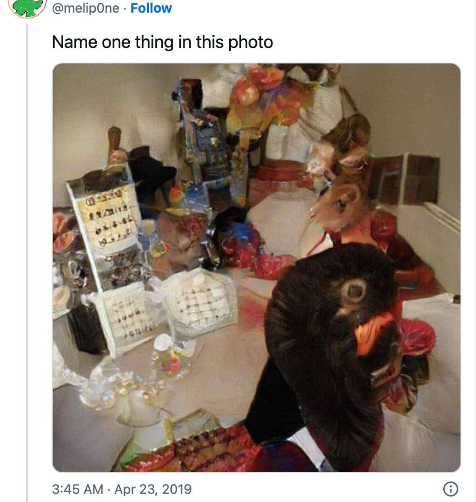
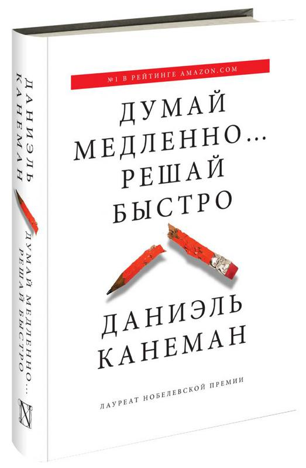

**Понятизация** --- это практика как-то находить предметы похожими друг
на друга и на этой основе выделять какие-то «фигуры из фона», выделять
объекты наблюдения и действия (смотрю на гвоздь и забиваю его, смотрю на
палящее солнце и загораживаюсь от него) из огромного числа потенциальных
окружающих объектов. А ещё эти объекты надо как-то называть
(необязательно словами, это иногда называют
маркировка/labeling/означкование), и поэтому общее название роли
**поэт**, у которого практика «разглядеть что-то в пестроте будней --- и
как-то обозвать».

Метафору понятизации и связанных с ней трудностей можно найти на вот
этой картинке (в каждой шутке есть доля шутки):

Тут нужно уметь ещё отличать имена предметов (name) от самих предметов
(thing), обозначаемых именами, то есть уметь понимать разницу не только
между крестами и кольцами (предметами), но и между крестами
металлическими и крестами католическими (понятиями).

По большей части речь идёт о врождённой части нейросетевого (в том числе
человеческого, но есть гипотезы, что вообще вся вселенная в каком-то
роде огромная нейросеть) интеллекта: умение группировать воспринимаемые
в физическом мире объекты и воспринимаемые
«умозрительно/умочувствовательно» понятия как объекты по их похожести,
равно как и понимать, что за звуками речи и символами на письме
скрываются понятия.

Именно врождённая понятизация лежит в основе быстрого мышления
(мышления-1, режим работы мозга S1) по Даниэлю
Канеману^[хорошо описано у него в книжке «Думай
медленно\... решай быстро» ---
<https://www.amazon.com/Thinking-medlenno-reshay-bystro-Russian/dp/5170800533/>].

В машинном интеллекте это «быстрое» понятийное мышление хорошо
реализуется глубокими нейронными сетями (deep neural networks). Но
необученная нейронная сеть бесполезна в плане мышления примерно так же,
как новорождённый ребёнок. Чтобы размышлять даже «быстро», «интуитивно»
(про логичное мышление пока молчим), людям с их «мокрыми» нейронными
сетями и искусственным нейронным сетям на самой разной аппаратной основе
(классические компьютеры, оптические компьютеры, квантовые компьютеры,
аналоговые мемристорные компьютеры и т.д.) нужен некоторый жизненный
опыт, насмотренность/наслушанность/наработанность. Нужно долгое (для
людей --- многолетнее) и дорогое познание/исследование --- предобучение,
а потом ещё и настройка на ту или иную предметную область
(профессионализация).

Маленький ребёнок насматривается, наслушивается, наигрывается --- он
тренирует нейронные сети в своём мозгу. Это неважно, что его не учили
писать, читать, логично размышлять. Говорить ребёнок сможет, какие-то
проблемы решать (обобщать примеры ситуаций, виденные им в жизни на новые
ситуации, в чём-то похожие на старые) ребёнок тоже сможет. Даниэль
Канеман подчёркивал, что режим S1 вполне обеспечивает речь, это вовсе не
только «образное мышление», «визуальное мышление». Символические
рассуждения в S1 вполне возможны! Невозможно только «алгеброй гармонию
поверить», если что-то «показалось» или «почудилось», то в этом режиме
нельзя логически покритиковать «привидевшееся» и отвергнуть. Хотя
интуитивно и это можно, умение вести логические рассуждения появляется
как эмерджентное свойство, оно тоже может познаваться/learn на примерах,
и потом обобщаться.

S1 обеспечивает быстрые, неточные, с большим числом логических ошибок
результаты. Кроме того, S1 не может объяснить полученные результаты. Но
интуиция, «нюх» (включая самые разные математические, логические,
физические интуиции), самые разнообразные ассоциации --- это всё S1
поддерживает.

Если человек или компьютер с нейросеткой много видел, участвовал во
многих ситуациях, много читал, много смотрел видео (и не только
художественных фильмов, но и документальных фильмов), то речь у него
будет богатой, ассоциации точными и не ограниченными одной модальностью
восприятия (видео, аудио, кинестетикой, вкусом, запахом).

Сколько это --- много? Это зависит от размера нейросетки. Есть
работа^[<https://arxiv.org/abs/2203.15556>, пояснения на
русском с <https://t.me/gonzo_ML/1216>], показывающая
зависимость размера нейросетки от оптимальной «насмотренности»: если
насмотреться меньше, то аппаратные возможности недоиспользованы, если
насмотреться больше --- результата не будет, только зря потраченное
время на познание, «некуда запоминать результаты». Если очень грубо, то
для 40-70 млрд параметров нейросети для обучения надо предъявлять
последовательности из 1.4 триллиона токенов (токен --- это какой-то
элемент как потенциальный носитель смысла, например пиксель, воксель,
аудиоотсчёт, буква, слог или часть слова --- корень, суффикс,
приставка). Мощность человеческого мозга по отношению к оптимальности
практически неограничена, нужно довольно долго (сейчас --- порядка
двадцати пяти лет) насматривать/нарабатывать/начитывать мозг, чтобы он
начал выдавать приемлемые результаты мышления. Но нет насмотренности ---
привет на работе пятилетнему ребёнку, он тоже человек, просто
насмотренности поменьше!

Большие языковые модели (large language models), с которыми работают
сейчас в области AI, тут мало отличаются: они начитаны, удивительно
творческие, хорошо пишут школьные сочинения и даже журнальные статьи, но
удивительно глупы: в сгенерированных ими текстах есть ошибки, и эти
сетки не трудятся их обнаружить и исправить. Со временем эта ситуация
исправляется, ошибок у нейросетей меньше и меньше, и у взрослых людей
ошибок меньше и меньше, но всё равно это не полная безошибочность
строгого математического вычисления.

Первая же догадка, которая приходит «на ум» (живому человеку или
компьютерной нежити) выдаётся как результат. Если догадка была в связи с
очень похожей на уже встреченные в жизни ситуации (опыт имеет
значение!), то всё ОК. Если ситуация отличается, то вероятность ошибки
догадки тем больше, чем больше отличается новая ситуация от ранее
встреченных. Так что начинаем мы с практики понятизации, как самой
основы мышления, но практики абсолютно недостаточной для качественного
мышления.

К слову сказать, и людей, и нейронные сетки учат сейчас распознавать и
такие объекты как «ошибка»: люди могут буквально физически чувствовать
при этом «ошибку» (например, чувство какого-то «дребезга» при
сопоставлении слова и подразумеваемого им типа, например, чёткое
ощущение чего-то не того в фразах типа «все три зверя чувствуют себя
хорошо: слон, муха и арбуз». Идёт замедление хода мыслей, обрабатывается
вот это ощущение «что-то тут не то!»).
