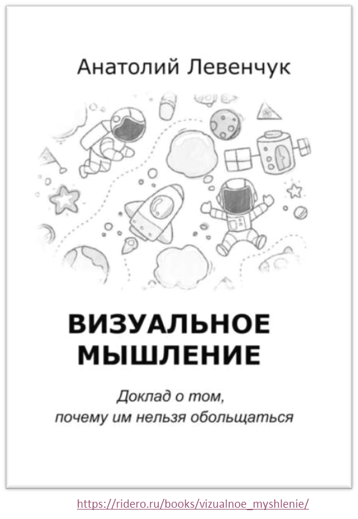

Модальности восприятия --- это восприятия от наших пяти чувств: видео
(зрение), аудио (слух), кинестетика (ощущения в теле --- и тут много
всего разного, включая проприорецепцию/проприоцепцию), ольфакторное
(обоняние), густаторное (вкус). В какой модальности происходит
понятизация? Ибо мышление идёт вроде как «в понятиях», амодально.
Понятизация --- это как раз «ввод-вывод для мышления», как раз про
проявление абстрактных понятий в сознании, осознанности «содержания
мышления».

Понятизация поэтому существенно связана с органами чувств, а также
нашими представлениями «в голове» о нашем восприятии. «Внутри головы» мы
визуализируем мысли в форме образов, аудируем в форме звуков, воображаем
вкусы и запахи, а также представляем себе ощущения --- «воображение
работает ровно таким же образом, как и восприятие. Нельзя ничего
почувствовать из того, что нельзя воспринять органами чувств». Но то,
что мы можем воспринять извне, всё это мы можем и «вообразить»,
«галлюцинировать», «представить». Все эти «голоса внутри головы» и
«картинки на внутреннем экране» реально существуют и представляют собой
вполне работающие дополнительные интерфейсы к мозгу-вычислителю, как
нейронной сети. Понятизация активно это использует.

Простейшая работа с нашим восприятием заставляет задуматься, как же мы
представляем себе какие-то объекты. Например, в курсе системного фитнеса
просят обратить внимание на кинестетическую модальность --- представить
себе ощущение обмякания каких-то мышц. Надо именно напрячь-расслабить
какое-то место в теле, попробовать дорасслабить его вдогонку
естественному расслаблению --- и запомнить ощущение как «кинестетическую
гифку, маленький фильм дорасслабления». А затем обращаться с этим
воспоминанием как словом/знаком на «телесном языке» (всё есть текст!).
Что же тут может пойти не так? Удивительно много:

-   Можно запомнить дорасслабление как визуальный образ, не обращая
    внимания на ощущения тела. Дальше теряем время: вспоминаем
    визуальный образ, потом рефлекторно переходим от него к «мышечной
    памяти» и только тут начинается действие.
-   Запоминаем ощущение в теле, но оно запоминается не как «развёрнутое
    во времени изменение в ощущении», а как «статичная фотка».
-   Запоминаем не ощущение, а последовательность действий, приводящая к
    этому ощущению, и туда наверняка попадает что-то лишнее. Например,
    можно сразу расслабить-дорасслабить место в теле. Но запоминаем
    почему-то сначала напряжение, которое нам нужно было только для
    того, чтобы начать расслабление. Его не нужно, если уже место в теле
    расслаблено, а дальше надо только дорасслаблять сознательно. Но мы
    сначала вспомним последовательность операций, затем выполним лишнее
    напряжение, а потом уже начнём дорасслаблять.
-   ... ещё много подобных ситуаций. Люди плохо работают с
    кинестетической модальностью: не обращают внимание на ощущения в
    теле. А ведь интуиция часто проявляется в кинестетической, а не
    аудиальной или визуальной модальностях, и уж совсем редко в форме
    запаха или вкуса!

Так что нужно тренировать работу с кинестетической модальностью --- как
восприятием мира в **первом доступе** (терминология взята в адаптации её
в НЛП из теории
автоматов^[<https://ailev.livejournal.com/649230.html>]).
**Прямой доступ** --- это то, что поступает на датчики, то есть фотоны в
глаза, перепады давления воздуха в ухо и т.д., дальше это кодируется
датчиком и перерабатывается мозгом. Человек получает первый доступ в
момент осознания восприятия, то есть человек осознаёт только результат
обработки прямого доступа. Когда речь идёт о коммуникации, даже о
попытке описать свои собственные восприятия первого доступа, мы выражаем
это восприятие привычным нам языком --- словами и жестами, картинками. В
попытках описать восприятия первого доступа (ко внешнему миру или
воображаемому/ментальному «внутри головы», это без разницы) мы уходим
довольно далеко от точности выражения этого восприятия, если будем
использовать слова, обозначающие какие-то абстрактные объекты, например
«я ощущаю затруднение» (какое именно? что трудно?). Но мы можем поднять
точность выражения, если будем заботиться о сенсорной обусловленности
описаний (то есть отслеживать, что мы представляем мир довольно точно
таким образом, как он выглядит, слышится, ощущается, пахнет, каков он на
вкус --- и ещё это в развёртке динамики, «гифками во всех модальностях
восприятия»). И тут оказывается, что наличие языка и какой-то
«насмотренности» накладывает ещё один фильтр: **сенсорная
обусловленность** в понятизации профильтровывается только тем, что есть
в культуре, **культурной обусловленностью**, поскольку, если чего в
культуре нет (например, нет слов для передачи какого-то ощущения), вы
передать его не сможете.

Предположим, у вас нет слов для передачи вашего ощущения для чего-то
очень специфического из вашей практики --- например, ощущения от
расслабления чего-то в районе горла. Это называется «субъективный опыт».
Передача субъективного опыта --- это огромная проблема для философов. Но
поскольку мы тут не занимаемся философией, мы эту проблему будем решать
инженерно, «из первых принципов», то есть исходить из физики (и
поступать так же, как поступают физики).

Роджер Желязны описывал, что два мага с изумлением обнаружили, что они
видят заклинания по-разному: для одного это были ниточки с узелочками, а
для другого лучики с блёстками. Вот это оно и есть. При этом, конечно,
для визуальности у нас полно средств описать, что там видно --- пока вы
не увидите что-то типа вертолёта, который нужно будет описать Чебурашке,
как в том анекдоте: «как бы тебе это объяснить? Апельсин знаешь? Ага,
знаешь. Ну так вот вертолёт на него абсолютно не похож». А теперь
опишите соседу, как вы чувствуете тальк, рассыпанный по полу --- это ж
просто кинестетика, да? Тело, которое вдруг начинает вести себя на
скользком тальке совсем не так, как на земле, но и не совсем так, как на
льду. И вы это тело воспринимаете не снаружи глазами, а в ощущениях,
изнутри. Как это ощущение описать? Ощущение поцелуя, ощущения эээ\... ну
вы понимаете.

Итак, вы называете нужное вам ощущение «расгорлить» и понимаете, что
никакие слова передать это ваше субъективное ощущение (субъективный
опыт) другому человеку не помогают. Чтобы «расгорлить» (то есть
представить это ощущение там, где вам надо --- и получить эффект
расслабления там, где надо), надо это представить --- но передать из
мозга в мозг ощущение нельзя! А уж если надо передать ощущение
«расгорлить» компьютерной нейросетке, то это и подавно оказывается
невозможным.

Тут помогает та же процедура, что известна физикам, когда они передают
свои абстрактные понятия типа «ускорение свободного падения». Они задают
какие-то операции во внешнем мире с понятными хорошо определёнными
предметами, чтобы точно воспроизвести какой-то эксперимент. В
эксперименте предусмотрено измерение, то есть обращение внимания на
какой-то конкретный параметр системы в ходе взаимодействия объектов этой
системы. Эксперимент уточняется и уточняется, пока не получается
однозначным (например, не просто кидается дробинка и пёрышко с Пизанской
башни, а падение делается в трубке, из которой откачан воздух ---
уточняются условия, убираются мешающие факторы, добиваются однозначного
воспроизведения у разных людей).

Как понять, что такое красный? Выполните инструкцию: проколите на
солнечном свету (конечно, тут мы поступаем как физики: долго описываем
все условия эксперимента, необходимые и достаточные, чтобы получить
результат измерения) пальчик булавкой, посмотрите на это место, там
будет жидкость как раз красного цвета, хотя и разных оттенков. Или
купите в магазине красную краску (попросите продавца продать «красную
краску») и поглядите на неё. Ещё лучше выполнить пять-шесть разных
замеров разными способами, чтобы как-то обобщить результат. Ощущения,
понятно, запоминаются --- и маркируются словом. Но передаётся от
источника знаний не «краснота», а инструкция по её получению. Когда мы
обсуждаем, как в эволюцию/развитие включить развитие внутреннего опыта,
если мы не можем записать это знание в мемом где-нибудь рядом в книжке,
то это тупик. Мы должны в мемом включать маркер для названия ощущения
(«красный») и пару-тройку инструкций по выполнению практики, как это
ощущение получить. Другой объект: запоминается практика со знакомыми
объектами, чтобы получить незнакомый внутренний опыт. Хотите узнать, что
ощущает гимнаст во время сальто? Сделайте сальто, и вы это ощутите!

Не заметили подвоха в предыдущих строчках? Чтобы сделать сальто, нужно
что-то сделать со своим телом, для этого нужно как-то им проуправлять
(как? вы ж не делали никогда сальто?), а уж потом вы попадаете в
сальто --- то есть вы как гимнаст воспроизводите телом ощущения прыжка в
сальто (но оно вам неизвестно!), а потом уже вы можете ощутить, что там
в самом прыжке, если вы ухитрились туда как-то допрыгнуть. То есть
сначала опытный гимнаст должен передать вам соматомеханическое описание
(что там происходит с телом изнутри тела: сома --- это как раз тело, как
оно чувствуется изнутри тела) для захода в биомеханическое внешне
видимое сальто вашего тела, чтобы потом вы оценили, как там оно в этом
прыжке в ощущениях. То есть вы уже должны неплохо владеть сомой, чтобы
выжимать из сомы всё новые и новые ощущения. Ну да, вы уже должны знать
про зрение, чтобы смотреть на «красный», а не слушать «красный», или не
пробовать «красный» на вкус. Всегда есть какое-то базовое знание, вы
обычно не с полного нуля начинаете, у вас уже есть какая-то
насмотренность/наслышанность/начувствованность, а также наработанность
как опыт манипулирования какими-то предметами, включая собственное тело.

Как тренеру системного фитнеса продемонстрировать обмякание в ваших
перенапряжённых мышцах, чтобы дальше вы могли работать с этим ощущением?
У всех эти мышцы перенапряжены в разных местах, внутри себя все
чувствуют разное (описывают это как жжение, давление, «тянет», «прёт»,
набухает, холодит и т.д. --- и часто это ещё и совсем другие ощущения).
Всё просто: вы проводите ряд операций типа подавить рукой на стенку с
разной силой, а потом прекратить давление --- и обратить внимание на
ощущения, да ещё сознательно попытаться его усилить, «доотпустить
мышцу», сопроводить этот сброс усилия. Не всё, конечно, вот прямо так
просто (то есть как и в случае «выйди на солнышко перед тем, как
смотреть на пальчик», чтобы было точно «красное», а не «в темноте все
кошки серы», нужно выполнить несколько дополнительных условий,
повышающих вероятность того, что вы ощущаете ровно то, что нужно), и
давите затем вы ногой, лбом --- пытаясь обобщить это ощущение сброса
усилия мышцами. Запоминаете это под названием «обмякание». Пытаетесь
воспроизводить с самыми разными регионами тела (вам же даже названия
мышц не нужны!), поднимаете вашу чувствительность к «обмяканию» (новое
ощущение! но вы уже знаете, каково оно, поэтому можно захватить его
вниманием и отслеживать его маленькие изменения!), добиваетесь беглости
воспроизведения сброса усилий мышц в разных частях тела «по памяти» (то
есть не надо давить куда-нибудь, чтобы получить ощущение обмякания, а
нужно просто дать сознательную команду --- «сбрасывай усилие», мышцы
обмякнут, и вот оно --- ощущение «обмякания», воспроизведённое по вашей
уникальной памяти). Как записать это уникальное знание «обмякания»,
чтобы потом обсуждать его, передавать от человека к человеку, оно ж
абсолютно уникально ощущается в каждом мозгу, в каждом теле?! А вот так,
процедурой «подготовка измерения, проведение измерения, передача
результата измерения в память». И, конечно, «результат измерения по
заданной процедуре» получает название, которое можно использовать при
обсуждении. Вот это самое «расгорлить» можно передать по вот этой
процедуре.

Возьмём случай посложнее. Вот собранный человек с хорошо развитым
сознанием, которое понятийно наводит внимание и умеет каким-то образом
не терять это внимание подолгу. Те, кто занимаются просветлением, берут
коан (любая бессмысленная мысль, смысла которой понять заведомо
невозможно --- вам же нужно занять ум задачкой, у которой заведомо нет
решения, чтобы задачка никогда не кончилась! Смысла заведомо не должно
быть, чтобы вы вечно могли его искать!) и удерживают его во внимании.
Оказывается, это можно тренировать, как цирковой трюк: удерживать
размышление над бессмыслицей весь день, а потом ещё и полночи (быстрый
сон), а потом еще и всю ночь (медленный сон). Ура, после круглосуточного
удержания внимания ваш мозг попадает в особый режим круглосуточной
работы сознания, вы можете называться «пробуждённым» (другое название
того же самого --- «просветлённый»), ибо вы спите, но ваше сознание как
удержание внимания на задаче работает. Полностью бессмысленное дело,
цирковой номер, ни на что не влияет, занимает кучу времени, но вам же
хотелось узнать «каково оно, быть пробуждённым/просветлённым» изнутри?
Вот, как раз операционный рецепт, цифровая (точно воспроизводимая,
словесная, знаковая) память, нужная для эволюции, простота репликации,
точность повторения (это повторяли сотни тысяч людей! Просветлённых на
Земле и сейчас десятки тысяч в странах, где практикуют буддизм, индуизм,
ламаизм). Нужно только выполнить последовательность операций, потратить
от двух до шести лет жизни. Эффектов для интеллекта от этого особо
никаких не получите (скорее, наоборот --- число лауреатов нобелевской
премии в странах, где много просветлённых пониже, и вообще уровень жизни
пониже, если бы люди от такого умнели, всё было бы
по-другому^[<https://ailev.livejournal.com/428032.html>]),
хотя внутри мозга это очень, очень приятно.

Альтернатива: удерживать внимание путём записей (на бумаге или в
компьютере --- это уже становится непринципиальным), записи помогут
удержать внимание на каком-то предмете и на пять лет, не только на время
сна! А за приятными ощущениями проще сходить в баньку попариться, или
послушать хорошую музыку, покушать клубнику со сливками и т.д. Можно
понять попов/жрецов и прочих продавцов религиозных мемов: чтобы затащить
к себе, они дают подобные ощущения «кайфа от нестандартных режимов
работы мозга», и человек на них подсаживается --- всё, вот ещё один
монах, который искренне рассказывает, что можно получать кайф вот таким
извращённым способом. Репликация мемов практики работы с вниманием! Но
можно ведь без кайфа и цирковых эффектов удержания мозга в несколько лет
тренируемых режимах, а просто быть осознанным и собранным для работы.
Более того, можно этими альтернативными «техническими» методами
удерживать собранность и коллектива! И даже не надо заботиться о
телепатии, если полагаться на смартфон, который по большому счёту эту
проблему «передачи мысли на расстояние» решил, и решил надёжно, дёшево и
без затрат на обучение и тренировки. Этот инженерный подход в сто раз
быстрее и в тысячу раз полезнее. Поэтому субъективно ощущаемая
«собранность» передаётся тоже словесно, тоже записывается --- но эта
собранность (включая собранность, поддержаную экзкокортексом/моделером)
как субъективное ощущение не может быть описана, как она ощущается
изнутри. И всё же она описывается: как набор операций, приводящих вас в
состояние, когда вы просто её ощущаете, то есть становитесь собранным.

Для «расгорлить» вы придумываете последовательность упражнений, в
которых внимание того, кому вы хотите это передать, направляется на
какое-то расслабление («подними гирю правой рукой на упоре, затем
отпусти гирю --- почувствуй, что у тебя расслабляется», «повтори другой
рукой» и т.д., далее инструкция на генерализацию --- всё это обобщается
как «расслабление где-то»). Дальше можно дать какие-то упражнения, где
мышцы напрягаются уже не гирей --- внимание знает, как искать где-то в
теле «расслабление». Далее надо задать упражнение, которое чуть-чуть
напрягает мышцы в горле, которые надо расслабить. И потом сознательно
надо усилить это расслабление «вдогонку», то есть «дорасслабить»
сознательно. Полученное конечное ощущение после действия сознательного
«дорасслабления» в горле --- это и есть результат операции «расгорлить».
Всё, достаточно теперь сказать, что надо «расгорлить», и мы получим
искомое состояние, просто сознательно выполнив это «дорасслабление в
нужном месте» без предварительных нагрузок и других упражнений. Время
изготовления навыка какого-то телесного действия, время использования
навыка --- получения нужного состояния, достижения заданных ощущений,
индивидуально воспринимаемых каждым в их первом доступе, но трудных в
словесном выражении.

Выполнить всё это оказывается возможным, если мы даём инструкции на
сенсорно-обусловленном, а также культурно-обусловленном языке (не
обязательно словами! Кинестетика, если эти ощущения нам знакомы, это
тоже текст, причём «слова» там могут быть «гифками», то есть это всё
динамическое, а не статическое. Слова речи «в голове», они ведь тоже
«аудиогифки», меняющиеся во времени фонемы, а не «один статичный
постоянный звук»!).

Конечно, тренировать сенсорную обусловленность и преодоление культурной
обусловленности нужно для всех модальностей, не только кинестетической.
Например, хорошо бы понимать, что происходит в визуальной
модальности --- «картинки внутри головы» не самый плохой интерфейс к
нейросети, эти картинки вполне могут становиться сами по себе объектами
внимания точно так же, как и внешне воспринимаемые зрительные образы. Но
как и с кинестетическими «образами», нельзя считать, что мышление идёт
именно в визуальной модальности. В европейской культуре визуализации
«внутри головы» обычны для мыслящих людей, с детства они работают с
диаграммами и художественными сложными образами, схемами и
иллюстрациями. В культуре индейцев визуализация мышления --- это дар
богов, или нужно пить психотропные вещества, чтобы тебя «посетили
видения». В книге «Визуальное мышление. Доклад о том, почему им нельзя
обольщаться»^[<https://ridero.ru/books/vizualnoe_myshlenie/>]
рассказано, что полагаться именно на визуализацию, как основной способ
мышления, неправильно:

