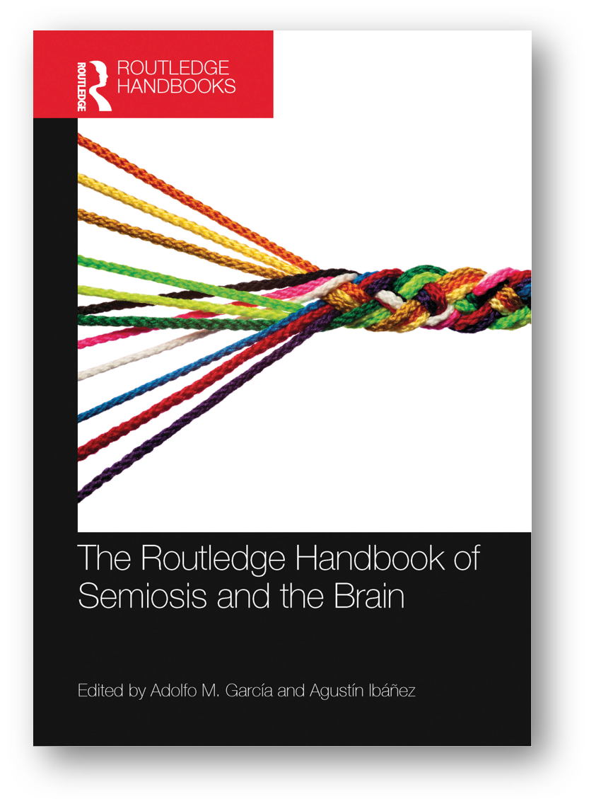
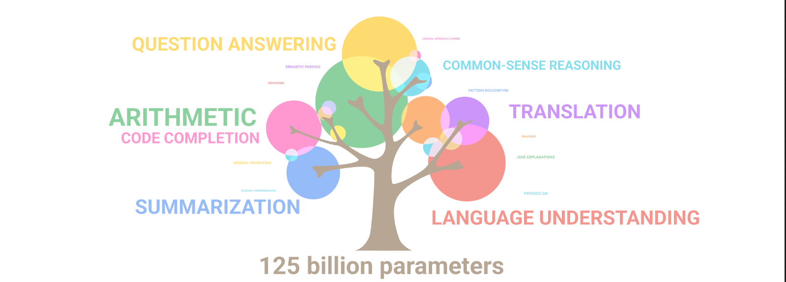
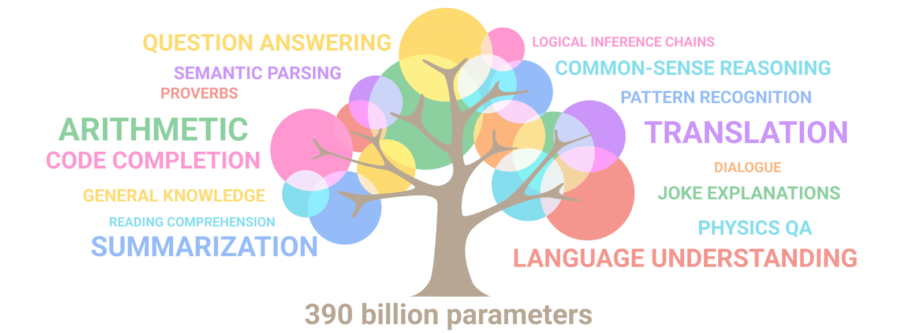
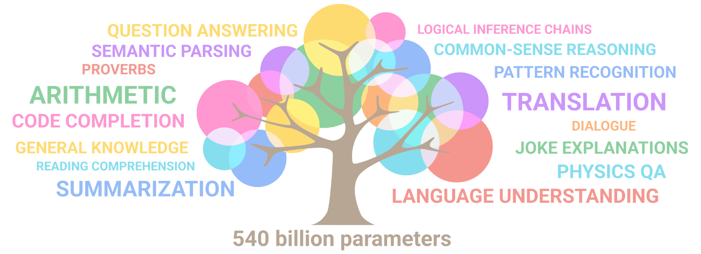

Понятийное мышление вполне синестезийно в части представления его
результатов как доступного восприятию, то есть которые можно выделить
вниманием, но абстрактно/внемодально в части понятийной работы, не
привязано к каким-то определённым модальностям. Понятия представляются
как некоторые области многомерного пространства, отвечающего всем
возможным понятиям. И эти понятия могут затем отображаться как картины
(или даже «фильмы/гифки»), звуки (или даже «речь»), ощущения (или
«кинестетические гифки»), и т.д., или даже «всё это вместе и
одновременно, тесно переплетённое», то есть
синестезийно^[[https://ru.wikipedia.org/wiki/Синестезия](https://ru.wikipedia.org/wiki/Синестезия)]
и
идеастезийно^[[https://ru.wikipedia.org/wiki/Идеастезия](https://ru.wikipedia.org/wiki/Идеастезия)].

В машинном интеллекте те же тренды: языковые модели получают уже и для
визуальных наборов данных, и наборов данных из подписанных картинок. Всё
больше и больше исследователей замечают, что есть огромное сходство
старого нейролингвистического программирования (NLP, neuro-linguistic
programming)^[<https://libcat.ru/knigi/religioznaya-literatura/samosovershenstvovanie/390938-dzhon-grinder-shepot-na-vetru.html>
--- описание подхода на русском языке, от одного из соавторов подхода,
профессора лингвистики.] и современной работы с
нейронными сетками в части естественного языка (NLP, natural language
processing, сводимого сегодня к «пониманию человеческой речи на
естественных языках»). Но так же, как понятийное мышление не визуально
(ну, или «и визуально тоже», можно визуализировать результаты), оно не
аудиально, то есть необязательно идёт «словами». Поэтому один из
подходов тут может считаться
нейросемиотическим/neurosemiotic^[The Routledge Handbook
of Semiosis and the Brain, 2022: Neurosemiotics aims to identify and
explain the neural processes and mechanisms that manifest as
sign-relations in the animal kingdom, thereby supplying semiotic models
to neurobiological accounts.] --- это про то, каким
образом формируются понятия и знаки в нейронных сетях, в том числе
человеческом мозге, но и не только --- компьютерные нейронные сети сюда
тоже попадают, а ещё можно рассматривать и другие варианты вычислителей
(семиотика --- это наука знаках).

Модель мира отражается в многомерном ментальном пространстве понятий, а
потом как-то становится доступной сознанию (иногда причудливым образом:
уши слышат, как наш рот проговаривает какие-то слова --- одна часть
мозга генерирует речь, а вторая часть мозга обеспечивает восприятие этой
речи как бы извне, но вот сама понятийная работа, само мышление как
поиск решений проблем остаются «невоспринимаемыми» --- я специально не
употребляю тут модально-окрашенных слов «невидимыми», «неслышимыми», «не
унюхиваемыми»).

**Понятизация** занимается тем, как соотносятся объект, его знак,
понятие, значение, смысл в нейросети живой или не очень живой, или даже
другом вычислительном субстрате **с позиции восприятия этого**
**вычислителя** («я работаю с понятиями»), как вообще идёт означкование
в каком-то вычислителе, какие алгоритмы можно применить в этом
вычислителе для работы с понятиями. **Нейросемиотика** --- это про
понятизацию в нейровычислителях (в том числе человеческом мозге, но это
могут быть и сообщества, и общества). **Семантика** занимается
соотношениями между знаками, стоящими за ними понятиями и объектами,
которые эти понятия отражают, причём с внешней позиции восприятия
субстрата вычислителя («он работает с понятиями», а не «я работаю с
понятиями»), вычислитель и его природа тут не так важны, сколько важно,
с чем этот вычислитель должен работать --- с отношениями знаков,
понятий, объектов. Как в обычном программировании/информатике можно
выделить алгоритмику (качественные алгоритмы, выдающие правильный
результат за минимальное время) и семантику как вопрос о смысле
вычислений, так и в нейролингвистическом/словесном или
нейросемиотическом/знаковом в любой форме программировании можно тоже
выделить понятизацию/алгоритмику (что делать, чтобы быстро и правильно
думать о понятиях, знаках и предметах и как-то устанавливать между ними
соотношениями) и семантику (каковы должны быть соотношения между
знаками, понятиями и объектами, чтобы они имели смысл).
Программирование/обучение/преднастройка на контекст может быть как
живого человеческого мозга (трудно представить мозг кошки, хорошо
работающий со знаками), так это может быть
программирование/обучение/преднастройка на контекст нейронной сети в
«неживых» вычислителях, «разговаривающий компьютер» уже вполне
существует.

В какой-то мере самые разные последовательности не только букв, но и
фонем в речи, нот в музыке, паттернов в чём угодно можно (и, наверное,
нужно) считать текстом, следуя известной максиме Jacques
Derrida^[[https://ru.wikipedia.org/wiki/Деррида,\_Жак](https://ru.wikipedia.org/wiki/Деррида,_Жак)]
«всё есть текст». Если вам пару веков назад бросили перчатку, то это
такой «динамический знак» (жест), означающий вызов на дуэль. Это
«словарное значение» знака, но их может быть и несколько разных («косил
косой косой косой»). Вокруг **текста** как последовательности знаков
(или даже одного знака) есть **контекст**, который уточняет значение
текста (или даже одного знака) --- ту область пространства понятий, куда
мы попадаем. А то, зачем мы вообще занимаемся вычислениями с этим
текстом, задаёт **смысл**: какое отношение к изменениям в физическом
мире имеют эти вычисления.

Пространство понятий в знаках выражается квантованно/дискретизовано, ибо
часто значение находится где-то там, где нет подходящего знака для его
выражения («между точками дискретизации пространства понятий»), и
приходится работать с пространством понятий через грубый язык, через
знаки, а иногда и изобретать знаки --- быть поэтом. Вот это и есть
предмет понятизации. Представьте себе 100 оттенков синего цвета, и
слова-знаки «синий» и «голубой» (при этом в некоторых языках даже может
не быть слова «голубой»). Вот это типичная ситуация: требуется довольно
много слов, чтобы выразить некоторые понятия. Потом их можно
означковать, но это если они часто встречаются. Большинство понятий не
имеют каких-то своих значков, но вполне выразимы на естественном языке.

Нейролингвистические программисты влед за Хомским говорят о
**поверхностной структуре** языка (выразимой знаками, как изображение
пикселями, а звук отсчётами амплитуды в какие-то дискреты во времени) и
**глубокой** **структуре** (понятия, кодируемые нейросеткой, эти понятия
обычно «промеж пикселей, результат вычислений», не точно соответствуют
каким-то знакам). Знаки (поверхностная структура) тем самым представляют
какие-то вехи, обозначающие места в понятийном пространстве (глубокая
структура), поэтому иногда говорят о знаковой координатной сетке/grid
(скажем, понятия разных синих цветов вам или больше доступны, если есть
слова/знаки «голубой» и «синий», или менее доступны --- вы хорошо можете
различать голубой и синий цвет, но не сможете это хорошо выразить. Чем
больше развит язык, тем точнее можно высказываться на нём. Ньютон писал
свои трактаты на латыни, ибо тогдашний английский был как язык довольно
убог).

Представьте себе, что у вас есть мир Майнкрафта и слова для каждого его
объекта. А потом вам предлагают описать ваше реальное рабочее место
только этими словами. Трудно, да? В этот момент вам захочется и как-то
аллегорически или метафорически заговорить на этом языке, а иногда и
новые слова в этот язык внести, а иногда переопределить значение уже
имеющихся слов. По большому счёту, с естественным языком происходит
ровно вот это: выражение на языке знаков (без разницы, синестетических,
визуальных, аудиальных, динамических/жестов, кинестетических и т.д.) ---
это дискретизация, что-то типа АЦП, аналого-цифрового преобразования, а
понимание выраженного знаками --- обратный процесс, «цифро-аналоговое
преобразование» со всеми вытекающими особенностями аналогового
представления (например, невозможность многократного точного
копирования, ибо при аналоговом копировании накапливается ошибка).

По большому счёту, значительная часть работы человеческого и машиннного
(Bing, ChatGPT, Bard, ERNIE Bot и множество других систем AI на базе
современных нейронных сетей) мыслительного мастерства сегодня проходит в
простом и лёгком режиме S1 по Канеману. Из экспериментов в AI известно,
что способности нейронной сети к научению растут с размером этой сети, и
при достаточных размерах даже наблюдается рост способности к обобщению,
а потом и возможность
рассуждать^[<https://ai.googleblog.com/2022/04/pathways-language-model-palm-scaling-to.html>]:

Человек в этом плане лучше, чем муравей или кошка. В мозгу человека
множество разных нейронных сетей в разных частях мозга причудливо
связаны друг с другом так, что появляется и понимание языка, и понимание
шуток. А в мозгу кошки нейроны связаны друг с другом так, что понимание
языка и шуток не появляются. А вот в искусственных нейронных сетях это
всё появляется, но эти сети тоже должны быть не любыми, а специально
устроенными.

Сами по себе проверки на ошибки в каких-то представлениях в нейронной
сети не появляются, и огромные нейронные сети страшно ошибаются, если
решаемые ими задачи вдруг становятся проблемами, то есть требуют
разбирательства с новой предметной областью. Ребёнок, у которого не
удерживается внимание, который не владеет логикой, но который много чего
повидал и почитал --- вот это и есть человек с хорошо развитым
мастерством понятизации и отсутствием разных других видов мастерства.
Это поэт, который легко отождествляет морскую звезду из монографии по
биологии морских безпозвоночных и Патрика из мультильма Спанчбоб.
Поэтому в его рассуждении морская звезда со дна моря вполне может
сказать несколько слов и иметь друзей. Это поэзия, склеивание миров. В
мире поэзии граф Дракула --- вампир, а высказывание «вампиров не
существует» заставляет графа Дракулу смеяться. Поэт интуитивно может
расклеить разные миры, но может и не расклеить --- ибо устранение ошибок
смешивания рассуждений из разных контекстов делается обычно логическими
проверками.

Мы начинаем учиться тогда, когда уже умеем выделить какую-то фигуру из
фона: выделить объект (ментальный или во внешнем восприятии) и
обнаружить сходство его с другим каким-то объектом, который вынимаем из
нашей памяти. Начинаем с врождённого умения выделять объекты и обобщать
способ, которым мы эти объекты выделяем (находим в объектах похожести).
Это и есть понятизация --- работа с понятиями, их
ассоциирование/сопоставление друг с другом на предмет нахождения
похожестей.

О том, что мышление человека существенно опирается на аналогии, на
нахождение паттернов/закономерностей/связей/шаблонов/ритмов хорошо
написано в книге Дугласа Хофштадтера «Гёдель, Эшер, Бах. Эта бесконечная
гирлянда»^[[https://ru.wikipedia.org/wiki/Гёдель,\_Эшер,\_Бах](https://ru.wikipedia.org/wiki/Гёдель,_Эшер,_Бах)].
Это книжка аж 1979 года (написана сорок два года назад), поэтому она
давно уже неактуальна как «передовое знание человечества», но она являет
собой хороший сборник примеров причудливости проявления аналогий и
ассоциаций, хорошее введение в саму проблематику понятизации. За сорок с
лишним лет после издания этой книги она перестала быть «передовой», и
человечество существенно продвинулось в объяснении того, что в этой
книге описано. Но главное --- у человечества появилось машинное
обучение, а в рамках машинного обучения появились большие языковые
модели (large language models), которые показывают, каким образом
появляется понятизация, дают возможность экспериментировать и
возможности инженерной разработки устройств, которые выполняют
понятизацию.

Всевозможные детские упражнения на «логику» типа «какой тут предмет
лишний» --- это, по большому счёту, упражнения не на логику, а на
классификацию (отнесение предмета к какому-то типу на основании его
похожести по каким-то критериям). Это как раз про понятизацию. Логика
нужна была бы только в том случае, если нужно было бы объяснить, почему
было принято то или иное решение по поводу отнесения объекта к типу, но
для этого объяснения нужно будет много чего ещё уметь, кроме как выдать
догадку, что же в ряду лишнее или что на что похоже.

Классические тесты на IQ --- это тесты на часть понятизации, связанные с
определением паттернов. Это хорошо показано в работе François Chollet
«On the Measure of
Intelligence»^[<https://arxiv.org/abs/1911.01547>]
(2019). По большей части это тесты, которые не требуют даже владения
естественным
языком^[<https://lab42.global/arc/core-knowledge/>]
(хотя там для людей бывают и лингвистические тесты, но это не главное
там тестируемое, и компьютерные варианты этих тестов не обращаются к
знанию языка для тестируемых на интеллект
алгоритмов^[<https://lab42.global/arcathon/>]).

IQ тесты мало тестируют мастерство в других практиках интеллект-стека,
хотя они и связаны тесно с собранностью (если у вас внимание
отсутствует, то вы просто не помните, какой паттерн уже видели --- и
ничего повторяющегося в мире у вас нет. То есть для понятизации уже
нужна собранность! Деление на отдельные практики интеллект-стека и
выстраивание в последовательность довольно условно). И хоть понятизация
лежит в основе интеллект-стека, это не самая большая его часть. Так что
IQ не слишком коррелирует с успешностью в науке или бизнесе, хотя
некоторая связь, конечно, есть. Но не такая прямая, как это обычно
представляется. Люди со средним IQ могут получить хорошее образование и
добиться больших успехов в науке. А люди с высоким IQ вполне могут иметь
мастерство в других практиках интеллект-стека похуже, и не достичь
особых результатов. Интеллект не определяется полностью качеством именно
понятизации или собранности. Интеллект определяется совокупным
мастерством мышления по дисциплинам всех практик интеллект-стека в
целом.
