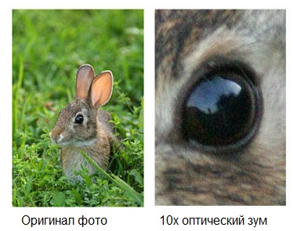

Если наше внимание должно направляться какими-то важными для роли
объектами, то это должно происходить свободно, но если происходит
какое-то отвлечение, то «Я» должно отслеживать это отвлечение --- и ещё
«Я» должно уметь на эти темы общаться. Например, «Я» может организовать
какой-то коллектив из частей личности, выделив им в вычислительном
субстрате (мозге) какие-то части. Понятно, что это будут более-менее
убогие личности (у них не все вычислительные ресурсы), и даже
разговаривать они не все смогут в полной мере, и вменяемость у них будет
похуже, но как минимум, можно будет устроить общение их между собой ---
обсудить происходящее. Но оставим тут вопрос, какова концепция личности,
до момента обсуждения инженерии личности: того момента, как мы начнём
эту личность «изготавливать»/развивать/«выращивать». Обратимся к
описанию одной из важнейших функций личности: присмотр за вниманием, без
которого собранность реализовать нельзя.

**Внимание** --- это как супер-видеокамеры, направленные на какие-то
предметы из бесчисленного числа окружающих нас предметов. Они передают к
нам в мозг на обработку изображение, звук, запах, вкус, ощущения. Эти
камеры выдают в мозг некоторый мультимодальный (все пять модальностей
восприятия --- видео, звук, запах, вкус, ощущения) поток информации,
называемый «**поток внимания**». Интересно, что эти **камеры внимания**
могут быть направлены на мир и использовать аппаратные датчики (смотреть
через глаза, слушать через уши, и так далее), но могут смотреть и прямо
внутрь мозга и брать какую-то информацию из памяти или даже из
промежуточных вычислений нейросети мозга.

Камеры всегда куда-то направлены, и от них всегда идёт какой-то поток
информации. Внимание всегда есть, оно всегда выхватывает из мира и даже
из самого мозга какие-то потоки, и мы реагируем на них, безо всякого
сознания или с сознанием. Но агент с высоким уровнем сознания может
управлять этими камерами осознанно --- люди могут обратить внимание на
какие-то объекты вовне или внутри мозга и воспринимать главным образом
эти объекты, игнорируя все остальные. То же относится к современным
система AI: вы можете сказать чат-боту, каких ответов о каких объектах
какой предметной области вы от него ожидаете, после чего вы будете
получать именно такие ответы, остальное чат-ботом будет проигнорировано.

Что можно настраивать в камере? Куда смотреть: в мир, или в
мозг/нейронную сетку/хранилище информации (картинки внутри головы,
внутренние голоса, какие-то неясные ощущения дискомфорта в теле --- всё
это от внимания, направленного внутрь. Конечно, увиденное может быть и
**галлюцинациями** (причём и у искусственных нейросетей
тоже^[<https://en.wikipedia.org/wiki/Hallucination_(artificial_intelligence>)]):
**положительными** (увидели, или услышали, или почувствовали то, чего в
мире или даже мозге/нейросети нет), или **отрицательными** (не увидели,
или не услышали, или не почувствовали того, что есть).

Какие характеристики внимания? Прежде всего --- это его
**сфокусированность**. Вот прямо сейчас посмотрите на вот эту букву «а»
и подумайте, из русского она или английского шрифта? Поток вашего
внимания передавал в мозг ровно эту букву, остальной мир был вне
сознания, вы его не видели. Камера внимания показывала вашему мозгу
главным образом эту букву, а не остальной мир. Это **концентрация
внимания**, один из режимов его работы. А теперь не сводите глаз с вот
этой буквы «б», но постарайтесь охватить при этом максимальное
изображение, на которое вы способны --- в том числе и боковым зрением.
Там всё статично? Что-нибудь шевелится? Есть ли яркие точки? Это
**деконцентрация внимания**, когда передаваемым в мозг для обработки
объектом становятся не целевые объекты, а фон! Это другой режим
сфокусированности, и он едва ли не более важный, чем концентрация
внимания.

Деконцентрация --- передача воспринимаемого мира камерами внимания
максимально широкого поля восприятия во всех его модальностях (видео,
аудио, и т.п.), удержание от появления в нём любых фигур/паттернов,
кроме необходимых (например, когда прислушиваешься, или когда ищешь
ошибку в тексте: игнорируешь все помехи и ждёшь прихода сигнала с любой
стороны, в любом месте. Сигнал как бы всплывает из однородного фона).
Противоположность: концентрация внимания, когда рассматриваешь детали
фигуры в очень узком поле восприятия и игнорируешь фон как таковой.

Деконцентрация нужна при любой поисковой активности. Есть ли у вас
сейчас перенапряжённые мышцы, не нужные для удержания позы?
Деконцентрируйте ваше внимание к телесным ощущениям по всему телу
(ощутите всё тело одновременно, охватите его всё камерой ощущений),
чтобы найти эти перенапряжённые мышцы. Не нашли? А они ведь есть! Просто
они оказались вне вашего внимания, вряд ли вы без специальных тренировок
сможете их обнаружить, вы просто не знакомы с этими ощущениями, не
знаете, как их обнаружить среди множества самых разных ощущений, которые
генерирует тело. Мы говорим тем самым о деконцентрации внимания в
телесной/чувственной/кинестетической модальности восприятия. А теперь
прислушайтесь ко всем звукам, что вас окружают --- и близким, и далёким.
Что это за звуки? Это деконцентрация внимания в аудиальной модальности.
Концентрируйтесь на одном из звуков, игнорируйте остальные --- и вы
поменяли деконцентрацию внимания на концентрацию.

А теперь обратите ваше внимание на содержимое ваших мыслей (повторим:
внутри головы вы можете получить тоже изображения, звуки, вкусы, запахи,
ощущения --- и ничего такого, что не могли бы получить от окружающего
мира). О чём они? Сможете ли вы заметить, как предмет ваших размышлений
убежал --- рассуждения чтения текста вдруг заменяются рассуждениями по
поводу текста, вдруг заменяются рассуждениями о чём-то другом (например,
о каких-то срочных делах, или приходит мысль, что нужно срочно потупить
в сериал или ВКонтакте?).

Можно даже сознательно навести камеру на пульт управления камерами,
чтобы разобраться с их настройками. Сознательно отслеживать,
контролируете ли вы ваше внимание, или оно гуляет само по себе.

**Вычисления/размышления/рассуждения** **(даже «интуитивные»,
недоступные** **сознательному вниманию** **вычисления нейросетки) ---**
**это** **дорогой ресурс, его надо экономить.**
Вычисления/размышления/рассуждения не могут производиться сразу со всей
информацией от всех возможных мультимодальных камер внимания. Поэтому
люди обычно в состоянии отслеживать только несколько потоков внимания,
несколько аудиовидеопотоков от его камер --- и всячески стараются
уменьшить это число.

Надо быть **собранным**: помнить о том, что камеры внимания в нашей
власти, не позволять этим камерам беспорядочно показывать вам то, на что
они случайно навелись и случайно сконцентрировались или
деконцентрировались. **Управляйте вниманием, не довольствуйтесь
случайным блужданием вашего внимания!** **И не забывайте не только про
внимание к внешнему окружению, но и про внимание к происходящему у вас в
мозгу!** **И не забывайте, что биологический мозг несовершенен:
используйте экзокортекс, хотя бы удерживайте пальцем места, где нужно
удерживать внимание, чтобы меньше его терять.** **Как шахматист думает
над доской, а не «в уме», используйте внешние опорные предметы,
позволяющие удержать внимание!** **Но** **ещё** **лучше ---** **всё**
**записывайте, чтобы потом было легче вспомнить!** **Лёгкость
вспоминания будет за счёт двух факторов:**

-   **Вы напряжёте ваш мозг для записи, потратите время на то, чтобы
    подобрать слова, как-то ясно выразиться. Пишите не как для себя, а
    как для других (например, опубликуйте** **запись в публичном блоге,
    чтобы уж наверняка быть внятным). Если вам придётся читать эту
    запись не буквально завтра, а хотя бы через месяц, то вы сможете
    прочесть её и вспомнить, что вы имели в** **виду. Тут важно то, что
    при таком подходе вам достаточно долго придётся удерживать внимание
    на материале записи, это обучит вашу нейронную сеть в
    мозгу**^[<https://www.youtube.com/watch?v=MnCV3sOkVVw>]**.**
-   **Вы будете иметь запись, которую сможете передать другим людям, эту
    запись сможет прочесть** **AI** **(ваш персональный ассистент), эту
    запись сможет прочесть поисковая машина ---** **и вы потом сможете
    её найти. Экзокортекс интересен тем, что он частично личный (записи
    для себя), но всегда можно его развернуть в сторону коллективного
    экзокортекса: совместного с вашим или даже не вашим** **AI** **и
    другими людьми.**

Во многих психотехнических традициях речь идёт о Свидетеле/witness,
наблюдателе. Собранность/осознанность там пассивная, мысли как бы
«саморастворяются» при внимании к ним, останавливаются. У нас совсем не
так, **у нас собранность с волевым началом, и включающая действия в
физическом мире** --- «Я», живущее в теле и обладающее сознанием не
только позволяет увидеть кроме предметов, передаваемых в потоке
информации с камеры внимания и саму камеру с её настройками, но и
позволяет покрутить камеру, поиграться с её настройками и даже поглядеть
через эту камеру внутрь проводящихся мозгом вычислений или запросить
воспроизвести что-то из памяти. Воспринимать --- это активная операция
измерения с использованием датчиков, ибо датчики надо подтащить к
измеряемому объекту (заранее понимать, что будешь измерять!), настроить
и откалибровать, затем как-то обработать результаты измерения, возможно,
подстроить измерительную аппаратуру: опять совершить действия, например,
подойти поближе, или использовать «зондирование» --- то есть вызвать
какие-то изменения в объекте наблюдения, чтобы пронаблюдать эти
изменения в их сравнении с ожидаемыми.

Современный вариант рассказа об управлении характеристиками внимания ---
это то, как вы управляете современным фотоаппаратом. В этой метафоре нам
важна характеристика зума.

Зум --- это насколько широкую панораму вы охватываете в кадре. Если у
вас широкоугольный объектив, то угол зрения у него будет 52° до 82°,
если больше 90°, то это сверхширокоугольный объектив, а бывает ещё и
панорамный объектив (до 180°), это соответствует «деконцентрации», а
длиннофокусный объектив (наше «концентрированное внимание») может иметь
угол зрения всего в десяток градусов. Что не попадает в поле зрения
объектива --- то не замечается. Как мы рассматривали бы мир через
фотоаппарат с зумом, которым можно управлять этим углом зрения? Мы бы
искали какие-то интересные объекты на неинтересном нам фоне в режиме
панорамы, а когда находили бы объект, то заполняли бы им полный кадр, а
если нужно было бы подробней/внимательней рассмотреть какую-то часть
этого объекта, то мы бы добавляли ещё «увеличения», то есть уменьшали бы
угол обзора. И нас бы при этом не волновало, что из кадра исчезает вся
панорама! А когда нужно найти другой объект для рассмотрения? Мы бы
опять увеличивали бы поле зрения, наш кадр бы захватывал всё больше и
больше окружающего мира, пока не нашли бы новый объект --- и тогда наше
внимание было бы на нём, мы зуммировали бы наш объектив так, чтобы в
кадре остался только интересующий нас объект. Идея в том, что с нашим
вниманием нужно работать точно так же: не только направлять его на
что-то, но и отслеживать его концентрацию/широту охвата/зуммирование. И
это влияет на рассмотрение не меньше, чем направленность. Вот два кадра
аппарата, снятого с десятикратным зумом, и направленного на одно и то
же:

Когда вы направляете ваше внимание на какой-то объект, то вы точно так
же зуммируете это внимание: концентрируете его или деконцентрируете.
Поисковая активность --- вам важен фон, вы панорамируете в
деконцентрации, изучение найденного при деконцентрации --- зуммируете и
дальше у вас во внимании кроме найденного на уже не нужном вам фоне
объекта нет больше ничего.

Внимание работает всегда, оно всегда на что-нибудь направлено и что-тор
выхватывает из окружающего мира (и в этом участвует даже тело: надо
подойти к какому-то месту и повернуть туда голову, и довернуть глаза,
чтобы что-то заметить зрением --- это мышечная работа! Она может
проводиться осознанно, и не осознанно), или выхватывает из «внутреннего
мира» (но при этом рефлекторно тоже могут отрабатывать мышцы глаз, хотя
этого и не требуется). Даже когда луч/поле зрения вашего внимания
рассеян вовне и/или внутри нас, это просто деконцентрация внимания. Вы
не натыкаетесь на улице на столбы, не спотыкаетесь, ибо внимания хватает
для жизни и без осознанности в его отношении. Но вот если вам таки
нужно, чтобы внимание не убегало куда-то и было в нужном режиме
(например, при сложных размышлениях о рабочем проекте), вам придётся
присматривать за ним.

У нас собранность связана с функцией governance/присмотр/надзор «Я» за
вниманием. Это не просто «управление вниманием», это больше как присмотр
за детьми: пока дети играют в центре комнаты, ничего не происходит,
кроме наблюдения. Но когда один из присматриваемых лезет на окно,
присматривающий активно вмешивается и принимает меры --- он ни разу не
просто «наблюдатель», он деятель! Присмотр идёт всегда, а управление в
порядке присмотра --- только когда что-то идёт не так.

Собранность связана прежде всего с «недреманной волей», агентностью по
отношению к себе, это не просто «недреманное око», которое видит ужас
происходящего с «Я», но ничего поделать с этим не может. Так, именно эта
воля действует, чтобы актёр/агент/человек/личность не слился с ролью и
не начал жить как роль, забыв, что это всего лишь роль. Нет, жить в
целом агенту нужно как человеку (и не просто человеку, а члену разных
команд, а ещё самому быть усиленным разными инструментами, в том числе
искусственным интеллектом), а в проекте заниматься трудом по роли. И
вовремя менять эти роли, если нужно: мастерство собранности позволяет
развить осознанность, чтобы внимание в ходе игры по роли не дрейфовало
на какие-то другие дела.
