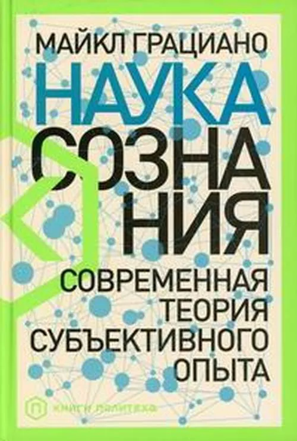

Теории сознания и теории внимания разрабатывались философами (но они
довольно схоластичны: не очень понятно, как их употребить для какого-то
дела), психологами и нейрофизиологами (им это нужно для объяснения
феноменов человеческой психики, попытки объяснений давались на разных
системных уровнях) и специалистами по машинному интеллекту (им нужно
получить сильный интеллект, и они используют в качестве догадок и идей
результаты работы нейрофизиологов).

Теории сознания нас интересуют «механистические», но это сугубо
положительная характеристика! «Механистичность» тут означает, что для
объяснения сознания не используется каких-нибудь трансцедентальных
сущностей (провидение, Космос, боги, матрица бытия, квантовый бульон или
ещё что-то плохо понимаемое). В механистических теориях сознания
принимаются только простые физические механизмы, в том числе
рассматриваются универсальные вычислители, в которых чётко можно
проследить связь между входом алгоритма и выходом --- никаких «чтений
мыслей», «обращений к мировому сознанию», всё абсолютно рационально.

В механистических теориях сознания делаются попытки их как-то
консолидировать в «стандартную теорию сознания», это прямая отсылка к
«стандартной теории» из физики, которая представляет из себя
признаваемое всеми физиками лучшее объяснение того, как устроен наш мир.
В текущей попытке создания «стандартной теории
сознания»^[Статья:
<https://disk.yandex.ru/i/R-KOlFtVUUttcg> (можно почитать краткий
пересказ её идей ---
<https://selfawarepatterns.com/2019/09/29/a-standard-model-of-consciousness/>).]
участвует шесть разных механистических теорий, это сентябрь 2009 года.

Один из лидеров механистических теорий сознания, особенно удачный в
объяснении того, как сознание воспринимается человеком в его
ощущениях --- это теория сознания как схемы внимания, attention schema
theory. Упрощённое изложение этой теории вышло в книге Майкла Грациано
«Наука сознания. Современная теория субъективного опыта», вышедшей в
сентябре 2019 года и уже переведённой на русский
язык^[<https://www.ozon.ru/product/nauka-soznaniya-sovremennaya-teoriya-subektivnogo-opyta-gratsiano-maykl-205761650/>].

В этой теории предполагается существование трёх вычислителей, которые
связаны друг с другом и отвечают:

-   За обработку входящей информации и перевод её в выходную
-   За поддержание модели внимания (собственно, это и есть «схема
    внимания», упрощённое представление о том, что нужно выделять из
    фона, куда направлено внимание)
-   За интерфейс к модели внимания (факт осознания)

В теории схемы внимания сознание действенно, мы можем через интерфейс не
только наблюдать за тем, куда направлено наше внимание, но и
перестраивать схему внимания, которая затем влияет на обработку входящей
информации.

В области машинного интеллекта используют похожие модели, но там меньше
ставится акцент на интерфейс к модели внимания, ибо разработчики софта в
отличие от человека могут добраться до модели внимания разными
способами, им не нужны представления о субъективном опыте. Например,
один из лидеров в разработке нейросетей Yoshua Bengio делает
замечание^[<https://mc.ai/deep-learning-cognition%E2%80%8A-%E2%80%8Aa-keynote-from-yoshua-bengio/>],
что «сознание» существенно демистифицированно уже, и сегодня можно этот
термин употреблять в приличном обществе, не привлекая внимания
санитаров. Его выбор --- это Global Workspace Theory, и он напоминает
свою работу «The Consciousness
Prior»^[<https://arxiv.org/abs/1709.08568>]
по формализации сознания для целей AI. К сожалению, Global Workspace
Theory не даёт внятного описания, как феномены сознания чувствуются
человеком, каково субъективное ощущение сознания. Но вот в статье
«Sources of Richness and Ineffability for Phenomenally Conscious
States»^[<https://arxiv.org/abs/2302.06403>]
его группа исследователей уже даёт две характеристики сознания,
разнообразие/richness как множественность самых разных характеристик
опыта, которые можно выразить в описаниях сознания и
невыразимость/ineffability, «невыразимость словами» --- частое
отсутствие понятий для каких-то характеристик состояний сознания. Так
что и исследователи машинного интеллекта постепенно движутся к тому, как
сознание ощущается «изнутри» и может быть затем коммуницировано
сознающим субъектом, но они при этом дают математические (большая
степень формальности описания) модели, а не просто словесные описания
«как оно там изнутри ощущается».

Можно говорить ещё об индексе референции per se (к себе и от себя,
скажем сома --- это как тело воспринимается изнутри, сознание как оно
воспринимается изнутри) и per re, описание с третьей позиции восприятия.
Это неявное обращение к системному подходу, система, имеющая границу со
средой --- откуда мы описываем происходящее, скажем передачу объекта?
Если «изнутри агента», то это будет «взял X, дал Y», для другого агента
то же самое будет «отдал X, взял Y». Каждый агент при этом пишет per se,
«от себя», опуская этот референтный индекс. Если агентов несколько, то
описание становится совсем другим, per re, ибо каждый раз надо писать,
кто кому что отдал (трёхместное отношение, которое несократимо, к «что
кому», поскольку референтный индекс «я» подразумевается при описании от
первого лица). Это хорошо показано в работах Chris Partridge, который
даже предложил для учения об описаниях с явным обсуждением референтного
индексом использовать не термин ontology/онтология, а термин
agentology/агентология^[<https://disk.yandex.ru/i/x1XhWKjt1Iad4A>
и <https://disk.yandex.ru/i/inRcf3iC91vbCw>.] (онтология
с точки зрения агента).

Вовсе необязательно иметь одну камеру внимания, один мультимедийный
поток от неё, тренированные люди управляются с несколькими такими
камерами. В работах по AI говорят в таких случаях о головках/heads
внимания примерно так же, как о магнитофонных головках или головках
чтения с магнитного диска: каждая читает свою дорожку с общего носителя.
В психологической литературе внимание не столько на камеру, сколько на
информацию от неё, поэтому чаще можно услышать про потоки внимания как
«видеопоток от камеры» (помним, что речь идёт мультимодальном внимании,
все пять чувств: внутри головы мы можем представить, то есть
увидеть-услышать-унюхать-вкусить-ощутить только такое же, что и в
окружающем мире нормальными органами чувств). В любом случае, речь идёт
об абсолютно механистических моделях, никакого управления вниманием как
это даётся в разных идеологиях «просветления», никакой «духовности»,
никакой религиозности, никакой эзотерики. Есть вычислитель, заодно этот
вычислитель имеет и функционал внимания, а также функционал сознания как
механизма управления этим вниманием (мы говорим о человеке, который
умеет управлять своим вниманием как о собранном человеке). Для этого
«карта/схема/модель внимания» каким-то образом в этом общем вычислителе
представлена, с ней возможны разные операции, возможны рассуждения о
сознании и внимании. Всё предельно рационально.

**Мы опираемся на** **state-of-the-art** **в теориях сознания. В этой
области тоже идёт научная революция, и она начинает подкрепляться
инженерными разработками. Исследования и разработки в области сознания
перестали быть уделом йогов-самоучек, ими теперь занимаются в
лабораториях нейрофизиологии и** **машинного** **интеллекта.**
