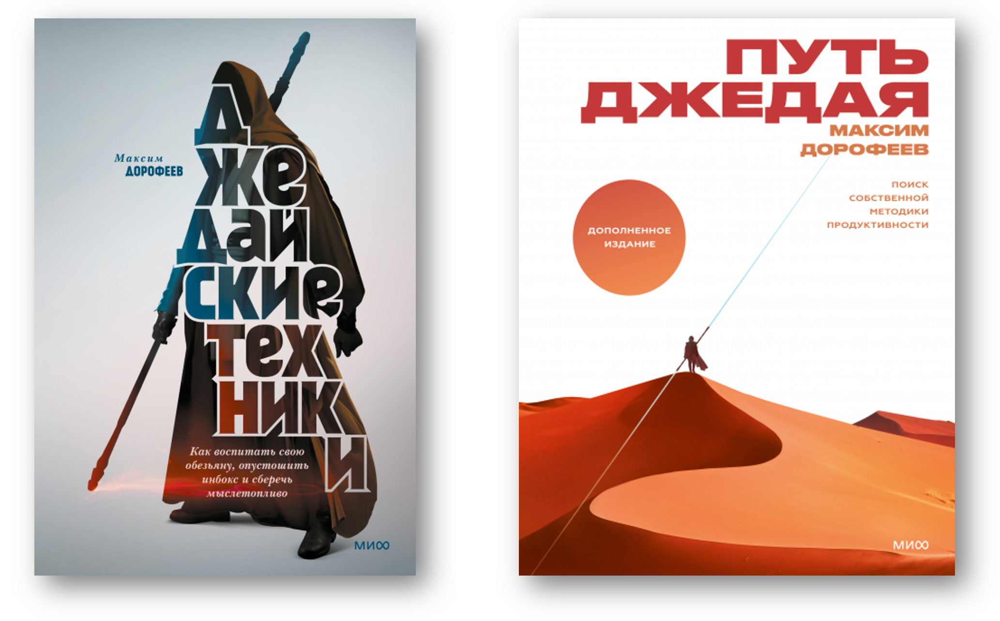
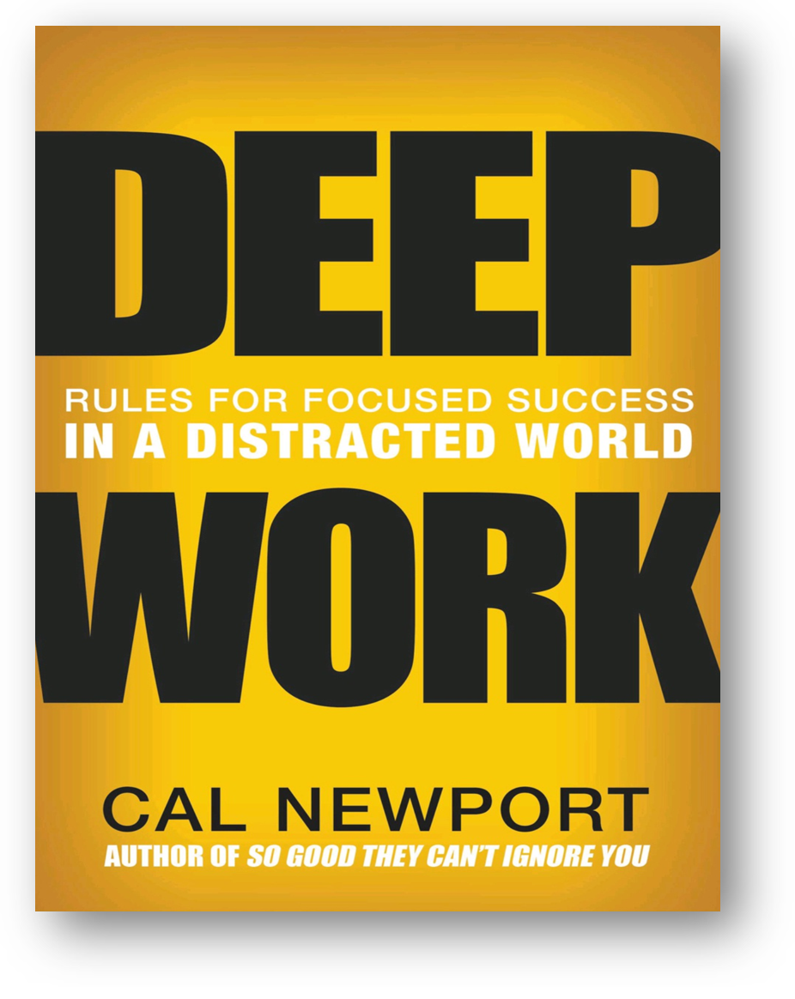
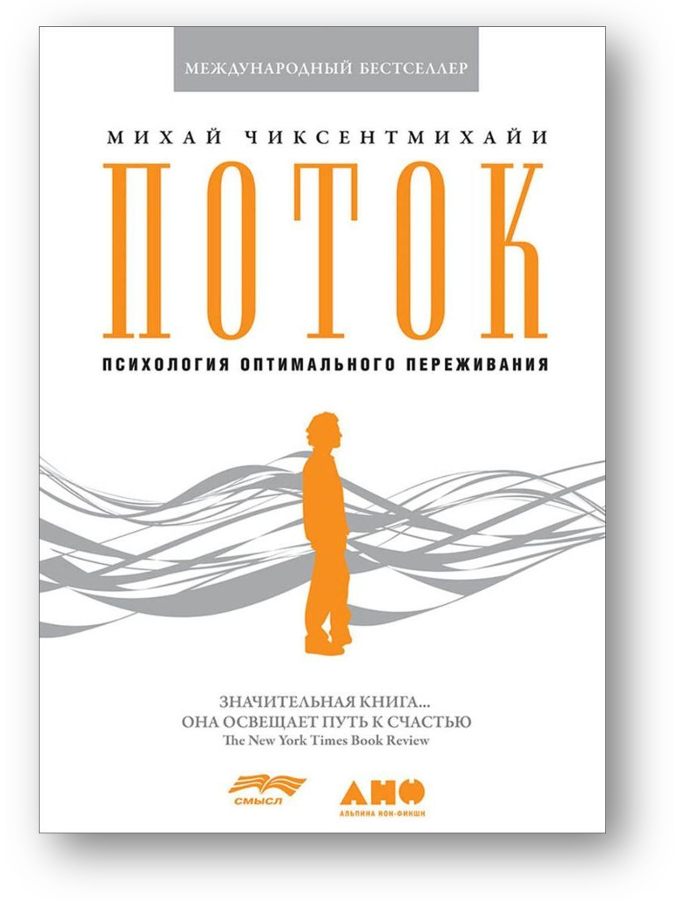
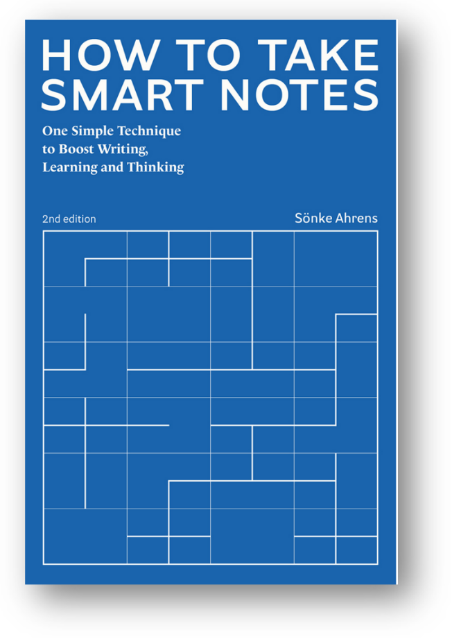

Первое, что даёт инженерный подход к собранности --- это понимание, что
мы психопрактиками буквально выращиваем куски мозга правильной структуры
(пластичность
мозга^[<https://en.wikipedia.org/wiki/Neuroplasticity>]),
а в системном фитнесе буквально отращиваем какие-то нужные нам ткани (и
не только мышечные, но и связки, фасции, хрящи и т.д.). В мозгу ведь
после обучения будут реально новые синаптические связи, в руках-ногах
новые клетки опорно-двигательного аппарата!

Собранность ума --- действительно выращивание физической части мозга для
надёжно работающего сознания как функциональной части мозга,
обеспечивающей функцию осознанности «Я». Непонятно, как именно
конструктивно реализованной части, но понятно, что реализованной новыми
нейронными связями. Сознание как вычислитель, реализованный какими-то
клетками мозга с новыми нейронными связями, получается путём такой
специальной «йоги», психопрактических упражнений, а не просто путём
чтения книжек по психологии и когнитивистике. Эти куски мозга правильной
для надёжной работы сознания структуры затем в своих вычислениях
реализуют мозговой инструментарий тех или иных мыслительных практик.

Но мы не надеемся на чисто психопрактические тренировки. Нам нужен
реально надёжный механизм для удержания внимания, а биологическое тело
человека, его мозг --- это очень ненадёжный механизм! Сколько ни
тренируйся копать лопатой, а экскаватор в этом плане мощнее. Вот для
собранности мы используем тот же приём: тренировать будем не собранность
биологического человека, а собранность человека, снабжённого
инструментом. Собранность киборга. Не нужно тренировать свою телепатию
(даже если вы в неё верите), чтобы связываться с другими людьми на
больших расстояниях. Просто позвоните по мобильному телефону! Не нужно
тренировать умножение десятизначных чисел в уме, просто возьмите в руки
калькулятор!

При обучении собранности помним, что меняем не только структуру мозга,
но и придаём этому мозгу в помощь компьютерные средства управления
памятью и вниманием, помогаем восполнить дефицит памяти и внимания
биологического человека специальным инструментарием. Мы не выживанцы,
отрицающие использование технологий. Наоборот, мы приветствуем
компьютеры, приветствуем киборгизацию.

Например, мы используем джедайские техники пустого инбокса для
управления временем/time management
(антипрокрастинатология)^[<https://www.litres.ru/book/dzhedayskie-tehniki-23590168/>
и <https://www.litres.ru/maksim-dorofeev/put-dzhedaya/>. Тщательно
отфильтровывайте в этих книгах восточную эзотерику! Вся эта «восточная
философия» легко уводит от сути дела. Оставляйте только рациональные
советы.], развитие многочисленных практик использования
«внешней памяти», начавшихся с практики Getting Things Done
(GTD)^[<https://ru.wikipedia.org/wiki/Getting_Things_Done>].
В этих практиках планы не запоминаются (ненадёжная и дорогая операция),
а записываются на внешний носитель. Хитрость тут в двух сочетаемых
привычках:

-   действительно записывать все планируемые дела, чтобы потом можно
    было найти запись (это легче), а не мучительно вспоминать
    незаписанное (это если вспомнил, что что-то забыл! Обычно и этот
    факт не вспоминают, просто забывают --- и всё).
-   Регулярно просматривать записанные дела и планировать порядок их
    выполнения. Не доверять себе работать по памяти. Использовать записи
    как чеклист: легко проверять, не забыли ли какое-то важное дело,
    легко упорядочивать приоритеты в выполнении дел.

Для поддержки рассуждений, особенно занимающих долгое время, мы
используем практику «мышления письмом», эта практика выводит
промежуточные результаты мышления на внешний носитель.

**Мозг должен быть всё время свободен для** **вычислений** **мышления,**
**не нужно тратить силы на запоминание. Ничего не нужно помнить,** **ибо
всё записано, не нужно перенапрягать своё** **внимание, ибо** **оно
тоже** **поддержано техническими средствами.** Лучший способ запомнить
какой-то пейзаж в деталях --- это сфотографировать его хорошим
фотоаппаратом, а не запомнить сцену мозгом! Лучший способ удержать
внимание к элементу пейзажа --- поставить там какой-нибудь флаг, или
проблесковый маячок, или что-то другое хорошо заметное. Этот же принцип
применим к идеям, планам, чему угодно. Лучший способ запомнить
содержание библиотеки Конгресса --- это выложить её в онлайн и
обеспечить доступ к книгам через Гугл или ChatGPT. Люди используют
инструменты, в этом их сила. Эти инструменты нужно (не можно, а нужно!)
использовать для поддержки памяти и внимания. Как револьвер Кольта в США
называли great equalizer (великий уравнитель) за то, что в драках он
уравнивал шансы очень сильных и очень слабых от рождения людей, больших
и маленьких людей, мужчин и женщин, детей и взрослых, так и
ручка-бумага-компьютер --- великие уравнители в части интеллекта, а уж
средства искусственного интеллекта просто продолжают этот тренд. Вам не
нужно десяти лет медитаций, чтобы развить память и устойчивость
удержания внимания для запоминания планов и не нужно долго тренироваться
в вычислениях, чтобы выполнить расчёт для плана. Собственные
биологические память и внимание вам нужны только для того, чтобы не
забыть записать ваши планы, а потом не забыть посмотреть на уже
просчитанные на компьютере и записанные красивым шрифтом планы, чтобы
начать их выполнять в той части, где что-то сделать надо будет лично
вам.

Все эти психопрактики сосредоточения, нужные для мышления письмом и
записи всех планов, связаны с концепцией глубокой работы, длительного
умственного сосредоточения «на пределе умственных возможностей».

Глубокая сосредоточенная мыслительная работа человечеством в массе своей
уже почти забыта в связи с параллельным работе разбавленным
пролистыванием ВКонтакте, чатов телеграма. Это клиповое мышление,
проклятье 21 века, воспитанное свободным доступом к огромным массивам
информации. Люди, которые сутками тупят в телеграм-каналы, гордятся, что
никогда не смотрят телевизор. Какая ирония!

Мышление должно выполняться долго, много (размышлять хорошо бы целый
день), и, желательно, с удовольствием. Тут можно ориентироваться на
книжку Cal Newport «Deep Work. Rules for Focused Success in a Distracted
World»^[<https://www.amazon.com/Deep-Work-Cal-Newport-audiobook/dp/B0189PVAWY/>].

Глубокая работа/deep work определяется Cal Newport как особый навык
выполнения практик своего мастерства в концентрации без отвлечений,
выходя на предел своих мыслительных возможностей. Этот навык трудно
повторить: если вы как мастер способны быть настоящим мастером 5 минут в
день, вы не повторите мастерство человека, который способен практиковать
своё мастерство без отвлечения в чатики хотя бы 8 часов. Это мастерство,
конечно, включает использование вычислительной техники и интернета. Но
или вы тупите в социальной сети, или вы сосредоточенно пользуетесь той
же социальной сетью для мышления письмом, сосредоточенно и
целенаправленно ищете информацию через Google или ChatPGT.

Психопрактики глубокой работы нужно понимать с использованием
результатов работ Михая Чиксентмихайя по потоку/flow в
работе^[[https://www.amazon.com/Поток-Психология-оптимального-переживания-Russian-ebook/dp/B01MQVWZLK/](https://www.amazon.com/Поток-Психология-оптимального-переживания-Russian-ebook/dp/B01MQVWZLK/)].

Суть этой практики --- бесконечное развитие через решение goldilocks
задач, через постановку целей ближнего развития. У работы должна быть
оптимальная трудность. Если работа слишком легкая, то скучно, и
отвлекаешься. Если становится слишком трудно --- отвращение, и тоже
отвлечение. Книжка уже старая, ей тридцать лет --- но принцип ведь
остаётся!

Наиболее убедительно и популярно тезис «мышления письмом» высказан в
книге Sönke Ahrens, «How to Take Smart Notes. One Simple Technique to
Boost Writing, Learning and Thinking --- for Students, Academics and
Nonfiction Book
Writers»^[<https://www.amazon.com/How-Take-Smart-Notes-Technique-ebook/dp/B09V5M8FR5/>],
2022.

Ahrens обосновывает, что нужно записывать свои собственные мысли по
любому поводу --- и вести картотеку (slip-box/zettelkasten) этих
заметок, разделив её на три части:

-   заметки по прочитанной литературе (ни в коем случае не цитаты, а
    пересказ своими словами: задача именно напрячь мозг --- и тогда
    записанное вовремя вспомнится. И сюда же пойдут библиографические
    ссылки). Это просто.
-   собственные мысли, приходящие в голову по поводу прочитанного,
    включая отсылки к другим таким мыслям. Порядок неважен. Это самая
    важная часть, это результат мышления, добавка к человеческому
    знанию. Это сложно, это основное.
-   черновик текстов для публикации, делается из двух предыдущих
    разделов дописыванием, упорядочиванием и литературным
    редактированием. Это просто.

Мышление --- это и есть письмо заметок по прочитанному, письмо
собственных заметок по заметкам, письмо черновиков публикаций по
заметкам. Нет письма --- нет мышления, мозг ничего не вычисляет,
работает вхолостую, результаты его работы нигде не отражены. Письмо
гусиным пером, или шариковой ручкой, или на клавиатуре, это совершенно
неважно, важно само отчуждение мысли: перевод мысли в текст на внешнем
носителе.

Если есть мышление --- оно должно быть явлено вовне, то есть результаты
должны быть как-то записаны. Не можешь записать результаты мышления ---
значит недодумал. Думай, и таки записывай!

При регулярном использовании картотеки/журнала/дневника/блога
гарантируется, что со временем ценность этих заметок будет возрастать, а
также будет возрастать мыслительная продуктивность. Чаще всего
приводится пример социолога Niklas
Luhmann^[<https://en.wikipedia.org/wiki/Niklas_Luhmann>],
который использовал подобную систему и отличался дьявольской
производительностью своего научного труда, но также в примерах много и
других людей, мыслящих с карандашом в руках или в последнее время за
компьютером (за компьютером, конечно, много лучше: избегайте бумаги и
ручки, пользуйтесь электроникой, не будьте дикарями!).

Мышление-в-уме, если оно не явлено в виде внешнего по отношению к мозгу
текста, обычно не может быть достаточно стабильно, чтобы быть оцененным
умом мыслящего, и поэтому ущербно и криво. Шахматист, думающий над
доской, думает надёжно. Шахматист, думающий в уме, думает ненадёжно.
Изложенная в тексте мысль может быть проверена, поправлена, приведена в
форму, удобную для коммуникации как с самим собой (например, через месяц
после написания --- читаешь сам, и понимаешь написанное), так и с
другими людьми (мышление коллективно).

Тезисы книги Ahrens сформулированы для варианта «мышления письмом»,
подсмотренном им у Niklas Luhman, пользовавшимся для своей работы
бумажной картотекой и писавшего огромные объёмы гуманитарных текстов.

Эти тезисы можно существенно обобщить и усилить для ситуаций
моделирования/абстрагирования и компьютерного программирования, а вместо
бумажной картотеки использовать современные productivity tools (средства
ведения структурированных заметок, причём как персональные, так и
коллективные).

Мышление идёт не только с текстами на естественном языке (thinking in
writing --- everything is externalised anyway, помним о концепциях
extended mind и extended cognition), но и с другого сорта формальными
моделями (thinking in modeling --- everything is externalised anyway).
Поэтому «мышление письмом/моделированием», и даже «мышление
документированием». Но не визуальными моделями, не рисованием! На
визуальных моделях в мышлении далеко не уедешь, так что речь идёт о
разных текстах-кодах, более формальных синтаксисе и
семантике^[см. «Визуальное мышление. Доклад о том,
почему им нельзя обольщаться» с возражениями против визуального мышления
в пользу текстовых моделей
<https://ridero.ru/books/vizualnoe_myshlenie/>].

Текст может быть неформальным, но формальность его может быть усилена
явным указанием типов использованных понятий. Более формальная модель
может быть написана псевдокодом^[доклад Антона Меркулова
про успех текстового представления для мышления об архитектуре
предприятия --- <https://www.youtube.com/watch?v=6EWUpa-5lSo>,
эксперименты в OpenMeta в 2003-2005 году по усилению формализма в
текстах, стиль «метлан» ---
<https://openmeta.livejournal.com/16970.html>], или
сложной смесью таблиц типа экселевских, баз данных с богатым текстовым
редактированием и аутлайнами^[пара видео выпускников
курса системного менеджмента ШСМ о результатах таблично-текстового
моделирования в современных productivity tools (главным образом
coda.io): <https://www.youtube.com/watch?v=JlXeQxAkDf0> и
<https://www.youtube.com/watch?v=KAQzn5GvMNw>.], а уж
далее уж идёт совсем формальный код --- математические формулы, код
языка программирования или моделирования.

Мышление письмом по методу Luhmann описывается Ahrens как несколько
проходов по тексту, каждый из которых относительно лёгкий, хотя и
нетривиальный. Сначала читаешь книги и думаешь при этом, это не так
трудно. Записываешь то, что думаешь, это тоже не слишком трудно.
Сортируешь заметки, записываешь мысли, приходящие и при сортировке.
Затем занимаешься литературной правкой отсортированных заметок. Ни в
один момент ты не застываешь перед листом чистой бумаги с попыткой
«творчества». Ты всё время решаешь задачу мышления как трансляции
входного текста в выходной, делаешь это в несколько проходов --- это
снижает сложность каждого прохода, работа будет затягивать каждый раз,
она будет как раз goldilocks, ни трудной, ни лёгкой.

Написание постов в публичный блог тоже делается для упражнения мозга.
Это просто удержание мозга на сосредоточенном размышлении на какую-то
важную тему, а внимание удерживается тем, что требуется документировать
результат, и тут не ограничишься смутными мыслями: придётся и термины
вспомнить, и лишний раз поглядеть на исходные тексты, когда будешь
приводить ссылки (и заодно придётся подумать об уровне доверия к этим
текстам, та самая работа с убеждениями, beliefs --- считать ли ссылку на
жёлтую прессу истиной в последней инстанции). Это \"журнал/log\"
(дневник для себя, утрясание своих же мыслей по тому, что прошло и по
тому, что встретил, и идей по тому, что будет --- мышление, которое само
по себе важно, а не важно для потенциальных читателей). Ведение журнала,
написание постов, работа с публичным экзокортексом главным образом ---
это работа для своего мозга, типа как походы в спортзал или на танцы ---
это работа для своего тела, часть образа жизни, а не что-то другое. А
если кто-то прочтёт этот пост и получит пользу, то это хорошо. Основной
эффект тут будет не в привлечении читателей или пользе для читателей.
Просто вероятность, что ассоциативная память после написания поста
вспомнит в нужный момент какую-то идею (или хотя бы ключевые слова этой
идеи --- по ним можно будет найти пост) после того, как мозг час
поработал над её оформлением в текст, много больше, чем после того, как
идея промелькнула неясными мыслями в мозгу за несколько
секунд^[<https://www.youtube.com/watch?v=MnCV3sOkVVw>].
Собранность ума и тела --- это не собранность голого человека из
джунглей. Это собранность человека-с-компьютером, это абсолютно другая
собранность, это внимание, которое может быть удержано годы и годы,
память, которая безупречно работает десятки лет.

В компьютере осознанные и документированные результаты мышления можно
проверить на соответствие логике (model checking), переслать результаты
кому-то ещё по компьютерной сети за пренебрежимо малое время, исправить
ошибки без полной перерисовки, напустить тот же компьютер для создания
других моделей на основе текущей (model transformation, предмет
информатики).

Тем самым развитие не просто психики, а киберпсихики даже одного
человека --- это путь к большей собранности: возможность выбора вида
модели и уровня формализации, вида используемой логики, нахождение
ошибок становятся возможными в тех ситуациях, которые раньше проходили
бы «как во сне», даже если это интеллектуальная работа в
чиксентмихайевском потоке. Использование внешних (в экзокортексе)
моделей/текстов^[Модели выражаются преимущественно
схемами, а не диаграммами. Диаграммная техника хороша только на самых
начальных стадиях умственной работы, начальных стадиях группового
размышления. См. подробней в книге «Визуальное мышление. Доклад о том,
почему им нельзя обольщаться»,
<https://ridero.ru/books/vizualnoe_myshlenie/>]
позволяет:

-   удерживать внимание на бо́льшем числе объектов (ибо они не исчезают
    при сбоях внимания)
-   обсуждать с другими (или компьютером) эти схемы на предмет
    нахождения ошибок, или передачи знания
-   проводить «дорогую» (тратится много усилий воли на удержание
    медленного мышления S2 по Канеману по сравнению с интуитивными
    «озарениями» быстрого мышления S1, они не требуют особой
    концентрации внимания) работу по логичному мышлению «дешевле», ведь
    можно регулировать скорость этой работы, делать перерывы, записывать
    промежуточные результаты и всяко разгружать рабочую память и
    потребное на её поддержание внимание
-   иметь больше времени и внимания для задания себе вопросов о
    выбранном методе действия, и тем самым иметь бо́льшую свободу.

Свобода --- это ведь всегда про возможность выбора, в нашем случае про
выбор способа психической и интеллектуальной работы. Главный выбор в
мышлении --- это полагаться на интуицию и не думать о методе этого
«думания», или всё-таки думать о том, как именно вы думаете, удерживать
на этом внимание и коррективровать методы мышления, если они вас не
удовлетворяют. Либо «Я» знает о моменте выбора и сделанном выборе (это и
есть собранность), или не догадывается, ибо в бессознательном трансе (и
тогда уж ничего исправить нельзя, например, выдаётся ошибка как
результат мышления и действия, при следующих действиях нельзя учесть
предыдущий опыт, и много ещё других результатов «жизни как во сне»). Вы
либо управляете автомобилем, либо выпускаете руль из рук, понимая, что
надёжного автопилота нет: это всё ОК, если вы знаете, что вы делаете.

Киберпсихика при этом представляется более прямым путём достижения этой
свободы, более детализированным, чем грубая фармакология в виде
ноотропов, влияющих на объем внимания и длительность его удержания, а
также на скорость проворачивания мозгов. Ноотропы никак не влияют на
способности использовать те или иные дисциплины в мышлении, а
компьютерные инструменты --- влияют существенно. Мыслительные дисциплины
обычно требуют инструментария в виде редакторов текста и моделеров.
Инструменты дают шанс удержания в длительном (в том числе коллективном)
внимании больших моделей --- и текстовых, и на формальных языках (кодов,
формул, информационных моделей в САПР). Да что там говорить, даже
десятизначные числа без калькулятора фармакологические допинги не
позволят перемножать быстро. И натренироваться это делать будет
непросто, да и не нужно. Калькулятор справится с этим легко, и он дёшев:
инструментарий дешевле, безопасней, быстрее, надёжней допинга.
Ручка-бумажка и уж тем более компьютер (как логический, так и
нейросетевой, и уж тем более гибридный) тут начинают и выигрывают ---
они делают всё то же самое, что фармакологические средства, но они ещё и
готовы помочь в движении по спектру формальности, обработать какую-то
трансформацию одного вида текста в другой (выполнить задачу информатики:
кодирование, перекодирование, отекстовку, перевод), в том числе
трансформацию текста вопроса в текст ответа. Экзокортекс такое сможет, а
вот «прокачанный мозг» не справится.

Это не значит, что не нужно прокачивать мозг! Это значит, что нужно
включить в его состав компьютер. Так, тренировка в «мышлении письмом»
много важней, чем просто тренировка памяти. Проще всё записывать, чем
трудиться запоминать!
