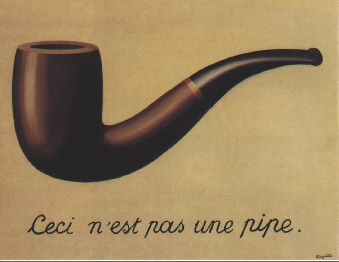

**Семантика** --- это учение, которое рассказывает нам про объекты
физические и ментальные/идеальные/математические, вводит отношения между
ними (в том числе отношение репрезентации математическим объектом
физического объекта и отношение презентации паттерном физического
объекта), говорит о разнице мира и его описаний, говорит о языке
описаний и степени строгости/формальности описания, а также вводит
толкователя языка. Практикой семантики занимается роль «**семантик**»
(можно говорить и «значкователь», но лишняя русификация тут как с
«мокроступами» вместо «галош»).

Семантика --- это учение о значении и смысле знаков как паттернов
физических объектов. Семантика занимается вопросом о том, чему
соответствуют в реальном физическом мире ментальные объекты,
обозначаемые знаками. Когда мы говорим или пишем «коса» --- что это
означает? А в фразе «косил косой косой косой»? А если речь идёт о таких
объектах, как движение/поведение/изменение?

Появление знаков и знакового мышления при этом изучается
нейросемиотикой, которую мы обсуждали, когда описывали понятизацию, а
надёжная память для знаков и удержание на них внимания, осознанность
работы с ними обсуждаются в собранности.

Семантику нужно изучать из-за вероломства образов. Что изображено на
картине «Вероломство
образов»^[[https://ru.wikipedia.org/wiki/Вероломство\_образов](https://ru.wikipedia.org/wiki/Вероломство_образов)]
художника Рене Магритта?

Курительная трубка (помним, что это картина 1929 года, это был более чем
обычный предмет)? Но надпись гласит --- «это не курительная трубка».
Художник говорит, что вот эту трубку вы не набьёте табаком и не
покурите, это «описание трубки», изображение. Более того, вы сейчас
смотрите на описание описания: на экране вы видите маленькую картинку,
изображающую картину Рене Магритта «Вероломство образов», которая
изображает физический объект --- курительную трубку художника.

А что вы видите, когда смотрите на букву «А»? Что означает «буква А»? То
же ли самое, что «ПЕРВАЯ БУКВА РУССКОГО АЛФАВИТА»? А если писать
маленькими буквами --- то же самое? Какое значение знака «А» или знака
«буква а»? Значение «слона» --- это идея слона, возникающая у вас в
голове. А значение «буквы а»? Какая идея знака для самого знака?
Запутаться очень легко. Если кто-то сожжёт флаг (это тряпка на палке,
специальным образом раскрашенная, когда жгут тряпку, то часто и палку
убирают), то почему все так нервничают? Флаг что-то обозначает, и
действует магия вуду, в которой колют иголками куклу, чтобы вызвать
болезнь у обозначаемого этой куклой человека? То есть действие над
флагом как-то означает действие над предметом, который он обозначает, и
абсолютно несуеверные люди вдруг начинают нервничать?

При этом нельзя считать, что во всех этих случаях участвуют два объекта
внимания: знак/нота/символ и означаемое/референт. Объектов много (и при
серьёзном рассмотрении их даже больше):

-   **Знак/нота/символ** и даже просто напишем «документированное
    описание» (тут может быть и текст, и картинка, и кинофильм, и
    «условный знак» типа выставленного на подоконнике цветочка, любимый
    знак шпионских историй). Знак интересен тем, что у него к
    означаемому отношение репрезентации, а ещё у него есть материальный
    носитель для этого знака, к нему у знака отношение презентации, а
    сам знак тут --- паттерн/узор/шаблон материального носителя. Но сам
    паттерн --- это ментальный объект, тип того, что бывает на
    материальных носителях. Знаками занимается **семиотика**, знаковым
    мышлением в нейросетях (включая мозг) --- **нейросемиотика**.
-   **Означаемое/денотат/референт/символизируемый/описываемый объект**
    (если это физический объект, то всё просто, но представьте себе
    какую-нибудь «благовоспитанность» или «эмерджентность», или даже
    «вампира», или «математическую точку»).
-   **Значение** --- какой-то паттерн работы вычислителя, распознавшего
    знак и/или означаемое, это
    концепт/понятие/референс/сигнификат/денотат/ментальный
    объект/математический объект. Отсылка на «паттерн/шаблон работы»
    вычислителя тут означает ход на конструктивное (через операции
    создания) определение понятия. Это снимает необходимость определять
    представление понятия как знака в памяти вычислителя: если
    вычислитель нейросетевой, то нельзя сказать, где именно в памяти
    вычислителя находится понятие, у него
    распределённое/нечленораздельное/«голографическое»/коннективистское
    представление^[<https://ailev.livejournal.com/1281819.html>].
    Кроме денотата/значения может быть ещё и **коннотат**/сопутствующее
    значение^[[https://ru.wikipedia.org/wiki/Коннотация](https://ru.wikipedia.org/wiki/Коннотация)]
-   **Смысл** --- это то, что агент хочет сообщить другим агентам
    (включая самого себя), когда он использует знаки для коммуникации.
    Смысл уточняет значение, а иногда (если смысл сильно меняет значение
    и ситуация повторяется, то есть становится паттерном) и вводит новое
    значение или делает какой-то физический объект (в том числе паттерн
    на физическом объекте) знаком.

Обратите внимание, сколько разных «почти синонимов» для каждого объекта!
Терминология будет немножко плыть, если знаком окажется слышимая фонема,
или знаком окажется небольшой томик «Войны и мира», или тот самый
«цветок на подоконнике» из шпионских романов. И ещё могут быть трудности
с иноязычной терминологией (иногда «смысл» в английском meaning, и
«значение» тоже meaning, но иногда «смысл» --- это sence. Да и в русском
языке «смысл» может иметь самые разные словарные значения: от
семантического «смысла» употребления какого-то знака в какой-то ситуации
до «цели всей этой деятельности», например «смысл нашего проекта ---
заработать нам много денег, остальное не должно волновать», и тут слово
«смысл» не про семантику и уточнение значение знаков, а про
прагматику/целеполагание).

Если я ткну в ходе лекции пальцем на какое-то место в воздухе вокруг
себя и скажу «вот это понятие», то это место само станет знаком для
понятия «понятие», а если я ткну пальцем на другое место в воздухе
вокруг себя, и скажу «знак», то это уже будет знаком для понятия «знак»!
Такое действие присвоения знака понятию часто называется
**означкованием**.

Тем самым воздух с размеченными в нём местами станет моделером: эти
места-знаки будут обозначать какие-то понятия, и нотационная
инженерия --- как сделать из воздуха моделер, какими знаками (местами в
воздухе вокруг лектора) какие понятия обозначать. Конечно, при этом
важна собранность: внимание к особым местам в пространстве что-то
обозначающим, должно длиться в ходе лекции, память о значении этих мест
(какие понятия они означают) должна быть достаточно крепка, чтобы
удерживать «знаковость» этих мест в ходе лекции.

Иногда знака вообще нет, но он подразумевается --- и его отсутствие само
по себе знак, и сообщение может строиться как раз на отсутствии
ожидаемого знака.

Это любимая тема шуток, игра с разными значениями знаков, при этом
сложные знаки конструируются из простых --- буквы из штрихов, слова из
букв, предложения из слов, разделённых пробелами и знаками пунктуации.
Конечно, классическая семиотика тут будет испытывать затруднения, а вот
нейросемиотика вполне будет справляться.

Получается, что семиотика в целом (и нейросемиотика в частности, когда
со знаками работает нейровычислитель, нейронная сеть) занимается главным
образом знаками, а вот всеми проблемами, которые относятся не к знакам,
а к их значениям, занимается семантика. Агент в **роли** **семантика**
разбирается со сложными отношениями, возникающими между знаками,
значениями, смыслами, означаемыми объектами в ходе каких-то
деятельностей, но акцент у этого агента не на знаки, а на значения и
смыслы --- понятия и их связи друг с другом и означаемыми объектами как
ментального, так и физического мира. А знаки? Знаков может и не быть,
может быть только их ожидание, знаки могут проектироваться/создаваться.

Типичный вопрос семантики --- это «что означает слово мир в «Войне и
мире» --- это мир-вселенная, или мирное время?». Это не вопрос про знак
(семиотика: вопросы про знаки), это вопрос про значение знака
(семантика: вопросы про значение). До орфографической реформы ответ был
однозначным: «*Война и миръ»* означали войну и мирное время, но легенда
о том, что название было в какой-то момент изменено, а изначально было
про мир-вселенную, «Война и Мiръ» --- эта легенда так и
осталась.^[<https://www.culture.ru/s/vopros/voyna-i-mir/>]

Что нового произошло в семантике за последние сто лет? Не хватит ли
обычной «языковой интуиции», эрудиции (то есть понятизации: обратили
внимание на объект, распознали в нём чашку, назвали «чашка») чтобы
справляться со всеми этими проблемами понятий, значений, означаемых?

Нет, понятизации и «просто начитанности» не хватит, если только речь
идёт не о поэтических образах, и цена ошибки невелика. Недостаточно
разбираться с «похожестями», недостаточно собраться, чтобы удерживать
внимание на «похожестях» предметов, знаков, понятий, нужно ещё чётко все
эти предметы различать. Представление даже о физических объектах,
которые неизменны в течение какого-то периода (или наоборот, изменяются,
но остаются теми же самыми) иногда называют frame
problem^[<https://chrisfieldsresearch.com/frame-how-pre.pdf>].
Например, вы покрасили красную цифру 1 в синий цвет --- это та же цифра
после перекраски, или уже другая? А если речь идёт о номерах игроков в
«красной» и «синей» командах, обозначаемых одними и теми же цифрами с 1
по 5 --- изменение цвета цифры будет что означать, переход в другую
команду, или ничего, поскольку это «просто арифметика, цифра всегда
цифра»? А если написать «один» --- это та же цифра? А если «адин!!!111»?
Сколько это будет --- стопиццот (100500), точно ли сто тысяч пятьсот,
или речь вообще о чём-то другом?

Как разобраться в подобных случаях? Или кто-то упоминает
сепульки^[[https://ru.wikipedia.org/wiki/Сепульки](https://ru.wikipedia.org/wiki/Сепульки)] ---
как вы догадываетесь, что это? Как вы определяете, когда говорящий про
системное мышление имеет в виду мышление про системные уровни и
жизненный цикл, а когда он просто хочет сказать «рациональное, хорошее,
упорядоченное мышление», и слово «системное» добавляет в абсолютно
бытовом значении «крепко подумал, ничего не забыл»? **В словарях для
одного слова приводится множество словарных гнёзд --- как вы понимаете,
какое из них использовано?** **Со знаком тут всё ясно, а вот что там со
значением? А что со смыслом?**
