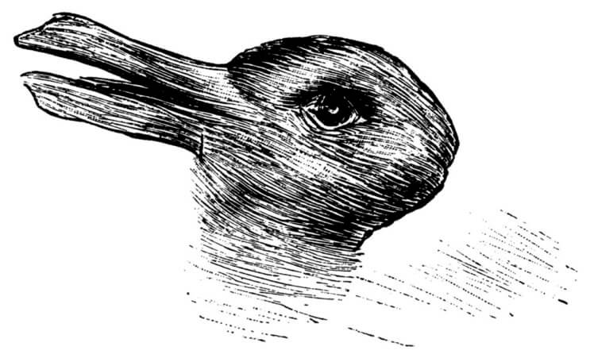

Знак (один символ или их множество, или вообще любое даже не символьное
описание --- а хоть и картинка) обычно отсылает к недоопределённому
понятию. Например, вы встречаете вот такое изображение:

Это утка или кролик^[Впервые иллюзия была предложена ещё
в 1901 году,
<https://archive.org/details/factfableinpsych01jast/page/295/mode/2up>]?
Не говорите, что «что-то совсем непонятное», ибо нарисовано достаточно
понятно, чтобы отличить от космического корабля или компьютерной
клавиатуры! Ещё один пример для того же самого: можно ли считать, что 3
хорошо обозначает число пи? Или нужно как-то уточнять?

В работе со знаками мы говорим о строгости/точности/формальности, если
ожидаем точности в определении значений, или
нестрогости/неточности/неформальности. Нестрогость значений в мышлении
нужна не меньше, чем строгость:

-   Рассуждения/вычисления с нестрогими значениями обычно много быстрее
-   Нестрогие значения легче сопоставить друг с другом.

Требование рациональности к мышлению характеризуется свободой движения в
мышлении от быстрого нестрогого/неформального интуитивного/неосознанного
(S1 по Канеману) мышления к медленному строгому/формальному
рассудочному/осознанному (S2 по Канеману), и обратно. Мастерство
мышления оказалось зависящим не только от умения рассуждать на каком-то
уровне формальности, но и менять этот уровень: управлять
формализацией/строгостью описаний, а не думать на уровне точности «уж
как смог». Способы выражения мира в мышлении (выражение понятий в
операциях с ними) меняются:

-   Строгие вычисления будут повторяться, с ними можно делать хоть 10000
    последовательных операций, получишь один и тот же результат.
    Нестрогие вычисления будут давать разный результат: для
    «приблизительных значений» будет быстро накапливаться ошибка. Если
    вы будете складывать целые числа (так называемые «цифровые
    значения»), то результат будет всегда однозначным. Если вы будете
    складывать какие-то измерения аналоговых параметров, то из-за
    неминуемых ошибок (шум, а хоть и тепловой шум, сбои из-за радиации и
    т.д.) результат будет чуть-чуть каждый раз разным. Если усиливать
    цифровой сигнал, он пройдёт 100500 (это сколько?) усилительных
    каскадов, и будет неизменным. Если усиливать аналоговый сигнал, то
    на выходе легко может оказаться шум (который присутствует в исходном
    сигнале, в каждом каскаде он будет немного усиливаться плюс
    добавляться какой-то свой шум --- и всё, сигнал будет в конечном
    итоге утерян, потеряется в шуме).
-   Если вычисления/рассуждения ума проводятся в нейросети, то в них
    появляется
    «квантованность»^[<https://arxiv.org/abs/2012.05082>]:
    пространство понятий оказывается представлено дискретно, причем эта
    дискретность подчиняется закономерностям квантовомеханической
    статистики. По факту вычисления идут не с непрерывным пространством
    понятий и оценивается каждая точка этого пространства, но с
    дискретным пространством понятий и оценивается только точка в
    «понятийном растре». Это примерно то же самое, что иметь пиксельный
    растр на дисплеях и частоту дискретизации для аудиотракта в
    компьютерах: в конечном итоге гарантируется, что исходные
    «непрерывные» понятия с каким-то уровнем точности могут быть
    восстановлены из такого «квантованного» описания.
-   Если вычисления при принятии решений квантовоподобные, то они
    линейны^[<https://www.sciencedirect.com/science/article/pii/S0303264720301994>],
    поэтому требуют меньше времени и ресурсов. И ещё они не откидывают
    события, о которых ничего не известно (и тем самым учитывают
    понятия, которые могли бы быть использованы в рассуждениях, но мы
    просто ещё не знаем, что эти события и отражающие их понятия
    существуют. Вычисления по Байесу их откидывают, а квантовоподобные
    рассуждения ---
    учитывают^[<https://www.frontiersin.org/articles/10.3389/fnbot.2022.910161/full>]).
    Тем самым биологические системы представляют понятия
    квантовоподобно, а не непрерывно, как в классической математике с
    непрерывными функциями. И люди оказываются неплохими
    квантовоподобными
    вычислителями^[<https://www.sciencedirect.com/science/article/pii/S0022249620301152>],
    а не плохими вычислителями байесовской вероятности.
-   Есть многочисленные гибридные вычисления/рассуждения, в которых
    участвуют и более точные формально определённые понятия, и менее
    точно определённые (или даже совсем неопределённые, не выходящие на
    уровень сознания, не осознаваемые и не имеющие знаков для своего
    представления) понятия.
-   Понятия не равны знакам. Если написать слово «единорог», то в
    зависимости от того, какое будет определено этим словом понятие, с
    ним можно дальше строить и строгие вычисления (например,
    «единорог^[<https://philosophy.stackexchange.com/questions/26782/what-is-the-truth-value-of-the-proposition-all-unicorns-are-beautiful>] ---
    это часть логического высказывания», и менее строгие (например,
    «единорог^[<https://en.wikipedia.org/wiki/Unicorn>] ---
    это персонаж легенд и сказок»,
    «единорог^[<https://en.wikipedia.org/wiki/Unicorn_(finance>)] ---
    это компания, достигшая оценки в \$1 млрд. до момента выхода на
    фондовый рынок»). Это даже неважно, одно и то же понятие имеется в
    виду, или нет (скажем, два первых примера имеют в виду одно и то же
    понятие, но в логике с ним обращаются строго, а вот в литературе ---
    не очень строго).

Особенно это важно, когда включаешь в мышление рассуждения/вычисления
нескольких человек, нескольких компьютеров --- уровни
формальности/строгости этих вычислений нужно обязательно согласовывать
при общении. Если кто-то делает «прикидку», то для него вполне нормально
сказать «насос», и считать, что «сифон», «напорная башня», и даже
«жёлоб» или «труба» для отвода воды вполне подойдёт. Если собеседник
ожидает другого уровня точности, то нужно будет указать конкретную марку
насоса, и будет очень неприятная ситуация, когда вместо «насоса»
окажется «сифон» (это тот же уткозаяц, который ведь не космический
корабль!).

Мышление коллективно, интеллект распределён в обществе людей и машин, в
одиночку мыслить всё одно не получится. И даже простые прикладные
рассуждения тоже не получатся в одиночку, труд сегодня существенно
связан с разделением труда.

Работа с изменением уровня формальности/строгости
описания/означкования/моделирования мира для коммуникации между
мыслителями (людьми и не-людьми) в современном мышлении обязательна и
связана с тем, что при изменении уровня строгости меняется теория
принятия решений. Булева логика даёт классическую теорию решений,
включая и теорию решений, основанную на байесовской логике.
Квантовоподобная теория решений опирается на совсем другие предпосылки,
это мы обсудим подробней, когда займёмся рациональностью как отдельной
дисциплиной интеллект-стека. Пока же надо просто запомнить, что при
принятии решений можно моделировать мир и коммуницировать по поводу этих
моделей грубо и многозначно, зато быстро, а можно коммуницировать много
точнее и однозначней, зато медленней.

Движение в сторону дискретной рассудочности, переход к локальным
представлениям и понятийному мышлению (даже в нейросетях!) назовём
**формализацией/моделированием/теоретизированием/познанием/схематизацией**
(это всё про понятия, и «схема» тут --- это не визуальная
диаграмма^[<https://en.wikipedia.org/wiki/Schema_(psychology>)],
а используемая в науках о мышлении абстрактная «схема понятий»), а
обратный переход к менее строгим (и часто
распределённым/коннективистским представлениям, например,
нейросетевым) --- **рендерингом/деформализацией/демоделированием**.

Рендеринг --- это когда по нотам пианист играет мелодию, добавляя свою
интерпретацию, или по информационной инженерной модели из системы
автоматизированного проектирования делается фотореалистическое
изображение. Удивительно, но образованные технари хорошо разбираются с
формализацией/моделированием, но убоги в рендеринге. Они на входе имеют
живой и богатый реальный мир, на выходе имеют абстрактную модель.
Гуманитарии, наоборот, хорошо справляются с рендерингом: они берут сухие
и чёткие формулировки и «наводят поэзию», ослабляют
строгость/формальность описаний. Технарь заменит изображения животных на
карте мира условными обозначениями (и сделает пространные описания, что
эти обозначения означают). Гуманитарий наоборот: возьмёт карту с
условными обозначениями, и заменит их картинками (не особо заботясь при
этом, как эти картинки соответствуют какой-нибудь научной классификации
животных). А как надо? **Надо уметь двигаться в обоих направлениях: и
поднимать уровень строгости, и снижать его.** **Слишком строгие
рассуждения часто невозможно сопоставить друг с другом
(формально-логические системы несовместимы друг с другом), слишком
нестрогие ---** **дают ошибки в рассуждениях, и эти ошибки накапливаются
при увеличении числа шагов в рассуждениях. Поэтому строгость в
рассуждениях должна варьироваться.**

Как рассуждать по описаниям на естественном языке, то есть рассуждать в
средней части спектра формальности, работая с обычными текстами, по
потребности управляя точностью описания объектов, которые участвуют в
мышлении, менее известно. Если бы это было хорошо известно, то можно
было бы реализовать такие рассуждения в компьютерах («объяснить
компьютеру», научить компьютер таким вычислениям/рассуждениям). Но пока
успехи компьютеров в области рассуждений на естественном языке более чем
скромны. Тем не менее, эти успехи есть: при росте размера нейронной сети
и росте числа примеров, которые может усвоить нейронная сетка в своей
«памяти» как сжатую модель языка и представлений о мире, способность
рассуждать появляется (мы говорили об этом в разделе «понятизация»,
когда приводили «деревце появляющихся при росте размера нейросети
свойств», способность к рассуждениям там росла). Нынешние нейросети
линейки GPT-3, GPT-3.5, GPT-4 (сервис ChatGPT) чётко это демонстрируют.

Как поэты, писатели художественной литературы, художники, композиторы
(все производимые ими описания должны только частично соответствовать
окружающему миру, чтобы быть узнаваемыми, но они не должны точно
описывать мир) компьютеры работают уже и сейчас отлично. Понятизацией
компьютеры овладели, и даже по многим тестам уже лучше, чем люди, стихи
компьютера и человека уже не отличить --- компьютеру даже не нужно
«прислушиваться к ощущениям в теле» (заметили, что «прислушиваться» это
слух, а «ощущения в теле» это кинестетика? Само высказывание
«прислушиваться к ощущениям» не очень «логично», не строго, но вполне
понятно). Собранности компьютерам не занимать, это и обсуждать не нужно.
Формальные рассуждения с точными значениями символов компьютеры делают
тоже лучше людей (перемножение десятизначных чисел компьютер делает
влёгкую, а вы?), при этом важно, что они не привлекают к этим точным
рассуждениям нейросети. Но вот мышление на уровне точности, чаще всего
задействуемой в профессиональной (а не бытовой на уровне «как пройти в
библиотеку») речи --- вот это у компьютеров пока плохо. Равно как плохо
с моделированием и
рендерингом^[<https://lab42.global/arcathon/> --- набор
задач на распознавание паттернов компьютеры решают на 31%, а люди --- на
80%. Хотя многие другие тесты компьютеры уже проходят не хуже людей ---
<https://super.gluebenchmark.com/leaderboard>].

Так что прямо сейчас, уже в 21 веке в семантике проходит революция,
меняется сам способ разговора о семантике, этот разговор становится сам
по себе достаточно точным, чтобы охватить работу с
символическими/знаковыми представлениями и живых людей, и
компьютеров --- по мере того, как растёт возможность компьютеров
работать и с формально-логическими представлениями, и с большими
глубокими нейросетями.
