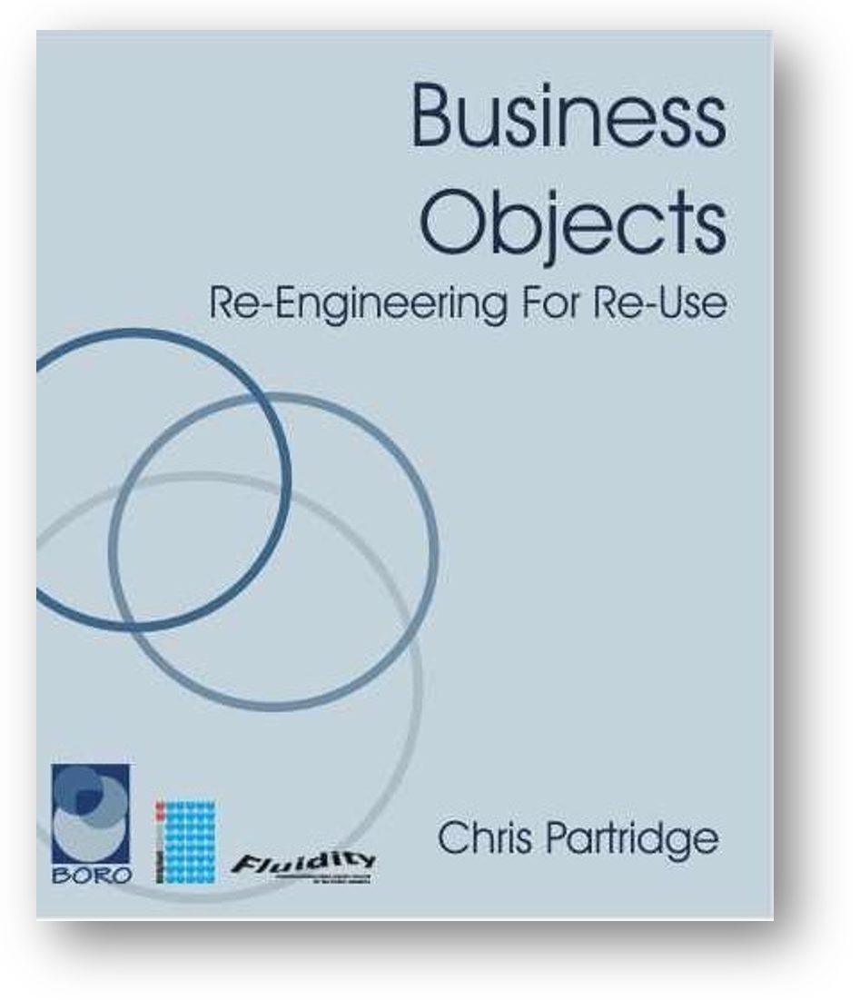

Цепочки описаний одними абстрактными/математическими/идеальными
объектами других подобных объектов всегда отталкиваются от описания
физических объектов, в самых абстрактных своих описаниях мы никогда не
отрываемся от реальности. Эта привязка всех абстрактных рассуждений (в
многомерном пространстве смыслов) к занимающим место в физическом
пространстве и времени конкретным предметам называется 4D
экстенсионализм. Подробно это описано в книге Chris Partridge «Business
Objects: Re-Engineering for Re-Use» (BORO book),
2011г.^[<https://yadi.sk/i/2SgjvILB3PqJEZ>]:

Последнее третье издание этой книжки вышло в 2011 году, она выросла из
длинного ряда философско-логических
традиций^[<https://ailev.livejournal.com/952930.html>]
и её материал лёг в основу систем интеграции данных жизненного цикла в
крупных инженерных и менеджерских проектах. В этой книжке
рассказывается, как достигать взаимопонимания, опираясь на привязку
абстрактных моделей мира к реальности, используя 4D (4 dimensions, три
измерения пространства и время) представления. Основная идея философской
логики, раскрываемая в книжке: **мы можем сопоставлять самые разные
формальные описания мира, если они относятся к одному и тому же месту в
пространстве-времени, занимаемому каким-то физическим объектом. И это
единственный способ договориться** **о мире**. Ибо если вы говорите «это
тёплое», а я «это гладкое», то единственный способ договориться --- это
показать на место в пространстве-времени, которое мы описываем. И если
это одно и то же место-время (например, оба показали на чайник), то мы
договоримся. Если это окажется разными местами-временами, то станет
понятно, что мы делаем утверждения про разные предметы. Если мы выдумали
какой-то мир, то договориться об этом мире мы можем только, если будем
привязывать все его описания к каким-то виртуальным физическим объектам
этого мира.

Вот эта операция привязки к физическому миру называется
**заземление**/grounding --- она обратная описыванию, обратная
репрезентации. В философской литературе, конечно, под заземлением
понимается более широкое
понятие^[<https://plato.stanford.edu/entries/grounding/>],
включающее в себя прежде всего «достаточность объяснений» для признания
того или иного объекта как-то определённым. Но мы тут будем
придерживаться позиции научного
реализма^[<https://plato.stanford.edu/entries/scientific-realism/>]
и отсылаться прежде всего к физическому миру.

Вам нужно уметь и описывать мир на разных уровнях строгости/формальности
описания, но и нужно уметь «деописывать», заземлять свои описания. Если
вы этого не умеете, или не можете распознать такое неумение у вашего
собеседника, то огромная вероятность, что вы будете обсуждать что-то
бредовое, фантастическое, и у вас будет полная иллюзия понимания, но
никакого понимания не будет. Если звучат какие-то абстрактные понятия
(типа «капитализм», который каждый понимает по-своему, или «системное
мышление») то попросите привести **примеры ситуаций в физическом мире**,
к которым применимы произносимые слова. Может оказаться, что вы
трактуете абстрактные понятия абсолютно иначе, чем ваш собеседник.

И мы не путаем многомерные представления объектов в пространстве смыслов
(понятия/concepts) и четырёхмерное существование в физическом
пространстве-времени!

Тут важно предостеречь от типичных ошибок (более полное их описание
можно найти в курсе «Практическое системное мышление»):

-   В попытке договориться делать ход не «к земле» (физическому миру), а
    наоборот --- отсылаться к более абстрактному понятию. Как ни
    странно, это стимулируется классическими определениями «по
    Аристотелю», то есть «вид --- это род, специализированный так-то и
    так-то», «сепулька --- это изделие, предназначенное для сепуления
    (то есть вид «сепулька» --- это такой род «изделия», который
    используют в сепулении)». Просьба выдать определение не работает!
    Определение --- это гробик для умершей мысли, часто только
    запутывает ситуацию. Надо выдавать для знаков наборы употреблений
    (по Витгенштейну) и связывать определяемые знаком понятия с
    физическим миром, а хоть и по длинной цепочке (конечно, могут быть
    множество «описаний описаний», «моделей моделей», «теорий теорий»,
    но тут ничего не поделаешь: ходы всё равно должны быть «к земле», а
    не «к небу»).
-   Неразличение физических объектов и описаний, когда речь идёт о
    документах. Документированное описание называют физическим объектом:
    «отчётом» называют не содержание отчёта, а пачку бумаги с текстом
    отчёта. «Передать отчёт» при этом --- действие роли курьера, а не
    того, кто этот отчёт готовил. Страница вебсайта при этом путается с
    тем, что этой страницей описано. База данных программы --- с тем,
    что описано этой базой данных. Строка таблицы --- с тем, что
    описывает эта строка таблицы. Книга --- с тем, что описывает эта
    книга. Это, пожалуй, самая распространённая ошибка: чтобы сделать
    систему, надо сделать сначала её описание. И вдруг про систему
    забывают, и целью становится документ с описанием! Это семантическая
    ошибка, ошибка в значении (говорят «отчёт», «книга» --- а имеют в
    виду то ли документы, то ли описанное в этих документах, всегда надо
    уточнять).
-   Ход на то, чтобы лучше представлять поведение/процесс/динамику как
    перечисление взаимодействующих и взаимоменяющихся в ходе этого
    процесса предметов вместо хода на облегчение понимания сути процесса
    вдруг становится ходом на создание системы-процесса. После этого и
    «жизнь» система, и «отдых» система, и «процесс» система. Нет, есть
    объекты, и есть их поведение. Но эта ошибка подробней будет
    разбираться, когда понятней станет с теорией понятий и онтологией.
    Семантика просто скажет, что если вы хотите что-то сказать про
    процесс, у вас должны быть про это знаки, и они как-то должны
    указывать на понятие процесса, и вот это понятие процесса как-то
    должно соответствовать тому, что можно найти в мире --- и это нужно
    сделать с какой-то степенью строгости. А уж что именно вы нашли и
    как потом будете использовать --- с этим будут разбираться другие
    дисциплины.
