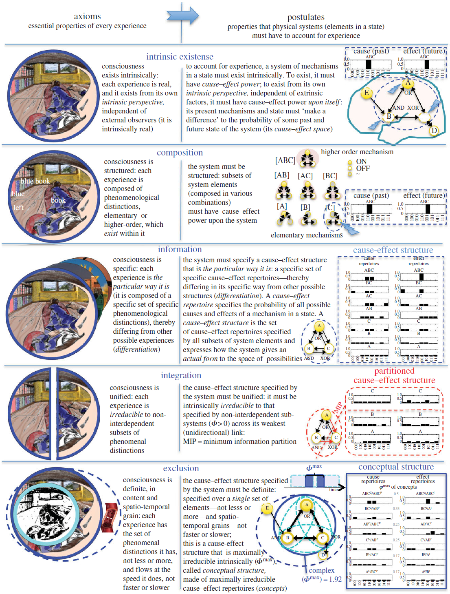

Познание/исследования начинаются с того, что предлагаются новые типы
объектов внимания, для которых делаются утверждения об
аксиомах/принципах, которым они подчиняются (скажем, предлагается
понятие евклидового пространства и высказывается догадка о том, что
параллельные прямые в нём не пересекаются, или предлагается понятие
энергии и высказывается догадка о принципе сохранения энергии). И да, в
зачёт потом идут только теории, с которыми можно делать измерения
(например, компьютерные/мысленные эксперименты для объектов идеального
мира, реальные замеры для физического мира) и контрафактические
рассуждения. Далее:

-   если объясняется меньшее число ситуаций, чем уже наличествующей
    теорией, то догадка откидывается (ну, или продолжает оставаться,
    если существенно проще в вычислениях, а точности или широты не
    нужно --- типа ньютоновской механики, которую никак не выкинут на
    помойку истории)
-   критика логическая (включая непротиворечивость рассуждений с
    использованием типов мета-модели, включая непротиворечивость
    рассуждений с использованием и смежных теорий, подтягивающихся в
    рассуждениях по длинной цепочке определяющих друг друга понятий и
    формульных зависимостей). Если рассуждения противоречивы, объяснение
    считается опровергнутым. Конечно, при этом может обсуждаться
    используемая логика, ибо что противоречиво в одной логике, вполне
    может оказаться ОК в другой логике.
-   критика экспериментом, проверяется порождение более точных
    результатов, чем у теорий-конкурентов. Если менее точные результаты,
    объяснение считается опровергнутым.

В естественных науках чаще всего предлагают/«догадывают»/«кладут»
объекты и отношения (предлагают некоторые аксиомы, принципы с
использованием этих объектов и отношений) в рамках
функциональных/поведенческих объяснительных теорий, называемых
**динамики/dynamic**: кладём/guess какое-то описание поведения (что-то
там течёт, взаимодействует, передаётся --- функциональная схема с
функциональными объектами, портами и потоками) как аксиомы, описываем
математику этого поведения через исчисление, чаще всего это делается
сейчас в форме дифференциальных уравнений для потоков, но возможны и
варианты.

Потом выполняем концептуальную работу: или обратную инженерию/reverse
engineering, то есть указываем, какие физические
объекты/конструктивы/модули реализуют/implement эту заданную уравнениями
функциональную схему, или прямую инженерию --- предлагая физическую
реализацию какими-то подходящими физическими объектами в реальном мире.

Это всё начиналось с механических моделей, но потом слово «механический»
в моделировании стало означать просто «неучастие божественных сил», то
есть возможность описания ровно той математикой, которая была
разработана для решения задач механики, а потом и квантовой механики.

Пример тут --- интегрированная информационная теория/integrated
information theory
(IIT)^[<https://en.wikipedia.org/wiki/Integrated_information_theory>],
которая предлагает какую-то математическую модель сознания на базе
предлагаемых для рассуждения объектов внимания (framework/ontology, как
раз не в форме knowledge graph, а в форме набора аксиом и некоторой
математической модели).

Далее разные варианты физических объектов/конструктивов/модулей для этих
функциональных/поведенческих объектов внимания обсуждаются как
реализующие или не реализующие её: «Начните с самого сознания, определив
его основные свойства, а затем спросите, какие физические механизмы
могут их объяснить». Именно такого подхода придерживается интегральная
теория информации (ИТИ) - развивающаяся формальная и количественная
структура, которая обеспечивает принципиальное объяснение того, что
нужно для возникновения сознания, предлагает простое объяснение
эмпирических данных, делает проверяемые предсказания и позволяет делать
выводы и
экстраполяции^[<https://royalsocietypublishing.org/doi/10.1098/rstb.2014.0167>,
\"Consciousness: here, there and everywhere?\", 2015, by Giulio Tononi
and Christof Koch].

Эта теория интересна тем, что сознание рассматривается как
общефизический феномен, связанный с восприятием --- и снимает
многочисленные парадоксы, которые занимали философов, занимающихся
сознанием. И подобных «механических» подходов к сознанию множество.

Дальше эти радикально новые догадки (frameworks/ontology), или
предложения по изменению уже существующих догадок, начинают
критиковаться умозрительно и экспериментально. **Опора на математическую
онтологию (присвоение «естественнонаучным понятиям»** **математических**
**типов) для фреймворка позволяет подтвердить хоть какую-то строгость
рассуждений: можно опереться в рассуждениях на свойства математических
объектов и задействовать рассуждения по формулам. Если мы говорим, что**
**«скорость ---** **это вектор», то для** **понятия «скорость»** **можно
использовать всё, что мы знаем о векторах, эти математические объекты
хорошо изучены!** **А после логической/умозрительной критики затем можно
«замерить и посчитать», то есть сравнить с данными эксперимента.**
