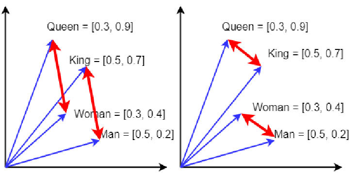

После критики эти догадки ещё и будут смешиваться с другими «догадками».
Для этого находятся какие-то аналогии. Некоторые понятия и отношения
между ними из разных теорий оказываются близкими, их отождествляют, а
дальше работают с более компактной общей теорией. Есть множество
подходов к тому, как находить аналогии и что такое вообще «рассуждение
по аналогии», что такое вообще «аналогия». Самым популярным автором в
этой области был Дуглас Хофштадтер, написавший «Гёдель, Эшер, Бах: эта
бесконечная гирлянда»
(1979)^[[https://ru.wikipedia.org/wiki/Гёдель,\_Эшер,\_Бах](https://ru.wikipedia.org/wiki/Гёдель,_Эшер,_Бах)].
В математике поиск аналогий крайне популярен: теория категорий многими
заявляется как хороший инструмент для отождествления находок в разных
областях математики, а поскольку эти математические объекты представляют
ещё и физические объекты, то можно говорить и об отождествлении находок
в разных областях физики. Вот классическая работа на эту тему, с
выразительным названием «Physics, Topology, Logic and Computation: A
Rosetta Stone»,
2009^[<https://arxiv.org/abs/0903.0340>].
В физике диаграммы Фейнмана используются для рассуждений о квантовых
процессах. В 1980-х годах стало ясно, что в основе этих диаграмм лежит
мощная аналогия между квантовой физикой и топологией: а именно, линейный
оператор ведёт себя очень похоже на
«кобордизм»^[<https://en.wikipedia.org/wiki/Cobordism>].
Подобные диаграммы можно использовать для рассуждений о логике, где они
представляют доказательства, и вычислениях, где они представляют
программы. С ростом интереса к квантовой криптографии и квантовым
вычислениям стало ясно, что существует обширная сеть аналогий между
физикой, топологией, логикой и вычислениями. В работе «Розеттский
камень» Joan Baez и Mike Stay уточняют некоторые из этих аналогий,
используя понятие «замкнутой симметричной моноидальной
категории»^[<https://en.wikipedia.org/wiki/Symmetric_monoidal_category>,
<https://en.wikipedia.org/wiki/Closed_monoidal_category>].
После описания взаимодействия систем как процессов в сетях/networks
(электрические, гидравлические сети, а также сети взаимодействий в
системной динамике, обычно связываемые с функциональными представлениями
системы, то есть представлениями времени функционирования) Joan Baez
делает предложение об использовании формализма теории симметричных
моноидальных категорий для описания не просто процессов, но открытых
систем, подразумевающих взаимодействие с окружающей
средой^[Symmetric Monoidal Categories: a Rosetta Stone,
<https://johncarlosbaez.wordpress.com/2021/05/28/symmetric-monoidal-categories-a-rosetta-stone/>].
Опять мы видим ход на использование теории категорий как foundational
ontology для онтологии системы, и основной ход --- это переход от
выражения онтологии в статичных отношениях к морфизмам, изменениям. Этот
ход соответствует ходу на конструктивизм в математике, когда от \"вечных
классов\"/eternal classes и их отношений мы переходим к операциям
построения/construction^[Constructive Mathematics,
<https://plato.stanford.edu/entries/mathematics-constructive/>].

Коннективистскую/распределённую/интуитивную линию рассуждений
(реализуемую сегодня нейросетями) представляет работа с переводами:
«аналогия между двумя текстами об одном и том же на разных языках».
Берём множество объектов и отношений из огромного набора (корпуса)
текстов какого-то языка о нашем мире и сопоставляем его с теми же
объектами и отношениями корпуса текстов о нашем же мире на другом языке.
Языковые модели в форме предобученных на корпусе текстов нейронных сетей
ровно это и делают: берут два облака точек «описания мира» на двух
языках (на самом деле --- на сотне языков, далее в картинках, далее в
действиях людей и роботов, далее в аудио, и т.д.) в многомерном
пространстве смыслов и как-то совмещают их друг с другом так, чтобы по
возможности направления в этом пространстве соответствовали
отношениям --- и максимально совмещают их «точка в точку», при этом
точки в пространстве смыслов представляют собой понятия, а вот
направления векторов характеризуют отношения между понятиями.

Это грубая модель, но современные нейросетевые модели переводят тексты,
включая перевод на язык, на котором нет параллельных
текстов^[<https://arxiv.org/abs/2201.03110>],
в том числе работая не только нейролингвистически (текстами), но и
мультимодально (картинки и т.д.): используется тот факт, что
описываем-то в корпусах текстов, картинках, объектах для «ощупывания» в
действиях робота один и тот же
мир^[<https://mt.cs.upc.edu/2021/02/08/major-breakthroughs-in-multilingual-neural-machine-translation-ii/>].
Проблема в том, что точность такого перевода заведомо оценить нельзя, а
если переводить несколько раз, то будет эффект «испорченного телефона»
(каждый раз вроде как вносится небольшая ошибка, но через три-четыре
перевода результат вообще оказывается непохож на оригинал).

Эти проблемы легко преодолеваются, если опираться не на быстрое
интуитивное «нейросетевое» аналоговое мышление S1, но на медленное и
трудозатратное логическое мышление S2, которое весьма эффективно
реализуется классическими электронными компьютерами, и которое
реализуется эмуляцией «логического вычислителя» на нейросетевых
вычислителях, в том числе человеческом мозге. В развитии цивилизации
должна присутствовать строгость и краткость описания мира, это и даёт
математика. Человечество опирается в своём познании и изменении мира в
том числе на символистскую, а не только на коннективистскую
онтологическую работу/метамоделирование. Символическая/семиотическая
работа идёт на высоком уровне формальности/строгости/изученности
поведения объектов, то есть задействует математику.

**Наука достигла** **сегодняшнего состояния как раз** **за счёт
использования математики как мета-мета-мета-модели/foundation**
**model** **для онтологии своих поднаук, то есть наука опиралась на
структурное сходство рассуждений по** **формулам для разных объектов
внимания. Это и есть основной путь науки.** При этом в математике есть
ещё и предпочтения: примат булевой логики и полной формальности над
байесовскими вероятностными вычислениями с их неопределённостью и
квантовыми вычислениями с их ещё большими неопределённостями. **Одна
беда: чем более формальны описания (длиннее цепочка** **присвоения
типов,** **то есть** **прописаны все типы по линии M0-M3 и иногда и M4,
да ещё и для точности введены промежуточные уровни), тем больше нужно
умственных усилий и тренинга для удержания этой цепочки. Поэтому
большинство населения работает с онтиками, используя интуитивное**
**нестрогое присвоение типов** **и неформальные (квантовоподобные, даже
не байесовские, как это выясняется в современных исследованиях по теории
принятия решений) правила рассуждений над типами M3 и M4, а хорошо
обученное меньшинство населения (учёные) ухитряются работать со всей
цепочкой, выдерживая строгую/булеву логику рассуждений с формальными
типами на высоких уровнях абстракции ---** **в том числе снимая
неминуемые противоречия, возникающие на этих уровнях абстракции при
попытке объединять рассуждения по разным онтикам.**

Противоречия неминуемо проскакивают в этот мир строгой формализации,
если используются разные онтики. Формализация имеет образовательный
ценз, физмат-моделирование (моделирование явлений физического мира
средствами математики) доступно не всем, ему нужно учить специально так
же, как любой другой работе с типами: учить как набору лучших имеющихся
типов как типов объектов внимания в какой-то предметной области, так и
операциям присвоения типов и проверки, насколько удачны были догадки об
этих типах (критика логическая и экспериментальная). И ещё есть
ресурсный ценз на альтернативную формализацию отдельных онтик каждый
раз, когда будет найдено очередное противоречие, возникающее при попытке
общего описания. Даже у учёных с их компьютерами может просто не хватать
ресурсов для ведения строгих рассуждений, требующих упоминания объектов
из разных предметных областей.

Ситуация ещё сложнее в силу запутанности конечных
классификаций/присвоений типа в классификационной иерархии как отношения
репрезентации между физическим миром и абстрактным/математическим миром
и наличием функциональных (в каком-то смысле \"идеальных\", обобщённых,
типизирующих, ролевых) объектов, в которых выполняется моделирование
физического мира. Объекты из учебника физики проще считать
функциональными (рассматриваемыми в run-time) с их репрезентацией
абстрактными/математическими объектами с хорошо изученным в математике
поведением, а вот продукты/модули/конструктивные объекты какого-то
прикладного domain --- это уже физические объекты (а не объекты из
учебника физики, те как раз функциональные!). То есть помидоры на весах
мы моделируем как помидоры::продукт/физический объект,
реализованный/realized/implemented by физическое
тело::функциональный\_объект, описываемый
весом::переменная::скаляр::абстрактный/математический объект. Иначе не
разобраться, см., например рассуждения по поводу понимания концепта
Markov blanket у разных авторов у Ian
Glendinning^[<https://www.psybertron.org/archives/15856>].

Этот подход «совмещения формальных описаний» на базе сходства отношений
между объектами этих описаний обычен и в мире «промышленных» онтологий,
где вместо математической upper ontology с формулами, как у физиков,
используется только foundational ontology из логики. John Sowa в софте
компании VivоMind реализовал подход VAE (VivoMind Analogy Engine), когда
просто ищутся два фрагмента графа знаний с одинаковой структурой
объектов и отношений, такое даже компьютеру можно поручить (и в работах
VivoMind показывается, что такой подход вполне практичен, есть успешные
приложения AI, полученные во времена, когда ещё не было
нейросетей)^[<http://www.jfsowa.com/pubs/analog.htm>].
И таких работ множество, хотя тот же John Sowa после многих лет мучений
с таким подходом пишет, что подобные методы поиска аналогий в
правой/строгой части спектра формальности мышления очень вычислительно
трудоёмки и вскрывают проблему: никакие промышленные upper ontologies не
помогают в поисках аналогий, для разных задач удобные для них
мета-мета-мета-модели кардинально различаются и общих рассуждений по ним
принципиально не построишь.

Аналогичный результат будет и для вероятностных описаний: общее
байесовское рассуждение для разных статистических теорий не проведёшь,
приходится переходить к квантовоподобным, то есть переносу математики,
разработанной для квантовой механики, на другие предметные области. Это
требует перехода от колмогоровской теории вероятностей для вычислений по
Байесу, которые в какой-то степени соответствуют строгой булевой
алгебре, ко множеству несовместимых вероятностных алгебр, что отмечает в
своих работах Андрей
Хренников^[<https://disk.yandex.ru/i/-HSzsN6thL0Y-w>].
Отказ от «булевости» и «байесовоскости» важен также для более
ресурсно-адекватного моделирования мира и отмечается также и другими
авторами (квантовоподобные представления линейны и дискретны, это резко
уменьшает объем вычислений, кроме того «байес» откидывает вероятности
априорных событий, о которых мы не знаем, а квантовоподобный расчёт
как-то их
учитывает)^[<https://www.sciencedirect.com/science/article/pii/S0303264720301994>
и
<https://www.frontiersin.org/articles/10.3389/fnbot.2022.910161/full#B45>].

**В функциональных объяснительных теориях ищут одинаковую структуру
математических формул, которыми они выражены (при этом смотрят на то,
чтобы речь шла не об одной формуле, а о каком-то массиве формул, чтобы
подобие было более-менее развёрнутым/очевидным, а не эпизодическим
случайным совпадением) ---** **и делают выводы, что природа хорошо
описываемых одинаковыми формулами явлений похожа, это всё проявления
каких-то общих закономерностей.** **Каждый такой случай закрепляет
использование общего для многих случаев математического аппарата. Ровно
таким образом распространились классические «исчисления», а в последнее
время распространяется «новый треугольник», просто предлагаемые ими
математические объекты оказались очень универсальными в плане
возможностей описания физического мира.**
