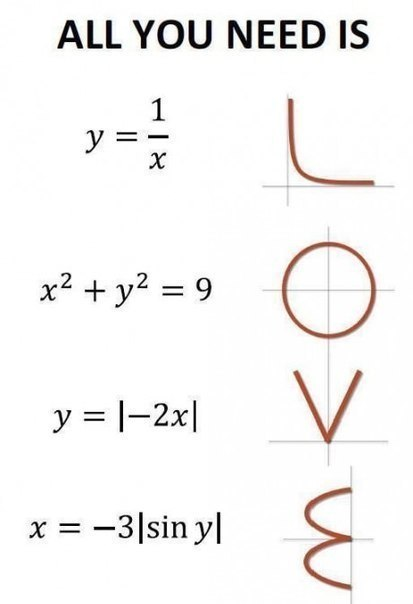

В написании этого подраздела был использован следующий ход: из статей
Владимира Воеводского был взят список важных математических объектов,
которые придумали математики в последние годы, но которые пока почти не
используются в естественных науках: categories, sheaves, cohomology,
simplicial sets. Затем взята идея «оснований математики» на базе
унивалентной аксиомы: вместо логик разных порядков (формулируемых на
базе теории множеств) иметь гомотопические уровни объектов разных типов
(формулируемых на базе алгебраического выражения геометрических
представлений о форме). Автор попросил GPT-4 рассортировать categories,
sheaves, cohomology, simplicial sets по этим уровням. А потом попросил
дополнить этот рассортированный список объектов другими важными
объектами (важность определялась GPT-4 самостоятельно). Вот итог, в
котором было вставленное по-русски дополнение про теорию порядков, это
важно для выражения идей кардинализма и ординализма, например, в
экономике, но всё остальное порождено GPT-4 и осталось нетронутым:

h-level 0 (contractible types):

1.  Point: A single point is a contractible space, as it can be
    continuously deformed into itself.

h-level 1 (propositions):

1.  Cohomology: Cohomology theories usually involve abelian groups or
    modules, which are sets, but the actual cohomology groups can be
    seen as propositions when considering them up to isomorphism.
2.  Equivalence relations: An equivalence relation on a set partitions
    the set into disjoint subsets, and can be seen as a proposition
    about the elements of the set.
3.  Equations: Mathematical statements that assert the equality of two
    expressions can be seen as propositions.
4.  вся теория порядков - предпорядки, решетки, соответствия Галуа и
    т.п.

h-level 2 (sets, и тут вычислимость, так как объекты стали различимы и
можно вычислять их свойства):

1.  Chu spaces: A Chu space is a set-theoretic structure consisting of a
    set of states, a set of events, and a satisfaction relation between
    them.
2.  Categories: A category consists of a set of objects and a set of
    morphisms, along with composition and identity operations satisfying
    certain axioms.
3.  Simplicial sets: A simplicial set is a functor from the simplex
    category to the category of sets. The category of sets is an h-level
    2 object, so simplicial sets can be considered at this level.
4.  Topological spaces: A topological space is a set of points, along
    with a collection of open sets satisfying certain axioms.
5.  Groups: A group is a set with a binary operation satisfying certain
    axioms, such as associativity, identity, and inverses.
6.  Functions: A function is a relation between a set of inputs and a
    set of possible outputs with the property that each input is related
    to exactly one output.
7.  Matrices: A matrix is a rectangular array of numbers, symbols, or
    expressions, arranged in rows and columns.
8.  Vectors: A vector is an element of a vector space, which is a set of
    objects that can be added together and multiplied by scalars.
9.  Sequences and Series: A sequence is an ordered list of elements,
    while a series is the sum of the terms of a sequence.
10. Graphs: A graph is a mathematical structure consisting of a set of
    vertices and a set of edges connecting pairs of vertices.
11. Probability Distributions: A probability distribution is a function
    that describes the likelihood of obtaining the possible values of a
    random variable.

h-level 3 (groupoids):

1.  Sheaves: A sheaf is a functor from a category (usually a topological
    space or a site) to the category of sets or groupoids, satisfying
    certain axioms. Since groupoids are at h-level 3, sheaves taking
    values in groupoids can be considered at this level.
2.  Lie groups: A Lie group is a group that is also a smooth manifold,
    with the group operations being smooth maps. Since groups are
    h-level 2 objects and manifolds are h-level 3 objects, Lie groups
    can be considered at this level.
3.  Fractals: A fractal is a complex geometric shape that exhibits
    self-similarity and has a non-integer dimension. Fractals can be
    considered at h-level 3 as they often involve groupoid structures.

Проблема в том, что переформулирование онтологии предметной области в
терминах теории категорий как объектов с хорошо изученным поведением в
терминах теории типов --- это тяжкий и весьма объёмный труд, хотя его
сегодня можно делать с использованием AI.

Но что потом можно будет сделать легче, или вообще сделать? Ответы пока
не слишком внятны. В целом вроде как можно пройти по спектру
формальности в сторону больших кусков проверенных формальных связных
согласованных утверждений о мире. Но вот польза от этого пока не была
продемонстрирована, и тут дело даже не в одном-двух примерах, необходимо
демонстрировать что-то массовое и доведённое до практики (скажем,
какие-то массовые инженерные расчёты).

В учебных программах ШСМ по интеллект-стеку можно использовать эти
материалы как поправки к мета-мета-модели. Это не слишком формальная
онтология, которая позволяет точнее и быстрее думать (но не вычислять
более формально, о чём больше всего заботится подход унивалентных
оснований математики в частности и теории гомотопических типов в целом).
Пока понятно, что проблема не столько в отсутствии формальности в
мышлении, сколько в плохих объектах для мышления на среднем уровне
формальности, и выбирать объекты желательно так, чтобы потом проще было
формализовывать, если это будет сочтено нужным.

Обучение математике тем самым стоит посвятить математическому мышлению,
а не изучению поведения некоторых конкретных классов математических
объектов. Если примерно понятно, как устроена математика в целом, что
там в основаниях математики (foundational ontology), что на уровне
«чистой математики» (изобретение новых видов математических объектов),
что на уровне прикладной математики (использование вычислений с
известными математическими объектами), то можно рассчитывать на то, что
при встрече с какими-то проблемами в математическом моделировании можно
будет разобраться хотя бы с постановкой задачи для математического AI.
Конечно, нужно будет при обучении получить какие-то примеры таких
связных рассуждений (что там в основаниях, как предложены какие-то
конкретные важные математические объекты, какие модели и вычисления с
ними делаются в естественных науках), но это именно примеры. Не стоит
ожидать, что просто на изучении поведения объектов в каких-то «разделах
математики» появится это математическое мышление. Конечно, если
математику преподаёт какой-то «великий математик» (или «великий физик»,
которому нужна новая математика для его области физики), то может
состояться неформальная передача этого математического мышления, но это
будет у одного студента из десяти. Нужно же экономить время обучения:
тому, что понятно про роль математики в науке и инженерии учить
непосредственно, как и учить непосредственно тому, что и как в
математике развивается.

Это открытый вопрос: можем ли мы поднять качество мышления в целом, если
перетолкуем текущую математику выражения онтологии на гомотопии. С одной
стороны --- геометрические интуиции пространств, путей (траекторий),
типизация вроде как вся остаётся (хотя её нужно будет перетолковывать).
С другой --- непонятно, насколько это поможет в мышлении «вот прямо
сейчас». Учитывать нужно, что уже есть AI класса GPT-4 с Wolfram Alpha и
выше, которые помогут в мышлении с «классикой». Но в любой науке есть
идеи «удобных для мышления объектов» прошлых поколений, с использованием
которых было наработано довольно много знаний. А потом всё равно
приходилось перетолковывать этот огромный корпус знаний заново по мере
получения более формальных, более точных, более универсальных знаний.

Если впрямую научить рассуждать про обычный мир вокруг в терминах
объектов и операций, предлагаемых в основаниях математики (обычно
хватает понимания 70-80 понятий для начального обучения мышлению в
какой-то предметной области, тут можно ожидать такого же), то станет
удобней мыслить об окружающем мире, и проще потом будет заниматься
математическим моделированием. Такой подход поможет быстрее проходить
развилку: чистая философия против физики, «думайте в терминах вот этих
объектов» против «думайте в терминах вот этих объектов, и вы сможете
что-то посчитать и сравнить результаты с измерениями». Самой математикой
должны заниматься компьютеры, но обучать нужно тому, что в этих занятиях
нет никакой магии, никакого «вдохновения» или «гениальной интуиции», но
есть рациональные объяснения.

Высказывание «математика царица наук, но служанка физики» оказывается в
каком-то смысле верным: математика открывает новые типы ментальных
объектов и изучает их поведение, но затем эти объекты оказываются нужны
для того, чтобы как-то отождествлять их с физическими объектами и судить
по поведению математических объектов о поведении физических объектов.
Физикам приходится тем самым ограничивать своё воображение только теми
ментальными конструкциями (сконструированными из более мелких более
крупными ментальными объектами), которые как-то соответствуют данным
экспериментов. Из физиков вырастают великолепные руководители крупных
организаций, но из математиков такого почти никогда не бывает. Но по
мнению Александра Жаворонкова (CEO Insilico
Medicine^[<https://insilico.com/>]), для
задач создания новых видов нейронных сетей, занимающихся решениями
биологических и фармакологических проблем, лучше использовать
математиков: они для таких задач оказываются немного креативней физиков,
«отвязней» в своих догадках. Так что учить только физическому мышлению в
его привязке к физическому миру не совсем правильно, нужно ещё и обучать
математическому «отвязному» мышлению.

Что из математики надо знать «простым людям» (не-математикам) для того,
чтобы точнее делать предсказательные/порождающие модели для своих самых
разных ситуаций? Что «одинаковое в математике» вынести за скобки всех
проектов и выучить один раз, чтобы потом по-быстрому применять во всех
проектах? Идея о том, что «все будут профессиональными физиками» --- не
работает, «все будут профессиональными математиками» --- тоже не
работает, и даже «все будут профессиональными программистами» --- так же
не работает. Какой объём математических идей должен попасть в мышление
(возможно, заменив сегодняшние «бытовые» мемы/эвристики/догадки более
продуктивными, найденными математикой-физикой-информатикой), чтобы
продуктивно использоваться в повседневном мышлении по решению самых
разных классов проблем?

Тут надо бы слушать не столько самих математиков, сколько тех людей,
которым математика зачем-то была нужна, и которые были бы и рады без неё
обойтись, но не могут, ибо она оказалась полезней всего остального для
их проектов. Первые из этих людей --- физики, вторые --- программисты
(включая программистов систем искусственного интеллекта), третьи ---
инженеры, но математических модельеров надо искать и в других областях.
Трудность в том, что они не знают ни современной математики, ни
альтернативного способа организации обучения математике, поэтому
расскажут только о том, как учили их самих и дадут какую-то оптимизацию
этого старинного образования. «Всё новое приходит сбоку», прорывы в
математическом образовании и использовании математики придут явно не от
математиков.

Важнее всего оказывается разделить «содержание математики» на
многочисленных её уровнях выше основания, «разделы математики» и
собственно математическое мышление как способы наработки нового
содержания математики, способы применения этого содержания к жизни, в
том числе к другим трансдисциплинам, способы построения математических
объяснений.

Есть сотни книг вроде как про «математическое мышление», скажем, Барбара
Оакли, «Думай как математик. Как решать любые задачи быстрее и
эффективнее»^[<http://loveread.ec/view_global.php?id=70641>].
Эта (и многие другие похожие книги) больше похожи на курсы собранности,
а не математики: там рассказывается про память, концентрированное и
деконцентрированное внимание, прокрастинацию, а также дают прикладное
знание по собранности, то есть дают постановку привычки учиться. И это
всё дано бытовым языком, на байках и метафорах, теории собранности нет,
только «лайфхаки». Книга оказывается не про математическое мышление как
задание важных объектов внимания и операций с ними для рассуждений об
использовании математических знаний в проектах. Книга также не про
собранность в приложении к математике, но про «психотерапию для обучения
математике» (терапия --- это «ремонт», убираем отклонение от нормы,
убираем недостатки).. Нет в книге ответов на вопрос «почему именно это»
(объяснений), и на вопрос «как именно это нужно делать?! Легко сказать,
что надо быть поэтом! И ещё хорошим поэтом! Но как именно?!» (нет
описания методов). В книге не даются какие-то понятные принципы с
понятной объяснительной теорией за ними, но даётся сборник
психотехнических лайфхаков общего вида. Для постановки математического
мышления хочется другого, больше похожего на старинную (больше двадцати
лет назад) статью Атья и более новую статью Родина. Но Атья и Родин
писали как математик для математиков. А надо писать для всех людей, и не
как математик, а как учитель мышления, показывающий роль и место
математики в ряду самых разных других трансдисциплин. Поместить
математику в контекст, вот что важно!

Итого из относительно нового, что надо знать про математику в 21 веке:

-   HoTT (homotopy type theory) и дальше теория категорий вместо теории
    множеств и FOL (first order logic) как foundation ontology для
    теории понятий «объектов и отношений» (теория понятий лежит в
    основании онтологии предметного мира), так и математики как
    непосредственно используемой онтологии физики и естественных наук
    (мат.объекты и операторы как отношения). Новый синтез геометрии и
    алгебры в математике.
-   обсуждение «среднего уровня формальности» (informal type theory), то
    есть ходы на свободную формализацию и деформализацию, то есть
    изучение способов мышления на уровне «псевдокода», удобного для
    дальнейшей формализации и последующих строгих вычислений.
-   Обучение математическому мышлению, «как оно там в математике
    устроено» вместо обучения «разделам математики» в надежде, что
    появится математическое мышление.

