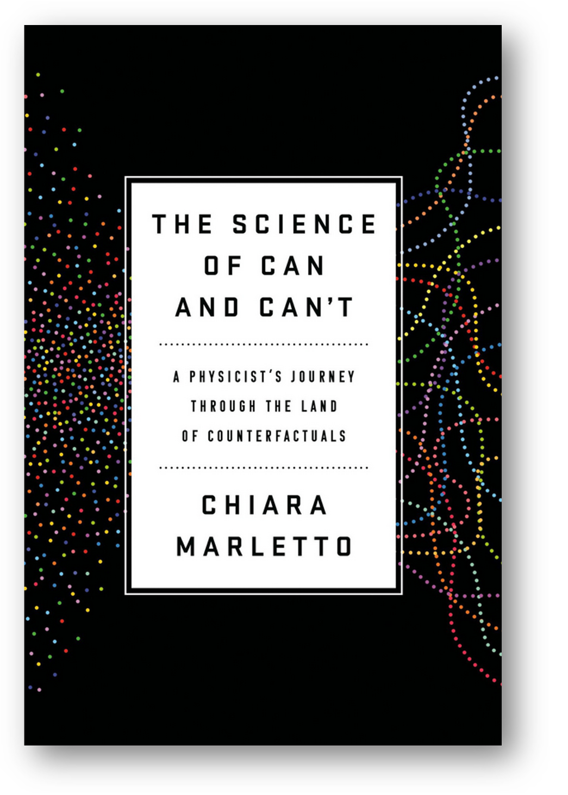

Дэвид Дойч в 1985 году
доказал^[<https://www.cs.princeton.edu/courses/archive/fall04/cos576/papers/deutsch85.pdf>],
что квантовый компьютер является **универсальным
вычислителем/компьютером**: то есть он может делать ровно такие же
вычисления, как и классический универсальный компьютер, описанный Аланом
Тьюрингом. А результат самого Тьюринга --- что любые вычисления, которые
может сделать математик с ручкой и бумажкой (если убрать ограничения на
время и память, то есть число записей, которые может этот математик
сделать) могут быть выполнены на так называемом «универсальном
компьютере», и одной из простейших форм такого компьютера является
машина Тьюринга. Разница только в объёме памяти, быстродействии и
используемых приёмах вычисления.

Именно физика говорит, что люди (которые работают с цифровой/дискретной
информацией, а не аналоговой --- помним, что при аналоговых вычислениях
быстро накапливаются ошибки в их длинных цепочках), классические
компьютеры, квантовые компьютеры и многие и многие другие физические
объекты-вычислители могут производить операции с информацией (и
суперинформацией в случае квантовых компьютеров) и получать одни и те же
результаты, если абстрагироваться от требуемых для этого времени, памяти
и способа вычислений/алгоритма. Мышление как рассуждения интеллекта,
прикладные рассуждения специалиста (в том числе прикладные рассуждения
медведя, едущего на велосипеде --- интеллект ему для этого не нужен,
равно как и специалисту, занимающемуся решением задачи, которую уже
известно как решать), рассуждения программы машинного интеллекта,
исполняемой на классическом электронном или даже квантовом компьютере,
совместные вычисления человека и его компьютерного экзокортекса --- всё
это имеет одну природу. И не физика определяется математикой, а
наоборот: математика определяется физикой в том плане, что математик ---
это физический объект, который может как-то отражать поведение
математических объектов. Склейка эта идёт через семантику: математика и
выражение её знаками, физические объекты и отражение их знаками.

Так что мы выделяем особые классы физических объектов: носители
информации/битов, носители суперинформации/кубитов и вычислители как
физические объекты, имитирующие поведение
идеальных/математических/понятийных/абстрактных объектов, представленных
знаками на носителе.

Лучшая книжка, которая обо всём этом как-то внятно рассказывает --- это
вышедшая в мае 2021 года книга физика Chiara Marletto «The Science of
Can and Can\'t: A Physicist\'s Journey through the Land of
Counterfactuals»^[<https://www.amazon.com/Science-Can-Cant-Physicists-Counterfactuals-ebook/dp/B08GJWFK92>]

Эта книжка полезна не только для понимания идей теории информации, как
она понимается физиками, она также касается и других трансдисциплин
интеллект-стека, прежде всего логики, объяснений, исследований. Часто
все эти разные учения/трансдисциплины объединяют под названием
«эпистемология», имея в виду объяснения того, как устроено научное
познание мира. Если доавить художественное и религиозное познание мира,
то это уже будет гносеология. Но теория информации и физичность
носителей знания и вычислителей/мыслителей (включая людей, включая
компьютеры, включая квантовые компьютеры и иные вычислители, в том числе
используемые для рассуждений, в том числе используемые для
мышления/познания) как ограничение на познание обычно эпистемологами не
рассматривается, так что сегодня приходится пересобирать традиционные
дисциплины, отказываться от веками произносящихся слов с греческими
корнями.

И помним, что согласно идеям active/embodied inference (extended mind,
extended cognition,
4E^[<https://www.ncbi.nlm.nih.gov/pmc/articles/PMC7250653/>])
мы от операций просто с информацией (вычислений) переходим к ещё и к
воспринятию ситуаций (датчики на вычислителе) и действиям в окружении
(актуаторы/эффекторы на вычислителе). В любом случае, вычисления и
физический мир оказываются связанными, при этом физический мир
(физичность вычислений) оказывается важней. Не вычисления и их
возможность определяют физический мир (Дойч называет эти идеи «поиском
компьютера в небе»), а физический мир определяет вычислимость или
невычислимость каких-то значений, решаемость или неразрешимость каких-то
проблем. Вычислители физичны! Но о физике мы всё-таки думаем в терминах
математики, вычислений путём операций с математическими объектами.

Вообще, физичность некоторых объектов, важных для мышления, нужно
обсуждать отдельно. Например, физична ли «вероятность»? Этот вопрос
важен для того, чтобы суметь построить квантовый компьютер. Основной
единицей хранения информации там является реализуемый или ионом, или
атомом, или фотоном кубит: узнать значение его можно измерением, но при
этом нельзя откопировать это значение (чем кубит и отличается от бита)!
И дальше можно задаться вопросом: а само это значение имеет
вероятностную физическую природу, то есть случайно, или всё-таки оно
строго предопределено, но вероятность возникает как способ наших
рассуждений о том, как устроен квантовый мир? David Deutsch и Wallace
развили (при этом до конца они так и не
договорились^[<https://arxiv.org/abs/0906.2718>])
на базе высказанного David Lewis principal principle как «человек/агент
верит в реальность в соответствии с
шансами»^[<https://plato.stanford.edu/entries/david-lewis/>]
так называемый decision argument. Оказывается, вероятность нужна людям
как концепт/понятие, на основе которого можно принять какое-то решение и
действовать! А в самой физике «без людей», которым на основе измерений
нужно что-то делать, вероятностей нет, там всё
предопределено/детерминировано, никакого «случая, происходящего из
вакуума». Серия измерений кубита даёт разные результаты, но эти
результаты не определены «случаем»! Вероятность не имеет физического
смысла, она субъективна! Андрей Хренников любит так её и называть:
«субъективная теория вероятности, используемая в квантовой механике»,
чтобы не путать с разными другими вариантами трактовки вероятности.

Chiara Marletto выпускает пару работ, где она «выводит из физичности»
как теорию информации (это она делает совместно с
Дойчем)^[<http://arxiv.org/abs/1405.5563>],
так и теорию
вероятностей^[<http://arxiv.org/abs/1507.03287>].
В работе по теории вероятностей она показывает, что важно не путать
детерминистичность («бог не играет в кости», в происходящих явлениях
природы нет случайности, физика не включает в себя «беспричинно
происходящие события») и непредсказуемость (даже если в каком-то событии
нет случайности, то его может быть теоретически нельзя предсказать).

Вышедшая в 2021 году книга Marletto пересказывает эти идеи более-менее
простым языком. Но вся эти линия рассуждений началас ещё в в 1985 году,
когда Дойч показал то, что квантовый компьютер --- это универсальный
компьютер. Но основные идеи новой SoTA теории информации как физического
основания для алгоритмики, включающие в себя квантовые вычисления,
появились за последние десять лет. Учитывая, что интеллект
(реализованный мозгом ли, классическим ли компьютером с AI, или даже
группой людей, чьё мышление поддержано датацентрами с квантовыми и
обычными компьютерами) --- это вычислитель, то или мы как-то понимаем
самые общие принципы того, как математические/абстрактные/ментальные
объекты представляются в мозге, классическом компьютере, бумажной книге,
квантовом компьютере, или вынуждены считать компьютер и мозг
шайтан-машинами, которые абсолютно непохожи ни в каком смысле, и дальше
честно верим в чудеса типа «чтения информации из Космоса» или влияние
неизвестных науке сил на работу мозга гадалок, магов, астрологов.

Теория информации как лежащая на стыке физики, математики и семиотики,
занимается ещё одной проблемой: кодированием информации (какие знаки
какие концепты обозначают по каким правилам, включая аспект
безошибочности за счёт избыточности в использовании знаков. Если через
компьютерную память пройдёт космическая частица и изменит содержимое её
ячейки, то ничего не изменится: информации в соседних ячейках хватит,
чтобы заметить и исправить эту ошибку). Фильтрация шума: если канал
связи привносит шум, то можно этот шум отфильтровать за счёт той же
избыточности. Сжатие информации: все эти .mp3 и .jpg файлы как раз тоже
приложения теории информации.

Каким образом мы храним данные, чтобы несмотря на неизбежные ошибки
из-за несовершенства материалов и неизбежных изменений в физических
устройствах хранения и физических каналах передачи информации быть
уверенными в отсутствии ошибок? Какой объем дополнительной памяти нужен,
чтобы обеспечить эту безошибочность? Как быстро мы можем передать
информацию по каналу связи с заданной пропускной способностью и
известным уровнем помех? Этим занимается классическая теория информации,
связываемая обычно с именем Клода
Шеннона^[[https://ru.wikipedia.org/wiki/Шеннон,\_Клод](https://ru.wikipedia.org/wiki/Шеннон,_Клод)].
Он первым предложил описание систем связи с математической стороны,
задействовал это описание в криптографии. Он первым предложил считать
канал связи множеством всевозможных шумов, а источник сообщений
множеством всех возможных сообщений. И именно он предложил бит как
единицу измерения информации, это всё было в 1948 году.

В интеллект-стеке предполагается, что теория информации --- это отнюдь
не криптографическая, не сугубо «айтишная» прикладная дисциплина, а
важная трансдисциплина, имеющая самые неожиданные применения в самых
неожиданных предметных областях.

Например, игрок на каком музыкальном инструменте более эффективен?
Который может передать своему инструменту за один раз максимальный поток
информации! Например, клавишник, играющий на синтезаторе, передаёт при
аккордовой игре с нюансами явно больше информации, чем играющие на
многих других инструментах --- и это не последняя причина, по которой
многие композиторы, изучавшие в консерватории «общее фортепиано»,
отказываются от приглашения больших оркестров для записи своих
произведений и справляются, задействуя клавишный синтезатор. Ещё вопрос:
откажутся ли люди от хорошей клавиатуры как средства ввода, если мы
видим резкий взлёт голосовых интерфейсов? Ответ: нет, не откажутся, ибо
скорость диктовки оказывается меньше, чем скорость набора на клавиатуре
при большем числе ошибок (и уж точно исправлять ошибки голосом дольше,
чем исправлять ошибки набора на клавиатуре: навигация по тексту голосом
долгая, навигация клавишами или мышью или даже пальцем --- быстрая). В
конечном итоге речь идёт о битах в секунду для переданного текста с
исправленными ошибками.

Для всех этих рассуждений было бы достаточно теории информации Шеннона,
давностью три четверти века. Более того, этой теории было достаточно,
чтобы умершего в 1914 году логика Charles Sanders
Pierce^[<https://en.wikipedia.org/wiki/Charles_Sanders_Peirce>]
назвали отцом теории информации в семиотике. Информацию в сообщениях
людей стали рассматривать точно так же:

-   Мы должны как-то кодировать сообщение/информацию, например, словами.
    Или танцем. Или выражением лица. Или выбором слов (скажем, написав
    сообщение канцеляритом).
-   Мы должны затем как-то передать сообщение/информацию через какой-то
    канал передачи. Например, собрать пресс-конференцию (если на неё
    кто-нибудь придёт!) и потом ожидать, что люди прочтут её во многих
    СМИ. Или послать одному человеку исчезающее личное сообщение через
    мессенджер. Или сделать спамовую рассылку. Или выйти на улицу с
    плакатом (и потом ожидать, что фото этого плаката разойдётся в
    социальных сетях). Или по-старинке позвонить по телефону и сказать
    что-то голосом. Или сесть в метро, приехать к собеседнику и сказать
    сообщение голосом прямо в уши, без технических средств.
-   Затем собеседник должен будет как-то обработать эту информацию
    (принять к сведению, что-то сделать, запросить уточнение, сообщить о
    том, что ничего не понял, проигнорировать).

Всё это в подробностях рассматривается в самых разных других
трансдисциплинах: редкость ресурса канала связи и вычислительного
ресурса для кодирования/декодирования учитывается в алгоритмике, а как
использовать информацию, чтобы убедить получателя-агента что-то сделать,
рассматривается в риторике. Но вот сама идея о том, что идеи/понятия,
выраженные в каких-то знаках нужно а) выразить в знаках/закодировать,
так, чтобы можно было потом прочесть б) куда-то передать без ошибок, в)
декодировать, чтобы получить представление, какие там у этих знаков
означаемые --- и что всё это связано с использованием каких-то
физических носителей информации и физических вычислителей разной
природы, это всё теория информации.

Что произошло в последние пять лет в теории информации? Глубокие
нейронные сети оказались неплохой памятью, они отлично кодируют и
декодируют информацию. Настолько хорошо, что можно говорить о революции
в тех технологиях, в которых они используются.

Например, именно сжатие информации оказывается основой для разговоров о
генетике (как из генома появляется феном: геном содержит сжатую
информацию о феноме), и даже теории творчества и
искусства^[<https://people.idsia.ch/~juergen/creativity.html>].

Теория информации имеет значение, мышление (включая коммуникацию между
мыслителями при коллективном мышлении) существенно опирается на её
положения.
