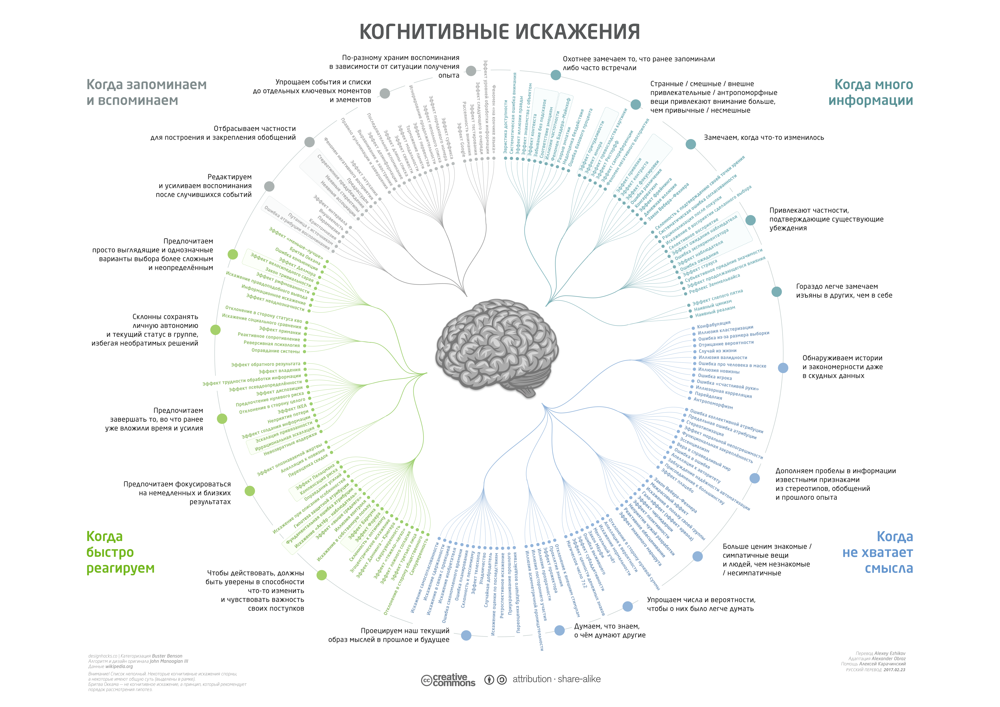

Ошибки интуитивного мышления (быстрое мышление S1 по Канеману) на
быстром-неточном конце спектра скорости/точности мышления часто называют
предвзятостями/когнитивными искажениями/cognitive bias. Ошибки эти не
замечаются мозгом, если только вы сознательно не включаете механизм
медленного осознанного рассудочного мышления S2.

Этих ошибок очень
много^[[https://ru.wikipedia.org/wiki/Список\_когнитивных\_искажений](https://ru.wikipedia.org/wiki/Список_когнитивных_искажений)]:

Сегодня стало модным искать в суждениях когнитивные искажения, вроде как
это должно поднять логичность этих суждений. В результате вы тратите 15
часов на разговоры с любителями выискивать когнитивные искажения не на
тему самого разговора (инженерию, менеджмент, предпринимательство, тему
другой деятельности), но о ваших ошибках и вашей к ним толерантности, их
классах, недостатках мышления обезьяны по сравнению с чётким логическим
мышлением со ссылками на литературу по когнитивным искажениям, важности
совпадения описания карты с территорией и т.д. Через пятнадцать часов вы
выясняете, что ошибок тьма, жизнь нелепа, в любом высказывании ошибок
можно найти не менее пяти или шести, карта вашего мышления плохо
соответствует территории предметной области, а быстрое мышление по
Канеману (S1) дурит --- и вы не продвинулись ни на шаг, analysis
paralysis, ибо в каждой попытке продвинуться вам укажут на очередные
когнитивные искажения. Если вы их хотите найти, то всегда найдёте. Если
очень хотите, то будете видеть только эти искажения, а продвижения
вперёд и интересные идеи будут полностью незаметны и будут ускользать от
внимания.

Во фразе «пайди вазьми 150 рублей прямо сейчас вон в том акошке», вы
будете обсуждать только ашипки и почему нельзя так ниграматно писать, а
до пойти и взять 150 рублей дело не дойдёт!

Беда с этими когнитивными искажениями, даваемыми длинными списками, как
раз в этом: лекарство незаметно и как-то печально неизбежно становится
болезнью. Как бороться с когнитивными искажениями? Сознательно уходить
от интуитивного мышления, развивать логику. Если известно, как
рассуждать правильно --- то можно отслеживать все отклонения от этой
правильности, какие бы они ни были, а не заучивать списки «чего делать
нельзя». Если 2\*2=4, то неправильные ответы --- 5, 26, xbc, 4.41,
«число», и не нужно запоминать список того, что могло пойти не так.
Правильно «по правилам логики» вот так, а всё остальное --- неправильно,
не нужно проверять специально. Но нужно помнить, что человеческий
мозг --- это очень плохой логический вычислитель, если работает
«интуитивно» в быстром и нетрудном режиме S1. Его логике нужно
специально учить, используя трудный медленный осознанный режим работы
S2!

Для логичных рассуждений нужно научиться моделировать/формализовать
предмет обсуждения (всё это разные способы называть одно и то же:
переход к логической строгости начинается с формализации предметной
области). То есть логическое рассуждение базируется только на том, что
вы рассуждаете, применяя правила логики к каким-то объектам, но ещё и на
том, что вы выделяете подходящие объекты внимания из фона, планируете
ресурсы для рассуждений, уточняете типы объектов и их отношения.
Логичное рассуждение возможно только тогда, когда у вас в порядке с
применением мыслительных практик всех предыдущих уровней
интеллект-стека. Если там непорядок (плохо с онтологией, плохо с
семантикой, плохо с собранностью --- много с чем может быть непорядок),
то у вас будут правильное применение правильных логических операций к
неправильным объектам, результат будет печальный.

Логика тесно связана с формализацией знания. В западной культуре
аналитике, т.е. основанных на логике формализации и моделированию,
исторически придаётся большое значение. Результаты этой западной ветки
цивилизации с её аналитичностью и логичностью хорошо видны: восточная
цивилизация успешна сегодня примерно в той мере, в какой она копирует
западные достижения научной, инженерной, менеджерской,
предпринимательской, да и всей остальной (кроме искусства и религии)
мысли^[Подробней эту линию рассуждения про преимущества
рациональности перед восточным упованием на интуицию и «непосредственное
знание» см. в текстах «об членораздельное и голографическое в
социологии» <http://ailev.livejournal.com/1281819.html> и «об интуицию и
чуйку» <http://ailev.livejournal.com/1295595.html>.].
Формализация/моделирование/онтологизирование в связке с рассуждениями по
правилам с элементами этих моделей лежит в основе западной цивилизации.
Знания накапливаются прежде всего в форме моделей, важных объектов с
важными связями! И дальше с этими моделями производят
вычисления/рассуждения --- и люди, и компьютеры, и люди вместе с
компьютерами, и в одиночку, и коллективно.

**Быть логичным, не умея моделировать/абстрагировать --- нельзя!** Или
вы обучаетесь моделированию, с которого и начинается медленное
рассудочное (формальное, логичное, по лучшим цивилизационным образцам)
мышление S2 по Канеману, и будете защищены от когнитивных искажений в
силу самого устройства этого мышления, или вы будете вечно искать в
результатах вашего интуитивного мышления, вашей «смекалистости» ошибки
от искажений/предвзятостей быстрого мышления S1 по Канеману, то есть
предвзятостей интуитивного мышления животного.

Вместе с тем, часть этих «когнитивных искажений» не является
искажениями. Люди являются совсем плохими формально-логическими
вычислителями, а даже плохими, но не такими уж плохими байесовскими
вычислителями, когда работают в режиме S1 (то есть без использования
сознательного рассуждения), это давно было установлено экспериментально.
И при этом отлично живут! Если вам не надо супернадёжного логического
вывода, чтобы запустить ракету в космос, то можно полагаться и на
интуицию --- это много менее энергозатратно, требует меньше внимания,
результаты доступны быстрее (надо «прикинуть», но не надо «рассуждать по
правилам»). Сейчас это наблюдение уточнено: люди являются плохим
байесовским вычислителем, но при этом неплохим квантовоподобным
вычислителем! Некоторые психологические эксперименты, которые нельзя
было объяснить, если считать человека байесовским вычислителем, можно
объяснить, если принять гипотезу о быстрых квантовоподобных вычислениях
«по интуиции», и результаты при этом не совпадают с логическими и
«чистыми байесовскими». Например, эффект порядка ответов (люди оценивают
вероятность разных ситуаций по-разному, в зависимости от порядка
предъявления вопросов) оказался лучше всего объясним, если предположить
квантовоподобность в
рассуждениях^[<https://arxiv.org/abs/2010.10444>].
Кроме того, квантовоподобное рассуждение даёт быстрый ответ (за счёт
того, что вычисления идут не непрерывных функций и тем самым не должны
быть верными для бесконечного числа точек, квантовоподобные вычисления
привязаны к квантам/дискретам различимости, то есть вычислений надо
меньше, и решения можно сделать линейными, что много быстрее), а ещё там
учитывается априорная информация, о которой мы не знаем, и которая в
чисто байесовском расчёте просто откидывается. Если у вас ограниченное
время и ресурсы на вычисление, то квантовоподобная логика (как раз
«интуиция», S1 человеческого мышления) становится вполне рациональным и
правильным выбором логики! А бесконечное выискивание «предвзятостей,
искажающих суждения» --- оно ведёт к analysis paralysis, застреванию в
бесконечных бесплодных рассуждениях вместо выхода на продуктивное
действие. В животном мире лишние раздумья приводят к тому, что вас
съедают, или вы сами не успеваете кого-то съесть. В мире конкурентного
рынка всё то же самое: если выбрана не та логика, то будут или ошибки,
или вы просто не успеваете всё продумать, или хотите получить результат
точнее, чем это теоретически возможно --- в любом случае, проигрываете в
конкуренции. Логика важна!
