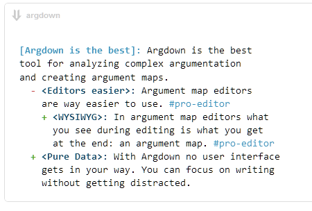
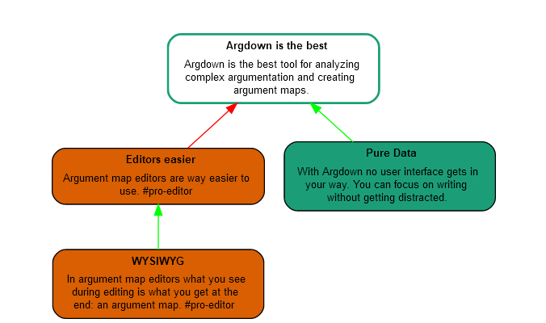

Язык, на котором выражается рассуждение, совершенно необязательно
формальный искусственный язык математической логики. Нет, это чаще всего
как раз естественный язык --- самый мощный из известных человечеству. На
естественном языке вы можете выразить всё то, что выразимо на формальном
языке, и заодно сделать заметки по тому содержанию рассуждений, которое
не укладывается в формальный язык (помним, что формализация --- это
сжатие информации, выкидывание ненужного. Но если всё-таки что-то
хочется оставить? Нужно менять формализм, или добавлять описания в
других формализмах, в том числе описания на естественном языке). На
естественном языке вы можете бесконечно уточнять высказывание: как
уточнять понятия (на какие места в многомерном семантическом
пространстве вы указываете), так и уточнять отношения между ними
(например, использовать N-арные отношения, не все формальные языки это
позволяют).

Критика и доказательства безошибочности суждений происходят чаще всего в
форме диалога
(полилога^[[https://ru.wikipedia.org/wiki/Полилог](https://ru.wikipedia.org/wiki/Полилог)],
разговора многих агентов) на естественном языке. И на этом естественном
языке делаются содержательные суждения/заявления/claims как
аргументы^[<https://plato.stanford.edu/entries/argument/>],
которые затем критикуются на предмет их логической непротиворечивости.

Собственно, практика логики в интеллект-стеке в существенной мере
заключается в выдвижении и критике аргументов. Дедукция, индукция,
абдукция, аналогия, заблуждение (неверный аргумент) --- всё это типы
аргументов. Аргументирование тоже может быть устроено по-разному. При
этом помним, что логическое рассуждение необязательно следует именно
правилам формальной/математической/булевой логики, оно может следовать
правилам байесовского вывода (уточнений/обновлений по мере накопления
информации), а также правилам квантовоподобного вывода.

Alan Kay в тексте про мощные идеи^[по-русски:
<https://m.habr.com/ru/company/goto/blog/358912/>, англ.
<http://worrydream.com/refs/Kay%20-%20Powerful%20Ideas%20Need%20Love%20Too.html>]
пишет, что надо отличать мышление и коммуникацию байками-повествованиями
или красочными пословицами от эссе с серьёзной аргументацией без
привязки к байкам-историям-пословицам:

Царь Соломон считался самым мудрым человеком, который когда-либо жил, и
поясняется, почему: он знал более 3000 пословиц! А пословицы работают
следующим образом: если вы возвращаетесь домой из поездки, и ваша семья
рада вас видеть, тогда «Разлука заставляет их сердца любить сильнее». Но
если вы вернетесь из путешествия, а они не очень-то вам рады, тогда
причина этому... что? Правильно: «С глаз долой, из сердца вон». Каждая
пословица существует для придания конкретной ситуации определенного
смысла, и каждая из них приходит на ум от случая к случаю. Если
пословица, которую вы сегодня используете (или игра, или фильм, который
вы сегодня смотрите), противоречит той, что была на прошлой неделе, то
это не имеет значения, потому что пословицы и рассказы оцениваются, в
основном, на основании того, насколько они хорошо подходят в текущий
момент времени, а не как они соотносятся с другими пословицами и
рассказами в целом.

Способ мышления и придания смысла своей жизни и обществу с помощью
историй и повествований является универсальным во всех культурах, а
также служит основой для «настройки соединения» с другими людьми.

\...Мышление на основе историй победило. Клод Леви-Стросс и Сеймур
Пейперт назвали это инкрементным изолированным «естественным» обучением
через процесс создания «любительских поделок», что означает сделать
что-то, «повозившись с техникой». Это одна из причин, по которой
инженерное дело начало свой путь за тысячи лет до науки; некоторые
конструкции могут быть реализованы постепенно, путем проб и ошибок, не
требуя каких-либо подробных объяснений, как все это работает.

Однако, если мы оглянемся на последние 400 лет, и задумаемся о том,
какие идеи стали причиной самых значительных изменений в человеческом
обществе, и какие вывели нас в современную эпоху демократии, науки,
техники и здравоохранения, то мы будем немного шокированы, когда
осознаем, что ни одна из них не представлена в виде истории \[и не
обоснована пословицами\]! В трактате Ньютона о законах движения, силе
тяжести и поведении планет задаётся последовательность аргументов,
имитирующих книги Евклида по геометрии. С тех пор все научные статьи
также представляются в форме доказательств \[последовательностей
аргументов\], а не историй.

Дальше Алан Кей говорит, что не нужно отказываться от историй, они
хороши для развлечений и театра. Но по итогам исследований 5% взрослых
американцев, менее 7% жителей Великобритании (в России и других
постсоветских странах можно ожидать того же самого) научились мыслить в
свободных формах (эссе) о причинно-следственных отношениях без привязки
последовательности рассуждения к историям. Из 150 самых продаваемых книг
в США ни одной книги не было в формате серьёзного эссе с
аргументированными доказательствами какой-то связной теории. Это
означает, что развивать цивилизацию и задумываться о длинных, а не
однозвенных цепочках причин и следствий будут те самые 5-7 процентов
населения, и не больше. **Вы сами способны разбираться в длинных
цепочках аргументов? Или на третьем аргументе вам уже
«многабукаф»**^[[https://slang.su/content/Многабукаф](https://slang.su/content/Многабукаф)]**?**

Конечно, для удержания логики/правил в рассуждениях мы не надеемся на
просто собранность «голого мозга», «медитацию-размышление», а хоть и с
использованием аргументов в качестве содержания мышления. Мы надеемся на
экзокортекс, письменные формы, киборгизацию в аргументировании.

В начале 21 века методы работы с аргументами с использованием
экзокортекса сводились главным образом к диаграммной технике, построению
карт аргументов/argument
maps^[<https://en.wikipedia.org/wiki/Argument_map>].
Это техника использования деревьев аргументов и их связей, очень похожая
на технику Mind Maps и технику Concept Maps, но только типы узлов и
ограничения на типы связей в этих техниках разные. А форма --- одна,
граф-дерево. Сейчас мода на визуальные представления прошла, ибо с ними
неудобно работать. Так, Mind Maps как диаграммная форма представления
информации в виде графа-дерева уступила место аутлайну, полностью
эквивалентному способу представления графа-дерева. Сначала люди
пользовались для быстрого создания и редактирования Mind Maps режимом
аутлайна в специальных программах, а затем обнаружили, что оглавления в
MS Word устроены ровно как этот аутлайн, и даже ещё удобней --- а сами
Mind Maps оказываются не нужными для рабочих целей, и используются
только как красивые картинки для презентаций. И мода на эти «ментальные
карты» прошла!

Тот же процесс идёт с софтом Argument Maps (это на сегодня десятки
программных средств). Как пример --- софт
Argdown^[<https://argdown.org/>], в
котором предлагается простой текстовый язык для описания графов-деревьев
аргументации. Основное время работа с аргументацией идёт в режиме
текстового представления, но затем для иллюстративных целей программы
могут это представление отображать в виде диаграммы, при этом визуальное
представление не главное. Вот текст с аргументацией того, что
Argdown --- это лучший инструмент для изучения сложной аргументации:

А вот представление того же самого картинкой, её вроде как приятно
разглядывать, но много сложнее редактировать, особенно если надо вносить
много мелких правок разными людьми (обычная коллективная мыслительная
работа, включающая подготовку письменной аргументации и удержания
коллективного внимания в большом проекте за счёт письма):

Хорошими средствами для моделирования сложной аргументации будут
productivity tools, при этом важно, что это инструменты для
коллективного моделирования (лидерами таких средств на сегодня являются
coda.io, notion.so).

Опора на технические средства в аргументировании, в представлении логики
рассуждения и спокойной проверке безошибочности рассуждений по правилам
логики --- это сегодняшний мейнстрим. Этот мейнстрим движется от
поддержки только булевой логики к поддержке вероятностной логики, и
дальше можно ожидать движения к поддержке квантовоподобных рассуждений.

Логика в рассуждениях на невысоких уровнях формальности (мы тут про
«размышления» о реальной жизни, а не про математику на высоком уровне
формальности/точности/строгости) поддерживается уже и программами
машинного интеллекта, универсальными алгоритмами. Можно выделить Project
Debater^[<https://www.research.ibm.com/interactive/project-debater/>]
как одно из первых таких приложений, но сейчас спорить и аргументировать
способен практически каждый чат-бот, так что этих помощников в дебатах
множество^[<https://topai.tools/s/Debate-generator>].

Все эти программные системы могут с разной степенью успешности (чаще ---
более успешно, чем другие живые спорщики) спорить с компетентными людьми
по сложным вопросам. Цель --- помочь сформулировать убедительные (трудно
критикуемые, логически выверенные) аргументы, чтобы на основе этой
аргументации дальше принимать рациональное решение о действиях.

Обратите внимание, что речь сейчас идёт о задействовании всего
интеллект-стека: в том числе мы говорим о моделях рассуждений, способах
записи этих моделей на носителях, аргументах и аргументировании с
критикой как способах уменьшать число ошибок в рассуждении,
использование компьютерных моделеров для удержания во внимании сложных
рассуждений, и даже об универсальных алгоритмах, которые способны
рассуждать логически и презентовать результаты рассуждений в виде
аргументов на естественном языке, а не абы как!
