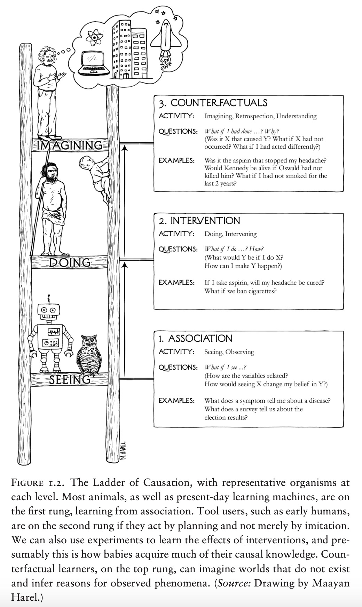

Дойч в книге «Начало бесконечности. Объяснения, которые меняют мир» (и
меньшей мере в книге «Структура реальности») продолжает линию Karl
Popper^[<https://plato.stanford.edu/entries/popper/>]
для эволюционной научной эпистемологии как бесконечной добычи знаний.
Karl Popper утверждал, что ключевая операция появления новых знаний ---
это догадка про то, какие объекты и отношения важны для эффективного
изменения мира к лучшему (мы тут не касаемся того, что означает «к
лучшему», это будет обсуждаться в этике). Это и есть основное отличие
**рационализма от
эмпирицизма**^[<https://plato.stanford.edu/entries/rationalism-empiricism/>]:
в эмпирицизме (по-русски иногда говорят ещё «эмпиризм») новое знание
выводится из наблюдений («данных о мире»), а в рационализме в основе
знания лежит догадка, невыводимая из наблюдений. Наблюдения нужны будут
потом, для проверки догадки! В эмпирицизме наблюдения начинают всё дело.

**Новое тут то, что** **догадка/guess** **(гипотеза)** **должна быть
не** **в виде** **любой идеи, а именно** **в виде** **объяснения.** В
оригинале у Karl Popper создание знаний начинается с догадки в форме
любой идеи, сами добываемые наукой знания он не конкретизировал.

Далее догадка должна пройти строгий контроль на то, что она среди всех
других догадок является лучшей. David Deutsch в своих книгах предлагает
проверять контрфактуальность формулировок объяснения (собственно, у него
именно это отличает «объяснение» от «просто любой идеи» ---
причинно-следственность), на трудноизменяемость (тут нужно копать:
похоже, это как-то связано с типами, но сам по себе критерий не очень
понятен), на рациональность (не парохиальность, какая-то байесовская или
квантовая, но не произвольная логика вывода, логическая стыковка с
другими объяснениями, а не обособленность), на универсальность
(покрывает большее число ситуаций, чем объяснения-конкуренты), на
точность предсказания данных эксперимента (сравнение с другими
объяснениями).

**Объяснения, которые не удалось опровергнуть, нужно принимать**
**всерьёз (то есть действовать в соответствии с ними)**. Это означает,
что с самого начала объяснения должны быть направлены на действия,
критерий хорошего объяснения --- возможность использовать его в действии
(такое обсуждается как **прагматицизм**). Если объяснения выглядят очень
странно, но вы не можете их опровергнуть --- вы должны строить свои
действия на этих объяснениях, и это очень контринтуитивно, очень трудно
принять, но именно так и надо действовать.

David Deutsch также предложил **критерий удовольствия/fun**
**criterium**^[<https://www.youtube.com/watch?v=idvGlr0aT3c>,
<https://www.youtube.com/watch?v=uQ2GHzFYxaI>] для
объяснений, связанный с семантикой: удовольствие/fun --- это когда сам
процесс эволюции идей идёт беспроблемно в плане совмещения
**явных/explicit**, **неявных осознанных/inexplicit/tacit** и совсем уж
**неосознанных/unconscious** объяснений в рассуждении. Рассуждение
только с явными объяснениями --- это «логика», но нейросетевые
вычислители работают не строго «логично», а подмешивают в рассуждения
дополнительные интуитивные соображения, осознанно или совсем
неосознанно. В этих трёх видах рассуждений людьми не должно ощущаться
«онтологического дребезга» (ощущений в теле, соответствующих
проблемности/противоречивости, обнаруженной в рассуждениях). Критиковать
в объяснении тут можно только явную/explicit часть, что абсолютно
недостаточно. Увы, даже если вы ощущаете этот «онтологический дребезг»,
он не даёт указаний о том, что делать --- надо выявить сначала его
причины, но потом всё одно придётся как-то решать возникшую проблему.
Это хорошо характеризует ситуацию, описываемую как «когда мы найдём
правильное решение --- мы это почувствуем». Конечно, речь идёт именно о
«почувствуем», ибо это уйдёт «онтологический дребезг», вы получите
удовольствие, оно будет вполне ощутимо!

Множество вариантов критериев хороших объяснений нерациональны.
Например, нерационален призыв следовать только explicit теории,
исключать из рассмотрения какую-то интуицию. Объяснения/теории должны
оцениваться по их содержанию, а не тому, откуда пришли --- скажем, может
быть письменное объяснение «из бульварных газет, они же буковками
написаны» --- опираться на это объяснение на основе критерия только
письменности было бы неправильно. Романтический критерий, где чувства
«интуиции» должны победить всё письменное/explicit --- это тоже оценка
не содержания теории, а источника откуда пришли, только в этом случае
источником будет «интуиция», а не тексты. Но нужно как-то применить
выдвижение догадок, критику, исправление ошибок к совокупности
конфликтующих осознанных письменных и интуитивно ощущаемых, а также
совсем уж неосознанных теорий (которые в рассуждениях принимают участие,
но мы на это просто не обращаем внимание --- но на результат рассуждений
они влияют!).

David Deutsch предлагает решение в том, что все эти неосознанные,
прочувствованные, явные (формальные писанные) объяснения/теории нужно
воспринимать как эволюцию их в некотором окружении других теорий/идей в
мозгу (или мозгах, или мозгах и компьютерах), и в этой совместной
эволюции идёт учёт всех трёх видов идей (явных, осознаваемых неявных,
неосознаваемых). Конфликт явных идей может быть проявлен логикой и
экспериментом, а вот в случае двух других видов идей/теорий это может
быть проявлено состоянием ума, в котором идёт эволюция всех видов идей
одновременно, и вот в этом состоянии ума у вас тот самый
fun/забава/удовольствие/развлечение.

Это совпадает с последней работой группы Karl Friston про биологическую
эволюцию, в которой нельзя рассматривать отдельные организмы и отдельные
генотипы, но нужно рассматривать взаимодействующие между собой организмы
и генотипы в ходе совместного эволюционного
взаимовлияния^[<https://mdpi.com/1099-4300/25/7/964>].

Другой современный защитник рационализма (сначала предложим модель,
потом проведём эксперимент) от эмпирицизма (сначала проведём
эксперимент, потом из результатов его измерений выведем модель) --- это
Judea Pearl. Его последние работы посвящены уже не столько тому, что
люди не в состоянии рассуждать рационально (то есть действовать на
основе объяснений, прежде всего объяснений того, как причины дают их
следствия), но и искусственный интеллект на основе современных
нейросетей не даёт
объяснений^[<https://ftp.cs.ucla.edu/pub/stat_ser/r502-reprint.pdf>].
В языке разработчиков универсальных алгоритмов рационализм получает
знания model-based путём, эти знания дают cognitive bias плюс для
проверки используются данные измерений --- вот это правильно!
Эмпирицизм: знания получаются из данных/измерений плюс «аппаратные»
знания как innate priors --- это неправильно! Вот три аргумента Judea
Pearl в пользу рациональности против эмпирицизма:

-   **Целесообразность (expediency).** Данные эксперимента и innate
    priors вполне можно использовать для эволюции знания. Но эволюция
    крайне неэффективна, на неё уходит огромное количество вычислений.
    Можно найти эффективные универсальные алгоритмы, реализующие
    эволюцию, но это поможет не радикально. При появлении какой-то
    неожиданной проблемы просто может не хватить времени для её решения!
    В биологии ответ на такое жесток: не успел убежать, защититься или
    напасть и съесть --- смерть. «Пробы и ошибки» --- это вполне рабочий
    метод, но человечество явно придумало и другие методы получения
    ответов на вопросы! Для того, чтобы выбирать новые эксперименты в
    ходе эволюции («что пробовать» в методе проб и ошибок), нужно уметь
    строить рациональные модели (в том числе и прежде всего --- модели
    причинности, модели для рассуждений о причинах и следствиях).
-   **Прозрачность (transparency).** Откомпилированное в теорию
    (абстрагированное и компактно представленное/сжатое) знание удобно
    хранить и переиспользовать. Понятно, как проводить с ним вычисления.
    Понятна его модульная организация. Разделение познания/learning
    (один раз задорого) и «рассуждений по использованию
    знаний/теорий»/вывода/inference (многократно задёшево) --- это очень
    выгодно вычислительно! Рациональные (откомпилированные, формальные,
    в том числе причинные) модели могут отвечать на вопросы, не выводя
    эти ответы эволюцией из данных.
-   **Объяснимость (explainability).** Ответы на вопросы должны быть
    объяснимы, что обычно происходит в терминах причин и следствий и
    правил рассуждений. Знание передаётся от агента к агенту не путём
    передачи исходного набора данных, из которого потом агент сам
    получит новое знание, но путём объяснения. Объяснение делается на
    причинных (с контрфактуалами!) моделях.

Judea Pearl и вслед за ним много кто ещё, например, Bareinboim со
товарищи^[<https://causalai.net/r60.pdf>]
заходят на формализацию причинности по линии «лестницы причинности»:

-   **Контрфактуальность.** Рассуждения о причинах-следствиях ведутся
    контрфактуально, с вопросами «если бы не было причины X, то что было
    бы» к уже свершившимся ситуациям. Это означает, что рассуждения
    ведутся с графами причинности, из которых исключаются стрелки.
-   **Интервенции.** Вероятности событий в графе причинности считаются
    как вывод в байесовской сети, и это do-calculus, исчисление
    интервенций, отвечает на вопросы «если делаем X причиной, то что
    будет следствием?».
-   **Ассоциации.** Граф причинности должен быть догадкой (рационализм
    против эмпирицизма), а расчёты байесовской сети по данным
    эксперимента («ассоциации») только сдвигают вероятность наличия или
    отсутствия связи. В редких и особых ситуациях граф причинности может
    выводиться из данных, но это нужно особо обсуждать каждый раз.

Вот страница «The Book of Why», где изображена эта лестница причинности:

Использование только «ассоциаций» (статистических закономерностей,
вычисленных из данных) не должно заменять индивидуализированное (а не по
итогам всей выборки) принятие решений. **Если принять аргументацию**
**Pearl** **и** **Mueller,** **то сегодняшние клинические исследования**
**двойным слепым
методом**^[<https://en.wikipedia.org/wiki/Randomized_controlled_trial>]
**оказываются** **не
рациональны**^[<https://ftp.cs.ucla.edu/pub/stat_ser/r513.pdf>]**!
Они дают ненадёжные результаты (то есть часто врут)!**
