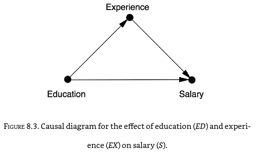

Логика занимается тем, что выполняет правильные рассуждения над
объектами, полученными в результате
моделирования/онтологизирования/формализации. Но любые ли модели нам
нужны для деятельности? Нет, нам прежде всего нужны модели, позволяющие
предсказывать состояние мира в будущем, то есть
**generative/порождающие** (противопоставляемые
**discriminative/различающим** моделям). И нам нужны
**причинные/causal** модели, позволяющие определять по причинам
следствия для этих причин. Такие модели называются **объяснениями**. Они
отвечают на вопрос «почему», «отчего» и «что будет, если», а не просто
выдают какой-то результат. Самое главное, что эти модели позволяют
отвечать на вопросы «а что, если...?» даже к уже прошедшим в реальности
событиям с моделируемой ситуацией, и получать ответы про «альтернативное
будущее для уже свершившегося», что явно будет «против
фактов»/**контрфактуально/counterfactual**.

То есть модели, которые показывают нам просто ассоциации/корреляции
между какими-то событиями, нам не подходят! Они не показывают, что в
этих событиях причина, а что следствие! Солнце встаёт, потому что петух
кричит, или петух кричит, потому что солнце встаёт? Или и солнце встаёт,
и петух кричит потому, что есть некоторая для них общая причина, которую
мы ещё не знаем? Статистики, показывающей связь между восходом солнца и
пением петуха оказывается недостаточно, чтобы разобраться. Нам нужны
объяснения.

Над статистическими моделями, отражающими ассоциации между какими-то
событиями, есть ещё два уровня «лестницы причинности»/causal ladder,
изучаемые относительно новым разделом логики^[Judea
Pearl: «I will treat causal inference as a new branch of logic, thriving
upon its own semantics, grammar and computational tools and capable of
quantifying its own capabilities and limitations» ---
<https://www.cs.ucla.edu/upcoming-events/cs-201-what-is-causal-inference-a-logical-perspective-judea-pearl-ucla-computer-science-department/>],
называемым причинным обновлением (causal inference, называем по образцу
«байесианского обновления» на основе получаемой информации на каждом
шаге inference/вывода/обновления), оформившимся в более-менее
самостоятельное направление в последние два-три десятка лет. Приведём
ещё раз лестницу причинности, теперь дадим её с первой ступеньки, и
пойдём вверх:

-   **Ассоциация (association)** связана с наблюдением. Типичные
    вопросы: что это? Как наблюдение X изменяет мою веру в Y? Да, там
    сразу условные байесовские вероятности P(y\|x), а не частотные
    фишеровские. Все эти p-критерии как «значимость фактора» нужно
    забыть, они остались в 20 веке, они оказались ведущими к кризису
    воспроизводимости. Примеры моделирования на этом уровне: «Что
    симптом говорит мне о болезни?», «Что опрос говорит нам о
    результатах выборов?» Проблема тут в том, что на этом уровне мы не
    можем обсуждать причины и следствия, обсуждать эксперименты и
    задавать вопросы «а что, если...?».
-   **Вмешательство (intervention)** связано с деятельностью, влиянием
    на жизнь. Типичные вопросы как раз: что, если? Что, если я сделаю X?
    Это уже за пределами байесовской статистики, ибо не статистика
    вовсе: требуется дополнительное введение причинной модели, т.е.
    каких-то гипотез от предметного эксперта о том, что там на что в
    предметной области влияет. Это важно: **гипотезу про причины и
    следствия даёт кто-то извне, предметный эксперт, она не получается
    из статистических данных! Дальше статистика подтвердит или
    опровергнет эти гипотезы, но не породит их! Знание про причины и
    следствия приходит извне, от эксперта, а статистика только критикует
    эти знания! Статистика не порождает знание! Знание не берётся из
    данных!** То есть добавляется оператор do, P(y\|do(x),z), а в
    остальном --- те же байесовские статистические расчёты, что и в
    первом пункте, байесовские сети ассоциаций между событиями. Тут уже
    обсуждаются возможные миры, которых ещё не было, речь идёт о
    проектировании будущего мира, о планировании действий: «Если я выпью
    бутылку кока-колы, исчезнет ли моя головная боль?», «Что будет, если
    я брошу курить, пить и работать по ночам?». Логика выходит в мир
    деятельности, мы обсуждаем изменения мира каким-то агентом,
    эксперименты!
-   **Контрфактуалы (counterfactuals)** связаны с возможными мирами,
    которые могли бы (прошедшее время! Нереализовавшаяся возможность!)
    реализоваться, но не реализовались --- это вопросы, задаваемые в
    рефлексии. Это уже не столько проектирование/планирование, сколько
    воображение, ретроспекция, вопросы про механизмы: «Почему?», «Это X
    привёл к Y?», «Что было бы, если бы я действовал вчера по-другому?».
    Это уже совсем далеко от статистики, выражения там P(yx\|x′,y′), и
    рассуждения требуют учёта вмешательства (пункт второй, и помним, что
    эти рассуждения о вмешательстве в свою очередь опираются на
    байесовскую статистику!).

**Объяснения как модели/теории --- это как раз сформулированные как
контрфактические модели/теории, которые дают ответ про механизмы**
**происходящего:** **что там причины, а что следствия. Они** **позволяют
давать ответ не на вопрос «что там с чем** **ассоциировано/связано в
непонятную сторону»** **(ассоциации), не на вопрос предсказания «что
будет, если я сделаю вот так»** **(интервенции, вмешательства,
предсказание результатов эксперимента), а на вопрос о механизме «какие
причины ведут к каким следствиям», «что было бы, если бы случилось вот
это и это?». Объяснения позволяют отвечать на вопросы, в которых есть
«бы»!**

За последние тридцать лет в этих предметных областях произошла
онтологизация в достаточной мере, чтобы навести формальную/строгую
теорию (выразить рассуждения про причины и следствия математически, с
доказательствами). Как пишет уже упоминавшийся нами Judea
Pearl^[[https://ru.wikipedia.org/wiki/Перл,\_Джуда](https://ru.wikipedia.org/wiki/Перл,_Джуда)],
**формализовывать нужно только то, что тебе реально важно (то есть нужно
моделировать! Модель ---** **это отражение реально важного и откидывание
всего неважного. Формализация ---** **это подбор
ментальных/математических объектов, которые наиболее точно отражают
важное в моделируемых объектах) --- но тогда уж не жалеть сил и
заниматься этим, а хоть и пару десятков лет, как он сам.** Он
отмоделировал и формализовал то, как могут быть представлены
объяснительные теории, «объяснил объяснения» как трансдисциплину.

Мутные/образные/неточные околофилософские рассуждения про контрфактуалы
(те самые, которые возникают в вопросах «Почему?», связанных с попытками
выяснить механизмы каких-то явлений) работы последних тридцати лет
вытащили из левой части спектра формальности/строгости мышления (работы
философов) далеко-далеко в правую часть (работы по математическому
моделированию явлений природы). В какой-то мере это была работа
«физиков», хотя речь шла главным образом не про собственно физику с
абстрактными «физическими явлениями» и их математическим моделированием,
а про моделирование явлений в экономике, сельском хозяйстве, медицине,
где с объяснениями было особенно плохо. Это тяжёлая работа интеллекта
(создание предмета «объяснения»: люди не умели формально объяснять, а
теперь появилась такая практика), но если уж она проделана, то дальше
формальная машинка логики будет оберегать от многих и многих ошибок.
Пользоваться готовыми формулами объяснений смогут при должной тренировке
и студенты, и даже школьники. Использование результатов этой работы ---
это causal revolution/революция причинности, как называл Judea Pearl
распространение новой модели формальных размышлений (т.е.
математизированной онтологии) о причинности в эпидемиологии, сельском
хозяйстве, экономике и социологии. Это подробно рассказывается в уже
упоминавшейся книжке Judea Pearl (ему помог написать эту книгу
популяризатор науки Dana MacKenzie) «Книга Почему: новая наука причины и
следствия»^[, The Book of Why: The New Science of Cause
and Effect,
<https://www.amazon.com/Book-Why-Science-Cause-Effect-ebook/dp/B075DCKP7V/>].
Сейчас Judea Pearl называет это моделирование/формализацию причинности
«одомашниванием причинности»/domestication of causal
reasoning^[<http://causality.cs.ucla.edu/blog/index.php/2020/12/28/edited-script-of-j-pearl-talk-at-montreal-ai-debate-2/>],
подразумевая то, что «охота и собирательство» хороших объяснений может
быть заменена их массовым осознанным «разведением», от «диких»
малопонятных «народных» объяснений с непонятными качествами можно
перейти к «домашним», то есть сразу получаемым понятными, с отличными
качествами!

Сама книжка призвана вытащить для использования широкой думающей
публикой важные для формулирования объяснений и
логических/аргументированных/безошибочных рассуждений о причинности идеи
из догадок, сформулированных в самых разных дисциплинах: причинность
постоянно обсуждалась в эпидемиологии, сельском хозяйстве, в разных
других дисциплинах, которые опирались на «просто статистику» (первый
уровень, ассоциации) или даже на эксперименты (второй уровень,
вмешательства), но обсуждающие причинность в этих предметных областях
люди сталкивались с неразрешимыми проблемами --- пока не догадались
работать с контрфактическими объяснениями. То есть речь идёт о том, что
теория причинности как основа объяснений --- это часть трансдисциплины,
которая должна занять надлежащее место в интеллект-стеке, а не какое-то
прикладное знание. **Причинное рассуждение/causal** **inference --- это
часть трансдисциплины рациональности, задающая** **способ** **работы**
**с объяснениями, что** **можно, а что** **нельзя считать объяснениями,
почему нельзя объяснение получить из данных расчётом (но можно
предложить объяснение эксперта «со стороны» в виде гипотезы о графе
причинности, и далее сделать расчёт по данным, который опровергнет это
объяснение).**

«The Book of Why» (русскоязычного перевода книги уже есть, «Думай
«Почему?». Причина и следствие как ключ к
мышлению»^[<https://ast.ru/book/dumay-pochemu-prichina-i-sledstvie-kak-klyuch-k-myshleniyu-862516/>])
задевает и планирование эксперимента (research/experiment design), что
важно не только для проверки научных гипотез, но и для проверки
инженерных утверждений --- это важная связь с системной инженерией, там
ведь есть поддисциплина инженерных обоснований.

И это же про объяснения как контрфактуальные теории рассказывает David
Deutsch в своих книгах, одна из которых ссылается на важность объяснений
прямо в заголовке: «Объяснения, которые меняют мир». Да, мир меняют
именно теории-объяснения, а не какие-то другие виды идей. Знание
человечества по изменению мира к лучшему состоит из контрфактических
теорий, объясняющих причинность в их предметных
областях^[<https://plato.stanford.edu/entries/causation-counterfactual/>].

Книга Chiara Marletto, которую мы тоже уже упоминали, называется «The
Science of Can and Can't», это прямая отсылка к контрфактическим
рассуждениям, которые обсуждают, что «в принципе» (т.е. теоретически)
может произойти, а что «в принципе» не может --- какие «возможные
миры»/possible
worlds^[<https://plato.stanford.edu/entries/possible-worlds/>]
«в принципе» возможны, а какие нет.

Конечно, два уровня математических наслоений над байесовской математикой
(используется математика «байесовых сетей»/Bayesian network/Bayes
network/Bayes net/belief network/decision
network^[<https://en.wikipedia.org/wiki/Bayesian_network>]) ---
это многовато, но человеческий интеллект довольно неплохо справляется с
рассуждениями о причинности в простых случаях (хотя в «логике» признали,
что по факту человеческий мозг реализует не байесовское рассуждение, а
дополненное байесовское, то есть квантовоподобное рассуждение).
Рациональность в части обсуждений говорит, что нам нужны объяснения,
которые устроены самыми разными способами, в частности --- через
предложение специалистами причинных графов/causal
graphs^[<https://en.wikipedia.org/wiki/Causal_graph>].
Логический вывод/inference по этим графам может быть сделан, в
частности, с использованием байесовского рассуждения или
квантовоподобного (дополненного байесовского) рассуждения. Логика
расскажет, как это делать. Рациональность в части создания объяснений
объяснит, что именно надо вычислять, чтобы получить хорошее объяснение.

Вам не надо уметь решать дифференциальные уравнения, чтобы ездить на
велосипеде, мозг отлично управляет велосипедом без этого. Математическая
поддержка нужна в сложных случаях. Пример использования причинных
рассуждений, строго следующих теории --- это обнаружение, что курение
укорачивает жизнь. «The Book of Why» рассказывает прямо детективную
историю с объяснением того, что курение укорачивает жизнь. Сейчас
примерно такая же история происходит по поводу пандемии ковида и пользы
медицинских масок и вакцинирования, как средств снижения смертности. В
своём
твиттере^[<https://twitter.com/yudapearl>]
Джуда Перл сожалеет, что медики до сих пор плохо знакомы с положениями
причинной логики, ибо опираются в большинстве своём на легко
манипулируемое использование статистических p-критериев (с их помощью
легко манипулировать результатами экспериментов) и не заботятся об
объяснениях, ограничиваются ассоциациями, статистикой.

**Статистика бесплодна без обсуждения причинно-следственных связей, без
предложенной экспертом для проверки статистикой объяснительной модели!**

Конечно, машинный интеллект должен брать все математические
расчёты/логические рассуждения на себя, но для этого надо научиться его
об этом просить. Не очень понятно, как получить универсальные алгоритмы,
способные к контрфактическим рассуждениям. Такие универсальные алгоритмы
AI, которые не просто решают проблему, но и показывают, на основе каких
объяснений предлагается решение, часто называют **«объяснимым
искусственным интеллектом»/explainable** **AI**. Люди с удовольствием
передали бы своему (или даже чужому) персональному ассистенту
возможность проводить все необходимые рассуждения в причинной логике для
получения объяснений.

Конечно, кроме наиболее распространённых контрфактуальных объяснений,
существуют и другие перспективные типы этих объяснений, например,
направляющие/directive explanations, которые даются в терминах действий,
нужных для получения желаемого результата. И оказывается, что люди
предпочитают (хотя и не всегда) именно такие
объяснения^[<https://arxiv.org/abs/2102.02671>].
И даже уже предлагаются фреймворки/подходы для выбора подходящих видов
объяснений из их огромного разнообразия, включая
направляющие/directive^[<https://arxiv.org/abs/2104.09612>].

Есть множество самых разных теорий
причинности^[<https://iep.utm.edu/causation/>],
используемых при объяснениях, но современные теории предполагают
использование формальных моделей причинности в виде графовых
вероятностных моделей, где узлами графа являются какие-то факторы, а
стрелки причинности указывают направление влияния этих факторов друг на
друга. На английском graphical, на русском --- это графовые модели, а не
визуальные/графические! Не думайте, что причинная логика использует
именно диаграммы, «графические модели». Нет, не диаграммы: речь идёт о
графах, которые можно а) нарисовать как узлы и рёбра, б) задать матрицей
связей, в) задать списками узлов и связей и т.д. Начинается всё с
простых моделек типа вот таких причинных соотношений между образованием,
опытом работы и уровнем зарплаты:

**Проблема в том, что эти модели причинности, (пока гипотезы, которые
потом будут проверяться расчётами --- и если выдержат проверку, то
станут объяснениями) должны делать разбирающиеся в предметной области
люди, а не статистики --- то есть по факту говорится, что data
scientists (специалисты по машинному обучению, «учёные данных») никто,
если они не работают рядом с subject expert (экспертом, разбирающемся в
свой предметной области). И Big Data это ни про что, если с этими
данными разбирается специалист-статистик, а не специалист по той
предметной области, из которой взяты эти самые данные. И программист
никто, если рядом нет специалиста, разбирающегося в
причинно-следственных отношениях целевой предметной области.**

Если у вас есть модель причинности, то вы можете делать следующее, чего
не можете сделать на «чистой статистике»^[краткое
изложение по черновику статьи Pearl для Communications of ACM,
<http://ftp.cs.ucla.edu/pub/stat_ser/r481.pdf>]:

1.  Записывать предположения о причинности в форме, которую можно
    тестировать, и которая затем непосредственно может быть использована
    для формального логического вывода (inference, как в «вывести
    формулу», тут «вывести причинность», мы часто передаём inference как
    «рассуждение»).
2.  Исчисление вмешательств (do-calculus) и разбирательства с возможными
    скрытыми общими причинами (control of confounding).
3.  Формализация (буквально: алгоритмизация) работы с контрфактуалами.
    Это нужно для уверенных рассуждений про «причины этих результатов»
    по сравнению с прямым рассуждением про «результаты этих причин».
    Пример: вопросы про необходимость и достаточность причин, типа «были
    ли занятия в бассейне достаточной и/или необходимой причиной для
    смерти Джо?».
4.  Анализ механизмов переноса изменений от причины к результатам --- по
    факту речь идёт о формализации объяснений и оценке объясняющей силы
    моделей. Типичный вопрос тут: «какая часть результата воздействия X
    на Y проходит через механизм Z?».
5.  Перенос знаний о результатах экспериментов в одних условиях на
    другие условия. Все эти «нерепрезентативные выборки» могут теперь
    быть модифицированы, чтобы быть репрезентативными. Это всё про
    устойчивость (robustness) оценок.
6.  Восстановление пропущенных данных в тех случаях, где не соблюдаются
    строгие условия случайности в пропусках (иначе бы и статистики
    хватало).
7.  Выявление причин. Хитрые трюки с наблюдениями по всяческим
    ассоциациям/корреляциям приводят к тому, что мы в состоянии из
    данных сказать, в каком направлении там причинность, хотя отнюдь не
    всегда. Грубо говоря, мы сможем сказать, это солнце встаёт, потому
    как петух крикнул перед его восходом, или это петух кричит потому
    как солнце скоро встанет --- но важно понимать, что это возможно не
    всегда (и всё равно нам нужно будет сформулировать гипотезу, которую
    мы будем потом проверять --- предложить два графа с разными
    направлениями стрелки причинности, и расчёт опровергнет один из этих
    графов). Обычная статистика тут, вестимо, отступает: она ничего не
    говорит про причинность вообще, только про взаимосвязь каких-то
    величин.
