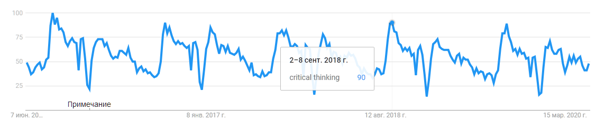

Критическое мышление --- это педагогическая традиция 20-го века для
«мягкого» (исподволь, через много примеров) обучения адекватности и
рациональности в мышлении и прикладных рассуждениях через выискивание
«фактических ошибок». Впервые его использовал в 1910 году теоретик в
области образования John Dewey в книге «Как мы мыслим».

Основание для такого названия были простые: «**критика**» --- это был
один из разделов логики^[The three kinds of value
judgments are Beauty, Goodness, and Truth. They determine the three
kinds of normative science: Aesthetics, Ethics, and Normative logic.
Peirce equated normative logic with logic as semiotic. But all sciences,
including the normative sciences, depend on mathematics and mathematical
logic (AKA formal logic). All empirical sciences, including the
normative sciences, depend on phenomenology for the analysis and
interpretation of perception. The three parts of normative logic (AKA
logic as semiotic) are (1) Critic, which is formal logic; (2) Grammar;
and (3) Methodeutic, which is Peirce\'s name for the methodology of
science. All these issues were discussed and analyzed in detail by
Aristotle, debated for centuries by the Greeks, Romans, and Arabs, and
developed to a high level of sophistication by the medieval Scholastics.
The books called «logic\'\' from the 13th to the 19th centuries
discussed all these issues. But the 20th c. logicians ignored all but
the formal logic. They did a lot of good work on logic, but they also
lost a great deal. That is why I said that they wasted too much time
studying Frege --- who ignored everything except the formal part. ---
это рассказано John Sowa в
<https://groups.google.com/g/ontolog-forum/c/xwFwCa0j8qI/m/iufObRmbAAAJ>]
(сегодня этот раздел --- формальная/математическая логика как наука о
правильных рассуждениях), а другими двумя разделами были эпистемология
(наука о познании, как рассуждения отражают физический и абстрактный
мир) и нормативная логика (логика как семиотика, работа со знаками).
Критическое мышление подразумевало, что мы проверяем рассуждения
логикой, и что не проходит этот фильтр, то просто отбрасывается.
**Критическое мышление** **поначалу означало** **просто логичные
рассуждения, а не абы какие фантазии.**

У термина была довольно бурная жизнь, его значение интерпретировалось то
очень широко, то очень узко^[Обсуждение критического
мышления в Стенфордской философской энциклопедии:
<https://plato.stanford.edu/entries/critical-thinking/>].
То, что это педагогическая традиция, а не что-то живое, используемое в
жизни (просто логичное мышление), подтверждается графиком частоты
запроса critical thinking в Гугле. Пик планетарного интереса
ежегодно --- 1 сентября, в каникулы интерес падает практически до нуля:

Изучение предмета «критического мышления» в его нынешней форме обычно не
приводит к усилению интеллекта, а само критическое мышление в его
текущем виде неприменимо в сложных проектах (например, в крупных
инженерных проектах, где просто пользуются логикой), поэтому осталось на
уровне учительских обсуждений в старшей школе и в силу исторических
традиций в гуманитарных вузах на младших курсах. При внимательном
рассмотрении критическое мышление сводится к призывам использовать в
жизни попсовые (на уровне «здравого смысла») знания по логике и научному
мышлению/исследованиям/эпистемологии. Но чаще нет и этого, дело
ограничивается призывами «думать больше! думать точнее! проверять факты!
сомневаться!». Для реализации этих призывов показывают разные способы,
придумываемые «на коленке» тем или иным преподавателем критического
мышления. О цивилизационном state-of-the-art речи не идёт.

«Критическое мышление» имеет
консенсус^[<http://www.insightassessment.com/content/download/620/3992/file/DELPHI+RESEARCH+TABLE+4+2014+redesign.pdf>.
Critical thinking is a process, a purposeful and reflective process of
problem solving and decision making, aimed at making a reasoned judgment
about what to believe or what to do. In forming this judgment a person
employs their critical thinking skills. These skills are described in
detail, with examples, in the 1990 APA Delphi Report which presented an
expert consensus conceptualization of critical thinking.]
(он так и называется --- «дельфийский консенсус» 1990 года) о том, что
входит в хорошее мышление. Согласно консенсусу, в критическое мышление
входит «всё хорошее против всего плохого», речь там идёт об
интерпретации, анализе, логическом выводе (inference), объяснении,
оценке и даже саморегуляции. Это сильно побольше, чем просто анализ
каких-то фактов^[подборка материалов на русском ---
<http://evolkov.net/critic.think/>], но все эти умения
больше ведут к суждениям об узнаваемом извне, чем появлению чего-то
нового --- в центре там «целенаправленное рефлексивное суждение»
(purposeful reflective judgment) как результат мышления. Это не совсем
то «творчество», порождение конструктивного нового, о котором довольно
часто думают, как о результате мышления как работы интеллекта. Логика и
следующее логике мастерство логичного рассуждения --- это только один
уровень интеллект-стека, только не самая большая часть интеллекта как
мастерства мышления в целом, хотя претензия «критического мышления»
именно в постановке интеллекта в целом, «за всё хорошее в мышлении
против всего плохого».

Как и следует из названия, это мышление критическое по отношению к
другим мышлениям, и это определённо не творческое мышление, как пытаются
его представить. Логика и следующая ей логичность в рассуждениях --- это
меч, рассекающий иллюзии, а не создающий миры гаечный ключ. Критическое
мышление как понятный комплекс идей по поводу логичных рассуждений
хорошо пошло в педагогику: ему учат массово в школах, вузах, прививают
все эти навыки хорошей критики как привычки мышления.

Проблема в том, что прививают логичность в рассуждениях уж как кто
понимает: каждым педагогом критического мышления его содержание
понимается по-разному. Мало ведь потребовать логичности в мышлении.
Какое же мышление не хочет быть здоровым и богатым, а не бедным и
больным --- логичными хотят быть все! Этой логике ещё нужно научить, это
значит, что нужно сформулировать сам предмет логики (куда сегодня входят
отнюдь не аристотелевские силлогизмы и связанные с ними ошибки) и
обучение этому предмету. Но вот беда: в самых разных школах мышления
(системном, критическом, изобретательском и т.д.) предмет логики
полностью не находится, только замечания о необходимости логичности и
небольшие кусочки объяснений на этот счёт. Ну, типа как из «математики»
даётся арифметика целых положительных чисел. И так по всем навыкам
критического мышления: других предметов интеллект-стека (онтология,
исследования/эпистемология/научное мышление и т.д.) в критическом
мышлении не даётся, и тем более не ведутся исследования по этим
предметам. Хотя изредка ведутся педагогические исследования.

Какие концепты привнесены в критическое
мышление^[<http://www.criticalthinking.org/pages/glossary-of-critical-thinking-terms/496>]
из других трансдисциплин, а какие появились и развиваются именно в
critical thinking в результате тамошних исследований? Например, в
системном мышлении появились и развиваются в ходе проведённых для его
развития исследований понятия системы, эмерджентности --- это
собственные понятия системного мышления, взятые их физики и
развивающиеся в рамках системного мышления. С удивлением обнаруживаем,
что ничего своего из базовых понятий в критическом мышлении нет, всё
заимствовано из других дисциплин. Поэтому улучшений в критическом
мышлении, развития критического мышления быть не может --- нечего
развивать. Развитие может быть только педагогической формы, но не
содержания предмета!

«Почему выпускники вузов до сих пор не могут
мыслить»^[<https://www.jamesgmartin.center/2017/03/college-graduates-still-cant-think/>] ---
так называется статья Rob Jankins про вырождение критического мышления в
академической среде. Действительно, мыслить в вузах нигде явно не учат.

В инженерных и естественных дисциплинах мышлению тоже учат, и тоже учат
«исподволь», в неявном виде. Сами методы/нормы/практики мышления не
выделяют в явном виде. Логика даётся только математическая, без привязки
к тому, как использовать её в жизни. Исключением является только логика
на философских факультетах --- формальная философия, философская логика.
Системное мышление очень редко идёт как отдельная дисциплина, только у
системных инженеров. И все эти дисциплины мышления как дисциплины частей
интеллект-стека никакого отношения к критическому мышлению не имеют, о
нём даже не вспоминают!

Само критическое мышление тоже никак не относится к другим школам
мышления --- ни
рационалисты^[<https://www.lesswrong.com>],
ни логики, ни системные мыслители не считаются «своими» в педагогическом
мире критического мышления. Даже критикующий полный развал современного
мышления Rob Jankins считает, что мыслить могут учить только люди,
учащие «по старинке понимаемому критическому мышлению» (т.е. которое ещё
не прогнило в современных гуманитарных факультетах, а сохранило прежний
широкий смысл). Rob Jankins даже мысли не допускает, что учить можно
думать не по антикварному варианту critical thinking, а как-нибудь ещё.
Например, вместо призывов «думать больше!» взять и безо всяких призывов
обучить людей логике. Вместо призывов «сомневаться!» обучить людей
исследованиям/научному мышлению/эпистемологии (и научить отличать
научное познание от других видов познания: художественного и
религиозного). Вместо призывов «думать обо всём важном!» обучить людей
системному мышлению, где будет указано, что именно в проектах считать
важным.

Критическое мышление не имеет своих понятий, поэтому не может
развиваться, интерес к нему поддерживается только консервативной
системой образования, это дань учебной традиции 20 века. Призывы им
заняться --- это призывы идти «назад в будущее». Но это ведь тупик!
Критическое мышление ждёт судьба кибернетики, которая была чуть ли не
синонимом системного мышления, но потом перестала развиваться и исчезла.
Системное мышление продолжает развиваться в инженерной среде, и
осталось. Логика продолжает развиваться у математиков, поэтому осталась.
Эпистемология/научное мышление продолжает развиваться у физиков, поэтому
осталась.

Нужно ли добавлять критичность к архитектурным требованиям к мышлению?
Например, должны ли мы специально говорить, что системное мышление
должно быть критичным? Системное мышление основано на логике, онтологии,
научном мышлении в их широком понимании (мы иногда даже называем этот
клубок дисциплин «онтологика»). Чтобы обсуждать рациональность и
логические основания высказываний/рассуждений, осознанность,
адекватность и абстрактность системного мышления, совсем не нужно
прибегать к педагогическому аппарату критического мышления. Есть много
разных специальных дисциплин, в котором представления об абстрактности,
рациональности, осознанности и адекватности мышления развиваются. Зачем
брать ещё и критичность, переставшую развиваться? Логику лучше изучать
как логику (включая байесовские рассуждения/inference, причинные/causal
рассуждения/inference, контрфактические рассуждения, отношение логики и
реальности, онтологические основания, квантовоподобный логический
вывод), а не в составе тех огрызков логики, которые попадают в
«критическое мышление». Исследования лучше изучать как
исследования/научное мышление. Информационные модели системной инженерии
лучше проверять на отсутствие противоречий логикой, как это делается
инженерами, а не в соответствии с «критическим мышлением» --- будет
заведомо проще, надёжней, понятней.

А как же борьба с фейками? Если у вас есть интеллект (включая интеллект
компьютера: Гугл в борьбе с фейками не менее важен, чем вас собственный
мозг), то фейки вам не страшны. Вас спасёт мыслительное мастерство в
целом, причём не только мастерство рассуждать логично, но и собранность,
и трудовой кругозор, и все остальные практики интеллект-стека. С фейками
борется весь интеллект, а не только логика как искусство рассуждений по
правилам. Заклинания о том, что вам нужно просто всё-всё проверять, во
всём-всём сомневаться --- не спасут.

Больше к критическому мышлению мы возвращаться не будем.

Но вот понятие **критики** мы оставляем: это важнейшая часть
критического рационализма, часть познания. Как относиться к критике? Вот
пример рационального подхода к
критике^[<https://twitter.com/reasonisfun/status/975357650752933888>],
учитывающего ограниченность ресурсов познающего агента, затратность
познания. Этот подход (назовём его **«подход интересной критики»**) даёт
главный совет --- отвечать только на ту критику, которая интересна.
Понятие интереса тоже легко формализуется, подробней об этом будет, как
ни странно, в обсуждении практики эстетики. Вот этот подход:

-   Критика помогает решать ваши проблемы
-   Нет необходимости отвечать на всю критику
-   Критика может высветить интересные проблемы
-   Вы не обязаны решать эти проблемы
-   **Прислушивайтесь к критике только тогда, когда она интересна.**
