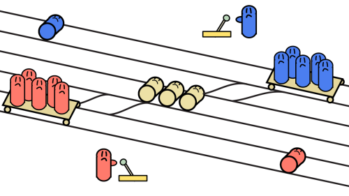
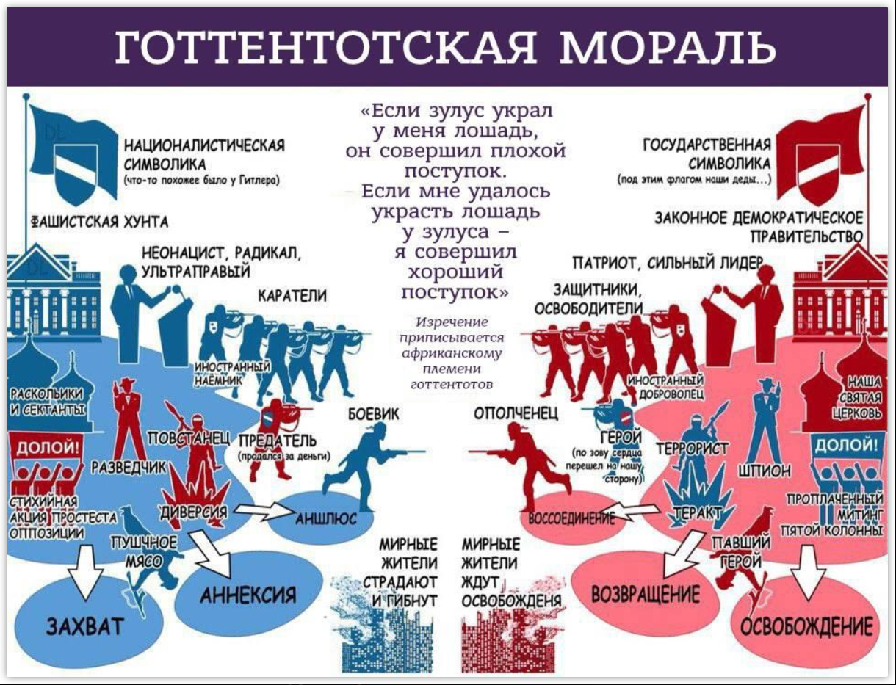

Интеллект-стек безмасштабный и неантропоцентричный: он про интеллект и
мышление, которое происходит в агентах самой разной природы, хотя мы и
считаем агентами главным образом способных к планированию агентов,
причём планы могут предполагать возможность временного ухудшения
ситуации (повышение уровня свободной энергии), чтобы затем перейти к
ситуации с минимумом свободной энергии (то есть минимумом неприятного
сюрприза). Это люди, но уже и AI, а также коллективы и сообщества людей,
поддержанные AI. Интеллект деятельный, мышление активно --- творчество
включает не просто познание себя и мира (изменение моделей себя и мира),
но и активное изменение себя и мира.

И в этот момент важно не забыть, что вы можете со всей мощью вашего
интеллекта решать проблему преодоления чьей-то головной боли путём
усекновения больной головы --- после отсечения головы ничего не болит,
«пристрелить страдающего --- это милость». Или не милость? А если
страдающий сам просит (эвтаназия)? А если «изменить себя» --- убить
себя, самоубийство?

Общего мнения по вопросам добра и зла нет, поэтому суд решает спорные
вопросы «по справедливости». Но даже прописанная в законах
справедливость оспаривается, для этого существует специальный
механизм --- жюри
присяжных^[<https://en.wikipedia.org/wiki/Jury>].
Так, жечь ведьм было справедливо по
закону^[<https://www.mass.gov/news/witchcraft-law-up-to-the-salem-witchcraft-trials-of-1692>],
но потом жюри присяжных сказало, что это уже как-то
неправильно^[<https://www.massmoments.org/moment-details/jury-finds-mary-parsons-not-guilty-of-witchcraft.html>].
Но откуда они это узнали? И почему раньше такого не было, присяжные
выносили решение
«жечь»^[<https://en.wikipedia.org/wiki/Salem_witch_trials>]?
И почему потом во многих странах отказались вообще от смертной казни,
заменили её пожизненным заключением?

В цикле убегания от неизвестности и задействования мыслительного
мастерства практически на каждом шаге вам придётся принимать решения, на
которые будет влиять **этика**, роль «**совесть**». Этика пронизывает
нашу жизнь, вообще ни одно решение нельзя принимать, выкидывая этику из
рассмотрения, это полноценная трансдисциплина интеллект-стека.

Например, вы понимаете, что вам уже нельзя оставаться в прошлом
проекте --- жизнь оттуда ушла, перспектив не будет, развитие
остановилось, денег не будет, ничего не будет. Но вот в проекте полно
ваших друзей, они ещё не разобрались в ситуации, и они хотят, чтобы вы
остались. Они даже считают, что уйти из проекта как раз сейчас, когда
всем так плохо (и будет ещё хуже) --- это и есть предательство! Как надо
поступать?

Или вы ставите себе новую цель: научиться продавать так хорошо, чтобы
уметь продавать даже ненужные, а то и вредные товары --- и чтобы
покупатели ещё и спасибо говорили!

Или подряжаетесь на какое-то грязное и очень вам выгодное дело,
доставляющее кому-то серьёзные неприятности, и ещё приговаривая «ничего
личного» (сами-то вы вроде как не виноваты, «вы только выполняете
приказ»).

Или вы берёте очень достойную цель (по вашему мнению), и дальше
выбираете самые грязные и недостойные методы её достижения, даже зная об
этом, но следуя поговорке «цель оправдывает средства», и поэтому считая
эти методы достижения не грязными и недостойными, а оправданными и
целесообразными.

Или вы ввязываетесь в государственный проект, где происходит очевидный
распил денег, ибо «всё равно эти деньги налогоплательщиков кто-нибудь
украдёт, пусть лучше это буду я!».

Или вы защищаете природу так рьяно, что существенно ограничиваете
деятельность людей и этим людям становится жить хуже, зато в более
нетронутой природе: птичка выигрывает в праве на жизнь у человека, и вы
этому радуетесь.

Или просто регулярно врёте, потому как иначе-то прожить нельзя!

Это всё будет зависеть от **текущих** **ваших** **представлений о том,
что такое хорошо, и что такое плохо --- от** **вашей** **морали**.
**Нравственность --- это и мораль, и этика, и всё что угодно, но чаще
всего это то, насколько каждый отдельный человек соответствует или не
соответствует в своей личной морали представлениям** **SoTA** **этики**.
А
**этика**^[<https://vk.com/@reducing_suffering-what-is-ethics>]** ---
это трансдисциплина, занимающаяся моралью и нравственностью.**

Интеллект --- это вычислитель, в который загружены какие-то способы
рассуждения о том, по каким принципам жить. Этику иногда определяют и в
таком самом общем виде: как вам нужно жить, по каким принципам, текущие
настройки интеллекта на эти принципы --- это ваша нравственность,
которая чаще всего не сильно будет отличаться от морали вашего
окружения. Если среди ваших друзей принято кушать на ночь младенцев
чужого племени, то и вы будете кушать --- откуда вам знать, что это
плохо?! «Все ж так делают, мне никто не сказал, что это
нехорошо»^[[https://ru.wikipedia.org/wiki/Банальность\_зла:\_Эйхман\_в\_Иерусалиме](https://ru.wikipedia.org/wiki/Банальность_зла:_Эйхман_в_Иерусалиме)]!
Роль совести оценивает ваши (полного агента как исполняющего все
деятельностные роли) и чужие (других агентов самых разных системных
уровней --- частей личности, личностей, коллективов, сообществ, обществ)
поступки. Иногда вы делаете что-то хорошее, потом узнаёте, что это
плохо --- и затем вас начинает мучать совесть, возникает чувство вины.
Живите теперь с этим! Жюри, приговорившее ведьм в Салеме к смертной
казни, потом раскаялось в содеянном, но это было уже после смерти
приговорённых
ими^[<https://gizmodo.com/the-real-life-letter-of-apology-written-by-the-salem-wi-1640827487>].

Как вообще себя вести этично? Где этому учат? Что-то такое происходит на
уроках литературы в школе, где филологи по образованию на фантастических
примерах (художественная литература, там же всё выдумано!) из далёкого
прошлого (в школе изучают литературу, описывающую уже давно прошедшую
жизнь) учат какой-то гремучей смеси поп-психологии с претензией на
этику. Эти филологи имеют профессиональное образование по этике? Нет, не
имеют. А чему учат? Они просто транслируют своё бытовое понимание
«добра» и «зла», своё понимание «справедливости» --- благо, что в
художественной литературе разных веков можно подобрать пример на любой
случай, и истолковать его уж как хочешь (помним, что Alan Kay говорил
про возможность иллюстрации пословицами чего
угодно^[<https://ailev.livejournal.com/1519853.html>] ---
это отличается от длинных связных цепочек взаимоувязанных объяснений,
так что рациональности на уроках этики, замаскированных под уроки
литературы, в школе не найти).

Этикой серьёзно занимались философы. Они и сегодня занимаются моралью и
этикой (этика и моральная
философия^[<https://plato.stanford.edu/entries/morality-definition/>]
слиты до неразличимости), хотя их голоса мы практически не слышим.
Скорее уж услышим какие-нибудь собственные наблюдения поэта или блогера,
чем мнение профи в этике. Когда возникли вопросы об этике запирания всех
по домам во время пандемии, а затем поголовного вакцинирования, вопросы
были даже не к медикам и науке (там были самые разные мнения, но вместо
научного разбирательства что там SoTA знание, эти мнения были
проигнорированы), а к политикам --- и они в разных странах принимали
абсолютно разные решения по локдаунам. Более того, многие люди во власти
(включая медиков) понимали, что они принимают нерациональные решения
(например, по обязательности ношения
масок)^[<https://www.michaelpsenger.com/p/how-zeynep-tufekci-and-jeremy-howard>],
но ничего не могли поделать --- так же, как в случае с ведьмами из
Салема, раскаиваться приходится потом.

Когда возникли вопросы об этичности занятий «слишком сильным»
искусственным интеллектом, вопросы были к инженерам по AI и
законодателям (юристам), но не специалистам по этике.

Это не означает, что знаний по этике нет, нет принципов этики. Основных
два направления, которых люди придерживаются в этике --- **деонтика**
(делай что должно, и будь что будет --- и там Кант со звёздным небом над
головой и нравственным законом внутри
нас)^[<https://seop.illc.uva.nl/entries/ethics-deontological/>]
и **консеквенциализм** (делай то, у чего будут получше
последствия)^[<https://plato.stanford.edu/entries/consequentialism/>,
<https://www.iep.utm.edu/conseque/>], наследник более
древнего
**утилитаризма**^[<https://plato.stanford.edu/entries/utilitarianism-history/>].

С деонтикой огромные проблемы: где источник долженствования? Когда тебе
говорят: «ты не должен врать!», то почему? Какое рациональное
объяснение? Религиозные книжки --- это ж художественная литература, и на
каждую святую книжку с предложением этического закона можно найти другую
не менее святую из другой религии с противоположным мнением. И есть
множество вопросов, которые в древних книжках не обсуждались вообще. И
есть много очевидных нелепостей. Поэтому от деонтики по факту перешли к
консеквенциализму (но явно не все в обществе! Много людей продолжают
верить в постулаты той религии, которая им больше нравится --- а
нравится обычно то, что знакомо с тех времён, когда воспринималось
некритически, обычно это «знакомо с детства»).

В консеквенциализме по факту нет чётких критериев добра и зла, и поэтому
нужно рассуждать каждый раз: выбирай действия, у которых лучше
последствия --- это какие лучше, и для кого? Можно ли убить невинного
человека, если при этом ты спасёшь от смерти тысячу человек? А если
никого не спасёшь из людей, но при этом сохранится какое-нибудь
формальное образование (предприятие или государство)? А можно ли убить
невинного человека во спасение десяти тысяч человек? Ста тысяч? А если
он пожертвует собой сам и убьётся ради достижения каких-то целей, не
связанных со смертью других людей (например, ради того, чтобы какое-то
правительство перестало быть у власти) --- это самоубийство, которое
должно быть осуждено или наоборот, поощрено, ибо это «герой, борец за
свободу, пример детям»?

Теоретики придумывают всякие «этические задачки» типа **проблеммы**
(дилеммы и проблемы одновременно, что подчёркивается двумя «м» в слове)
заключённого на вагонетке:

Вагонетка, наполненная любимыми вами людьми, несётся по рельсам в
направлении другого любимого вами человека, который привязан к рельсам.
Вы можете перевести стрелку, и тогда вагонетка уйдёт на запасной путь,
который безопасен. Проблемма в том, что с другой стороны запасного пути
стоит такой же бедняга, у которого по путям несётся такая же вагонетка.
Если вы оба выберете переключить стрелку, в обеих вагонетках погибнут
все. Что вы выберете --- переключить стрелку или не переключать, убив
одного своего любимого
человека?^[<https://zen.yandex.ru/media/aiqcnt/myslennyi-eksperiment-problemma-zakliuchennogo-na-vagonetke-5d120842e8766c05caf81817>]

Подобные ситуации изучают уже не только для советов, как поступать людям
(понятно, что в жизни ситуации будут и динамичней, и сложней, и такого
чёрно-белого выбора не будет --- всегда будет разнообразие выборов, один
другого хуже). Но вот такие вопросы начинают возникать и в отношении
машинного интеллекта. И иногда в формулировках чуть ли не буквально из
задач про вагонетку --- речь идёт о беспилотных автомобилях, тех самых
вагонетках, которые сами себе стрелочники и могут направить себя вместе
с пассажиром на пешеходов, чтобы спасти пассажиров за счёт пешеходов,
или в столб, чтобы спасти пешеходов за счёт пассажиров. Люди из MIT
решили выяснить, что думает человечество на эту тему, и построили
«моральную
машину»^[<https://moralmachine.mit.edu/hl/ru>],
собравшую 40млн. ответов на подобные вопросы. Оказалось, что ответы в
разных странах отличаются, представления об этике разнятся в разных
странах^[<http://news.mit.edu/2018/how-autonomous-vehicles-programmed-1024>,
<https://www.pnas.org/content/117/5/2332>]. Понимание
счастья и этики в разных странах разные, нет одного счастья и одной
этики, которые будут признаны всеми людьми на планете! И, конечно, у них
и разные понимания разными возрастами даже в одной стране, и разными
поколениями на планете (нравы становятся мягче, и убить человека
становится всё менее и менее этичным способом решения всё большего и
большего числа
проблем^[<https://ailev.livejournal.com/1574477.html>]).

Есть ещё и такое мнение, что сама дилемма заключённого на вагонетке ---
это бессмысленный и вредный способ думать об этике, такие вопросы
задавать нельзя, они не позволяют хоть что-то понять про этику в
реальной жизни. В реальной жизни подобные проблемы возникают постоянно,
но они имеют миллион нюансов каждый раз и не имеют типового решения.
Например, террористическая организация сознательно запускает ракеты из
школьного двора своей страны --- и эти ракеты летят, чтобы убивать детей
другой страны (это обобщённый пример, таких стран довольно много).
Другая страна подавляет огневые точки противника, тем самым заведомо
направляя свои ракеты на школьный двор. Мировая пресса в ужасе: «они
стреляют по школам»! А если «им» не стрелять по школам? Тогда ракеты из
школьных дворов будут свободно лететь и... тоже убивать детей! А какие
цели? Например, палестино-израильские столкновения: с одной из
сторон --- прямо объявляемые цели геноцида и уничтожения еврейского
государства, с другой стороны --- защита своей жизни прежде всего и
заодно государственности. А в освещении прессой? Объявляемые «большие
цели» палестинских террористов (геноцид еврейского народа, «чтобы не
мешал») не освещаются, освещаются средства достижения: ракетная стрельба
как «освободительное движение» и оборона от неё как «нападение на
гражданское население».

Смешиваются уровни одиночной смерти, смерти группы в одиночном поединке,
уровни смертей одной войны, уровни смерти целой нации --- и уровни
проектов, которые заняты этими смертями. Если же речь идёт не о смерти,
а о чём-то менее этически хлёстком (не про «не убий», а «не укради» или
«не прелюбодеяй», как это звучало бы в деонтической этике, оценивающей
неприемлемость самих действий, а не их последствий), то споры будут ещё
более жаркими.

Ещё один сюжет --- это блокада Крыма, чтобы тамошнему населению стало
хуже от того, что Крым стал российской территорией. Получается, что если
кто-то против присоединения Крыма к России, то он за то, чтобы крымчанам
стало жить «в оккупации» ещё хуже?! Чтобы до их курортов никто не смог
доехать и оставить там деньги --- и жители Крыма быстрее обнищали без
работы «в оккупации»?! Этичность лозунга «чем хуже, тем лучше» весьма
проблематична! Одно дело --- война с «оккупантами», другое дело ---
война с «оккупируемыми», жителями какой-то территории. Ещё один вопрос:
стоит ли начинать военные действия, чтобы просто переместить границу?
Даже если конфликтуют принципы права наций на самоопределение и борьбы с
сепаратизмом как поддержание целостности современных государств ---
силовыми ли методами надо решать эти вопросы, «судебным
поединком»^[[https://ru.wikipedia.org/wiki/Судебный\_поединок](https://ru.wikipedia.org/wiki/Судебный_поединок)]
(то есть дракой, в которую не вмешиваются третьи лица) на уровне
государств, это же явная дикость, если речь идёт о людях-агентах, почему
это перестаёт быть дикостью на уровне агентов-государств?

Современная война --- это ещё и война этик, «кто кого переспорит в
этике», на многих уровнях. Вот типичная картинка такого представления (и
каждый раз вспоминайте её, когда будете читать освещение какого-то
международного или даже отечественного конфликта, или даже конфликта
между двумя службами одной и той же компании, или даже конфликта соседей
по дому, обращайте внимание на выбор
лексики)^[<https://pikabu.ru/story/gottentotskaya_moral__dvoynyie_standartyi_4688439>]:

Это вовсе не означает, что каждая из сторон права, или каждая из сторон
неправа! Это означает, что нужно разбираться не с первыми же приходящими
на ум оценками и говорить первыми же приходящими на ум словами. Это
означает, что в этике нужно каждый раз разбираться, её нельзя
игнорировать!

Сама этика, как и любая другая наука, бесконечно развивается: что было
наиболее этично в 2020 году, может оказаться крайне неэтичным в 2120
году, и наоборот. Даже сами представления о том, что такое мораль и
этика будут различаться! David Deutsch в книге «Начало бесконечности.
Объяснения, которые меняют мир», которую мы уже упоминали, рассматривает
этику в главе «5. Реальность абстракций» как объективно существующую и
связанную с нашими лучшими теориями о мире:

*«Истина обладает структурным единством, а также логической
последовательностью, и, как я полагаю, ни одно верное объяснение не
является полностью изолированным от любого другого. Поскольку устройство
Вселенной можно объяснить, должно быть так, что правильные с точки
зрения нравственности ценности соединены таким образом с верными
фактическими теориями, а нравственно ложные ценности --- с ложными
теориями. По сути, этика занимается проблемой того, что делать дальше и,
в более общем смысле, какую жизнь вести, какого мира желать. Некоторые
философы* *ограничивают термин «нравственный» проблемами того, как
человек должен относиться к другим людям. Но такие проблемы плавно
перетекают в проблемы индивидуального выбора, какую жизнь вести, и
поэтому я использую более* *ёмкое определение. Оставим в стороне вопросы
терминологии, если бы вдруг вы оказались последним живым человеком на
Земле, то пришлось бы задуматься, какую теперь вести жизнь. От решения
«делать то, что больше всего нравится» толку было бы мало, потому что
то, что вам нравится, зависит от ваших моральных суждений о том, что
составляет хорошую жизнь, а не наоборот».*

David Deutsch призывает в вопросах этики брать независимое от
человечности (гуманизма) понимание этики, сразу брать «космическое» ---
не связанное с преимуществами или недостатками, или искажениями
человеческого вида, антропного/парохиального понимания этики. А вот в
книгах Steven Pinker этика рассматривается в главах как раз по
гуманизму, «человечности». Ибо когда лисичка кушает зайчика --- это явно
не обсуждается с точки зрения этики, этика появляется в рассуждениях
разумных людей. Люди были единственными разумные существами, о которых
можно было говорить (пока не появились современные системы
искусственного интеллекта, разумность которых сегодня активно
обсуждается, впрочем и разумность отдельных людей тоже активно
обсуждается!). И Pinker сам демонстрирует предвзятости. Например, он
активно на страницах книги выступает против Трампа, который к концу
книги предстаёт уже некоторым персонифицированным воплощением разного
зла. Но Трамп, например, боролся (и успешно) с налогами как грабежом
граждан со стороны госчиновников. И существенно продвинулся в вопросах
установления мира там, где это не удавалось сделать его предшественникам
и последователям. В целом Трамп вёл себя не хуже, и не лучше, чем
большинство его предшественников, и чем уже ведёт себя Байден, который
сменил Трампа. Так что на рассуждения самого Steven Pinker по этике
нужно смотреть тоже не как на последнее верное слово, окончательный
ответ на этические вопросы. Этика важна, но вы не можете сослаться на
«этический авторитет», ибо к этому авторитету тут же появятся вопросы,
если не сегодня, то буквально завтра!

Сегодня в связи с исследованиями машинного интеллекта появился ещё один
источник сомнений в адекватности «гуманистических» этических воззрений:
поскольку AI учится на накопленных человечеством за пару тысяч лет
письменных знаниях, то AI познаёт и расизм, и сексизм и все остальные
предвзятости/bias, которые много лет в цивилизованном обществе считались
этической нормой. Компьютеры уже принимают многие решения, и эти
компьютеры пока сделаны людьми, но уже в их проектировании и
изготовлении большое участие принимают сами компьютеры, и скоро уже
нельзя будет сказать, чего там больше: классического человеческого или
классического нечеловеческого, «нежити». Гуманизм оказывается уже
киборгизмом, «гуманизмом компьютерного человечества», но как про это
рассуждать --- это как раз предмет сегодняшней этики, тем более что
рассуждать нужно по-разному, когда обсуждаешь отдельно человека,
отдельно человека с компьютером, отдельно группу людей (компанию), или
даже огромные образования вроде государства (нарушающие или не
нарушающие международные договоры, содержание которых большинство
населения этих стран даже не знает!).

В литературе, новостях, книгах в мозгах сегодняшних людей глубоко
укоренены этические привычки, которые завтра могут быть сочтены
вредными. Кем сочтены?! Ну, например, «передовым этическим
меньшинством». И большинство населения при этом будет объявлено неэтично
себя ведущим --- расистами, сексистами, неполиткорректными, имя им
миллион. Кто кого первым обвинил, кто первым назначил себя жертвой, тот
и прав! Это происходит вот прямо сейчас, при этом возникают удивительные
взгляды на этику, например идеология
wokeism^[<https://ivanov-petrov.livejournal.com/2287616.html>].
И даже в науке возражать против вранья оказывается неэтичным, ибо это
сильно обижает врущих учёных, а обижать людей
нехорошо^[Пример такой истории: «Семеро «жестоких
вредителей» спасли морских рыб от уважаемого автора 250 научных работ»,
<https://naked-science.ru/article/nakedscience/semero> и в пределе это
сформулировано в «не быть токсичным учёным»,
<http://lleo.me/dnevnik/2021/03/05_toxic>]!

Изготовители (специально выбрали это «невкусное» промышленное слово
вместо «разработчики» или даже «воспитатели») машинного интеллекта при
этом стоят перед дилеммой: обученный на корпусе текстов алгоритм имеет
этические предвзятости/biases, впитанные «с человеческой культурой».
Например, доктора считает мужчиной, а не женщиной, чисто по статистике
упоминаний в текстах мужского рода, а не женского. А должен бы к
докторам относиться нейтрально по части пола! Если мусульманин, то
выученный по современной литературе искусственный интеллект считает его
более склонным к насилию, чем христианина, чисто по статистике
упоминаний в текстах (и тут уже непонятно, реальной статистике
агрессивности мусульман и христиан, или по предубеждениям, воспринятым
при обучении по материалам новостей последних лет, где мусульманские
террористы и впрямь очень часты, а других почти и нет).

При изучении того, как избавиться от таких предвзятостей, выяснилось,
что сами эти предвзятости как раз исходят из человеческой природы, из
того, как устроено мышление людей в обществе! И отказ от
предвзятостей --- это переход от реального «биогуманизма» к «гуманизму
искусственному», специальным образом спроектированному, то есть вроде
как уже и не гуманизму, исходящему из антропоцентризма!

SoTA меняется и в этике тоже, поэтому нужно поддерживать выдвижение
новых универсальных теорий/объяснений в этике, а также поддерживать
критику этих теорий, не ограничиваясь только проведением мысленных
экспериментов, но включая и экспериментальные проверки.

**Вывод: этику нужно изучать в явном виде, по работам профессионалов, а
не путём чтения романов, блогов в социальных сетях, статей журналистов с
журналистским образованием и выслушивания мнений своих знакомых, не
знакомых с научными трудами по этике. Нужно быть разборчивым в целях.
Нужно быть разборчивым в средствах. Нужно всё время задавать себе
вопрос: «кому именно нужно/должно? Кто сказал и почему? Почему плохо это
не делать, и какие будут последствия? Почему плохо это делать, какие
будут последствия?», когда встречаешь модальный оператор («нужно»,
«можно»). Да, к этому тексту такое поведение тоже относится.**

Закрывать глаза на этику нельзя, в этой области тоже есть SoTA, ситуация
тоже быстро меняется, по этике тоже нужно получать образование, чтобы не
оказаться приверженцем какой-то давно опровергнутой этической теории.
