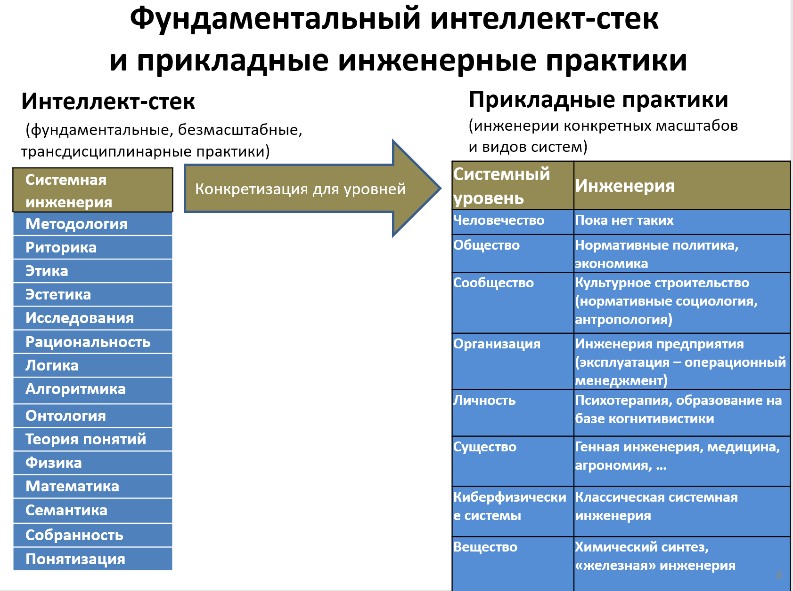
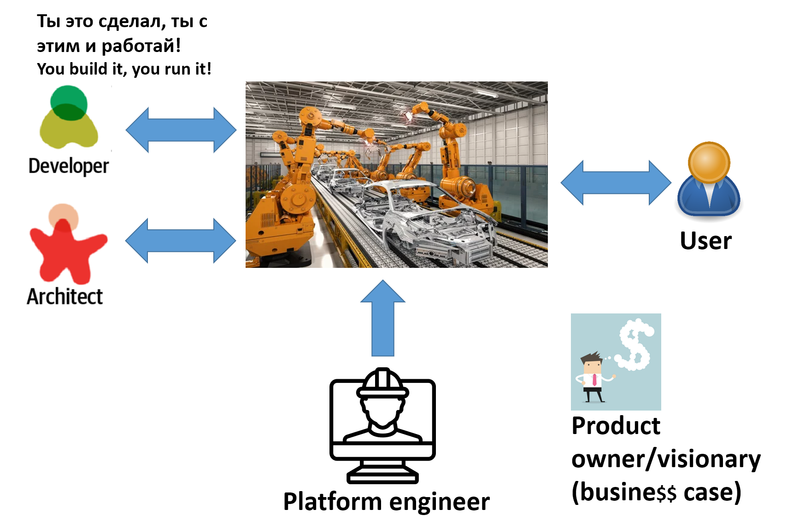

Если методология изучает различные паттерны деятельности/инженерии, то
**системная инженерия ---** **это нормативная дисциплина, то есть**
**рекомендуемый** **набор паттернов деятельности по изменению мира к
лучшему. Системность тут в том, что создаются части мира с чётко
определёнными границами ---** **целевые системы, при этом эти целевые
системы как части мира вписываются в мир так, чтобы по возможности
оптимизировать межуровневые конфликты, ведущие к неустроенностям.**

Практики системной инженерии быстро эволюционируют. Это практики
рекомендуемых подролей инженера/деятеля/практика, причём эти
трансдисциплинарные практики системной инженерии потом специализируются
до практик прикладной инженерии для самых разных видов целевых систем
самого разного масштаба.

Например, для программных систем/software systems такой практикой
является программная инженерия/software engineering, и основные тренды в
изменении паттернов создания систем в силу особенностей предметной
области программной инженерии реализуются потом в системной инженерии и
затем в её прикладных вариантах инженерии с некоторым лагом в 10-15 лет,
причём этот лаг стремительно уменьшается по мере уменьшения
необходимости переобучать людей-инженеров за счёт перекладывания работ
на компьютеры, которые легче переналаживаются на новые методы инженерной
работы. Так что в реальности в «железной»/hardware инженерии
киберфизических систем (в состав которой входит и разработка программных
систем, и разработка аппаратной части, например, сюда относится весь
транспорт --- аэрокосмические системы, но также и автомобили), инженерии
компьютерных систем (например, инженерия суперкомпьютеров, имеющая свои
особенности) используются всегда немного морально устаревшие практики,
но это всё больше и больше осознаётся инженерами и ситуация быстро
меняется.

Из принципиальных новинок последних лет --- инженерия коннекционистских
(построенных на нейронных сетях) систем искусственного интеллекта.
Аппаратная часть проекта там выполняется относительно классическими
методами системной инженерии, но затем следуют процедуры обучения
нейросети (а со стороны нейросети это акты познания/исследования),
причём сами нейросети являются частями более сложных когнитивных
архитектур^[<https://en.wikipedia.org/wiki/Cognitive_architecture>].
Но и тут оказывается, что общие знания системной инженерии оказываются
полезными при создании таких систем уже сейчас, но можно ожидать, что
развитие этой инженерии систем искусственного интеллекта будет влиять на
системную инженерию в целом. В конце концов, нейронная сеть --- это
просто ещё одна архитектура вычислителя/компьютера (то есть это
алгоритм, который выполняется на подходящей аппаратуре), и по факту речь
идёт о каком-то очередном изводе программной инженерии.

Много труднее обстоит дело в области практик инженерии систем, которые
традиционно не считались создаваемыми инженерами, поэтому не было
попыток рассмотрения вопроса о лучших практиках разработки для этих
систем: это организации (системная инженерия организаций --- это
менеджмент), личности (системная инженерия личности была разобрана по
самым разным дисциплинам, от педагогики и психологии до коучинга),
инженерия клиентуры (практики продвижения продукта: маркетинг, реклама,
продажи). Тут требуется два такта:

Показать, что речь идёт о создании систем какого-то сорта, то есть это
задача инженерии.

Адаптировать (специализировать) практики системной инженерии для данного
вида целевых систем: отобразить текущие профессиональные роли на
предписанные (это нормативная наука! Задаёт норму деятельности!) роли
системной инженерии, текущие профессиональные практики на практики
системной инженерии. Особое внимание при этом надо уделить:

-   Соответствию общим принципам системной инженерии (системное
    моделирование с обязательными описаниями, «непрерывное всё», графы
    создания, разделение архитектуры и разработки, обязательность
    инженерных обоснований и т.д.).
-   Нахождению «пропусков» (иногда говорят «разрывов»/gaps) в наборе
    практик и ролей, доформирование до полного набора ролей и практик,
    позволяющих проводить разработку и развитие целевой системы в режиме
    «непрерывное всё». По факту это означает развитие целевой практики
    прикладной инженерии за счёт привнесения новых знаний системной
    инженерии.

Практика системной инженерии формально вроде как имеет исполняющую её
роль «системный инженер», но в силу разделения труда сегодня эта роль
редко используется как таковая, ибо она нормативно разбита на подроли,
соответствующие основным нормативным практикам системной инженерии. На
верхнем уровне разбиения можно сказать, что есть
**разработчик/developer**, который разрабатывает разбитую
**архитектором/architect** на какие-то части целевую систему,
изготавливая её на производственной платформе (тут полезно думать о ней
как «заводе-автомате» с каким-то конвейером), который для этого типа
систем создаётся **инженером** **внутренней** **производственной
платформы/internal** **development** **platform** **engineer,** получая
согласие на разработку от визионера/visionary.

Вот таблица, которая определяет основные роли и практики системной
инженерии, а также даёт примеры адаптации:

Роль создателя системы (из мета-мета-модели)

Инженер/деятель/создатель/constructor

Логическое время

Время замысливания/Conception time

Время проектирования/design-time

Время изготовления/ manufacturing time

Время эксплуатации/operations time

Время проекта создания платформы разработки

Подроли создателя системы/роли команды организации создания (из
мета-мета-модели)

Визионер/visionary

Архитектор/architect

Разработчик/developer

Инженер платформы разработки

Проектировщик/designer

Технолог/manufacturing engineer

Оператор/operator

Роль создателя целевой системы (из метаУ-модели, пример киберфизической
системы)

Инженер целевой системы

Подроли создателя целевой системы/роли команды организации создания (из
метаУ-модели, пример киберфизической системы)

Визионер целевой системы

Архитектор целевой системы

Разработчик/developer целевой системы

Инженер платформы разработки целевой системы

Проектировщик

Технолог

Оператор

Роль создателя организации создания целевой системы (из метаУ-модели
системного менеджмента)

Менеджер (в широком понимании)/инженер предприятия

Подроли организации развития /Подроли команды менеджеров (из
метаУ-модели системного менеджмента)

Бизнесмен

Орг-архитектор

Организатор

Администратор

Менеджер оргразвития

Операционный менеджер

Орг-проектировщик

Лидер/управляющий орг-изменениями

Роль создателя клиентуры

Продвиженец

Подроли создателя клиентуры/ организации продвижения (из метаУ-модели
продвижения)

Разбиение, какое определено в учебнике по практике продвижения
(маркетинга, рекламы и продаж)

Роль создателя мастерства

Учитель

Подроли организации создания мастерства/курсов, школы, факультета,
кафедры (из метаУ-модели обучения)

Культуртрегер

Архитектор учебной программы/curriculum

Автор курса

Преподаватель

Тьютор

Декан

Методолог

Методист

Предметник

Лидер

Роль создателя инвестуры

Фандрайзер/fundraiser

Подроли фандрайзера/создания инвестуры (из метаУ-модели инвестирования)

Разбиение, какое определено в учебнике по привлечению инвестиций

Из этой таблицы понятно, что при инженерии предприятия, которой
занимаются менеджеры, нам надо будет тоже получать согласие на
разработку (только не у визионера, а у бизнесмена), создавать внутреннюю
производственную платформу (бэк-офис, администрация), и этим будет занят
администратор --- и так для каждой инженерной роли. Конечно, сам набор
инженерных практик будет для ракеты и предприятия различаться, но
принципы организации разработки --- общие. Увидеть эту общность как раз
и позволяет методология, которая даёт описания паттернов поведения
(практик) и обсуждает роли, которые занимают агенты в коллективной
деятельности по поводу создания систем.

Например, администрация (иногда её называют бэк-офис) создаёт и
развивает аналог internal development platform (DevOps), только речь
идёт о выпуске не продукта, а самой организации-создателя продукта.
OrgOps, те самые «сисадмины», только они «оргадмины», ибо их
«система» --- сама организация, а современные OrgOps создают
«организационную платформу», «завод-автомат», который в идеале «тёмный
холодный завод», ибо заводу без людей свет и отопление не нужны, но пока
там между айтишными системами поддержки финансов, проверки договоров и
т.д. всё-таки работают люди из службы администрирования. OrgOps
(администраторы) создают эти службы и развивают
их^[<https://ailev.livejournal.com/1686561.html>].

Особые сложности сегодня подход системной инженерии как нормативной
дисциплины (то есть замена «традиционного» неинженерного мышления на
мышление с задействованием полного интеллект-стека, включающего практики
системной инженерии) имеет при распространении его на людей, коллективы
людей, сообщества, общества. Как-то ещё удаётся объяснить, что создание
организаций (менеджмент) --- это инженерия организаций (ибо можно легко
себе представить какой-то «проект создания организации», оценить его
результаты). Но вот «инженерия людей» или «инженерия сообществ»
сталкиваются с большими сложностями, большинство из которых связано с
радикальными новациями в мышлении.

Сейчас ситуация быстро меняется, ибо про людей и даже сообщества
начинают думать безмасштабно и неантропоцентрично, распространяя на них
объяснения из физики и биологии.

Если обсуждать «инженерию личности», то прежде всего удаётся убрать
ограниченность предыдущих подходов в части перехода к «непрерывному
всему» от ограниченного подхода с обсуждением жизненного цикла личности
(а не постоянного развития личности) как достижения какой-то
запроектированной нормы (педагогика) и ремонта в случае отклонения от
нормы (психология, медицина). Ремонт в инженерии, конечно, предусмотрен,
но сама инженерия сейчас ориентирована на бесконечное развитие систем,
включая создание и новых типов систем (open-endedness) как
техно-эволюцию. То есть речь идёт не о выпуске людей, изготовленных под
какие-то нормы (педагогика, андрогогика) или устранении отклонений от
нормы (терапия и психотерапия), а о бесконечном развитии людей, причём
не ограничиваясь собственно людьми (эволюцию одного вида нельзя
рассматривать независимо). Это полностью меняет ход рассуждений и о том,
что такое «человек», приходится решать проблему биологического индивида,
но уже в инженерии, определяя границы инженерного проекта.

Инженерия сообществ и тем более обществ --- это такой же спорный
предмет. Ибо если мы имеем дело с людьми, то они могут заниматься
контр-инженерией: если какой-то ретивый инженер сообщества или даже
общества что-то задумывает сделать с вроде как неорганизованным
сообществом, то люди в этом сообществе быстро делают «партию» как
организацию (где понятно кто какими ресурсами и как пользуется) для
организованной борьбы с этим инженером сообщества и тем более общества.
И дальше уж кто кого «переинженерит», уж кто кого победит в конфликте
интересов (иногда такой конфликт перерастает и в силовой конфликт:
революция или «переворот», восстание/бунт как неудавшееся восстание,
затяжная война).

Как это всё происходит и как думать о составных агентах уровня выше
организации пока не очень понятно, формулировки проблем типа «роли
личности в истории» или работы по «выравниванию/alignment целей агентов
по отношению к целям общества» (как это пытаются сделать с AI, очень
модная тема) тут мало что дают: этика не даёт чёткого ответа на вопрос о
том, кто (какие агенты или их группы) прав или кто неправ при
декларировании, как должны быть устроены составные агенты. Непонятно
вообще, насколько сообщества и общества можно считать агентами,
насколько можно считать государства или хотя бы органы власти
(законодательные, исполнительные, судебные) государств агентами.

Работы типа «Designing Ecosystems of Intelligence from First
Principles»^[<https://arxiv.org/abs/2212.01354>]
начинают появляться, но там довольно далеко ещё до перехода к
нормативным (лучшим, которые должны приниматься всерьёз) практикам
создания сообществ и обществ, которые будут достигать минимума свободной
энергии на другом уровне неустроенностей, чуть получше сегодняшнего. Для
этого, конечно, нужны изобретения (какие функции должны будут
выполняться кем или чем из аффордансов, возможно ещё не существующих
сегодня?) и затем методы лидерства на уровне сообществ и обществ, чтобы
реализовать эти проекты в жизни. Понятно, что речь идёт о системах,
которые представляют собой в части вычислителей нейросети из других
нейросетей, а системная инженерия для таких систем только-только
начинает получать поддержку со стороны практик интеллект-стека.
Например, практика риторики специфически направлена на учёт того, что
коммуникация ведётся не между двумя устройствами, задействующими строго
логичные (в смысле математической логики) вычисления, но между
нейросетевыми устройствами, для которых используется prompt engineering.

Архитектура коннективистских систем тоже в зачатке, хотя в AI довольно
много работ, посвящённых архитектуре нейросетей. При этом архитектурные
метрики для этих архитектур пока разительно отличаются от архитектур для
традиционных «модульных» систем: достаточно почитать описания
характеристик evolving architecture в книгах по software engineering
(много таких книг приведены в курсе «Системная инженерия») и сравнить их
с книгами по архитектуре нейросетей. Впрочем, понятие архитектуры (как
нарезать на модули/конструктивные части систему, и какими интерфейсами
обеспечить связь между этими частями) тоже быстро меняется во времени,
стремительно отделяясь от концепции системы (какие конструктивные части
какие функции будут выполнять --- при обсуждении архитектуры меньше
акцент на конкретные функции, ибо «самые главные функции вы будете
реализовывать завтра, а не сегодня», это ж учёт «непрерывного всего» в
конструкции системы), поэтому каждый раз надо договариваться про
архитектуру и что под ней имеется ввиду --- и это мало отличается от
проектов традиционных модульных систем и систем с коннективистскими
(нейросетевыми) архитектурами, где модульность/композиционность важна,
но средства её достижения совсем другие. Так, средства достижения
модульности в нейросетях --- это варианты так называемого
«моделирования» прикладных предметных областей, в частности, LoRA
моделирования^[На примере нейронной сети Stable
Diffusion понятие модели: <https://stable-diffusion-art.com/models/> (и
там модели checkpoint, LoRA, hypernetworks, textual inversions), что
такое LoRA модели (https://stable-diffusion-art.com/lora/), LoRA модели
(библиотечка, поглядите на разнообразие, там счёт на тысячи):
<https://civitai.com/tag/lora>. Активно развиваются подобные подходы и
для текстовых больших языковых моделей (LLM).].

Инженерные обоснования по факту опираются на рационализм в его самой
продвинутой версии, это означает, что вывод в них не только
формально-логический (как это сегодня часто подразумевается инженерными
стандартами), но и байесовский причинный, а сейчас надо ещё и учитывать
квантовоподобный: понятие рационального рассуждения тоже довольно быстро
меняется, SoTA рациональности находится в постоянном движении.

И так можно говорить практически про все инженерные практики, которые
как в самом их общем виде (системная инженерия), так и в приложении к
какому-то конкретному виду систем (мастерство, кибер-физические системы,
человеческий организм, хлебо-булочные изделия, корпоративный софт)
поддерживаются практиками интеллект-стека, ибо всегда есть какая-то
невязка происходящего в реальном мире и прогноза, который даётся по
объяснениям дисциплин этих практик --- и тут требуется задействовать
интеллект.

Отдельный вопрос про обучение инженеров. В текущем подходе инженером
оказывается любой агент, который хочет изменить мир к лучшему:
«спастись» и, возможно, спасти кого-то или что-то ещё с учётом проблемы
биологического и технического индивида, то есть избежать неприятного
сюрприза, не исчезнуть, выжить. Это агенты делают через создание
каких=то систем, занимаясь инженерией/трудом/практикой. То есть
инженер --- это любой агент, в том числе любой человек, который что-то
меняет в физическом мире, создаёт (или участвует в этом создании,
например, создаёт объяснения, по которым будут сделаны улучшения в мире,
например, разрабатывает проект системы охлаждения атомного реактора в
энергоблоке АЭС).

Вся инженерия/деятельность/практика/труд --- это прежде всего
задействование лучших имеющихся практик по изменению мира к лучшему, но
также и изобретение практик, помогающих решить те или иные проблемы. То
есть инженерия опирается на мыслительные практики интеллект-стека. Как
учить инженера? Поднимать силу его интеллекта прежде всего, затем учить
конкретной версии практик прикладной инженерии для какого-то вида
систем --- и ожидать, что в быстро меняющемся мире в ситуациях
неприменимости текущих прикладных или даже фундаментальных (из
интеллект-стека) практик сильный интеллект агента даст возможность «на
ходу» или подправить текущие практики, или предложить новые практики,
решающие проблему --- и затем реализовать этими новыми практиками
целевую систему, тем самым изменив себя и/или мир к лучшему. Если они не
меняют мир к лучшему, не уменьшают вероятность неприятного сюрприза, то
они идут против законов физики, так что эволюция их быстро устранит.

Поскольку инженерами у нас по факту являются все способные к
планированию агенты (люди, искусственные интеллекты, всевозможные
коллективные интеллекты), то сильному интеллекту надо обучать всех. В
какой-то мере практиками мышления из интеллект-стека должны (нормативное
утверждение, включает долженствование!) владеть все --- и люди, и AI.
Впрочем, это уже обсуждалось в первом разделе курса, «Интеллект и
практики интеллект-стека». Возможно, имеет смысл вернуться к началу
курса (или даже к началу всех курсов) и пройти их ещё раз (включая курс
«Системная инженерия», мы тут не стали пересказывать его содержание),
чтобы дать своей мокрой нейронной сетке время поработать над усилением
собственного интеллекта.
